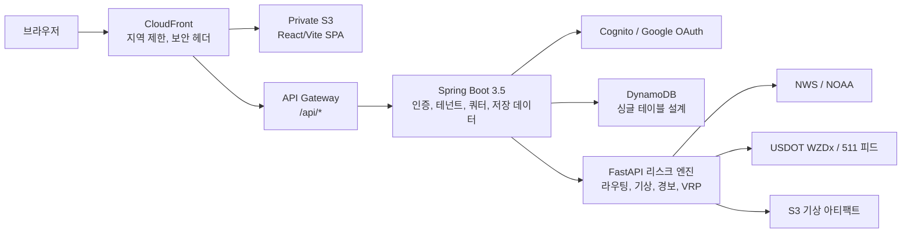

# AtmosPath

**대부분의 내비게이션이 답하지 않는 질문에 답하는 경로 계획 도구:**
*"지금 이 구간을 지나가면, 어떤 루트가 기상·도로 위험에 가장 적게 노출되는가?"*

AtmosPath는 소요시간만으로 경로를 비교하지 않습니다. 실시간 기상 위험, NWS 공식 경보, 도로 이벤트 노출도를 함께 계산해서 대안 경로를 제시합니다. 구간별 리스크 분해(비, 홍수, 바람, 폭염, 겨울 조건), 개인 경로 워치리스트, SaaS 형태의 쿼터·사용량 관리까지, 기본 지도 기능은 로그인 없이 사용할 수 있습니다.

[라이브 미리보기](https://d23c97ytqgl4xu.cloudfront.net/) | [API 헬스체크](https://d23c97ytqgl4xu.cloudfront.net/api/health) | [데모 플레이북](docs/demo-playbook.md) | [변경 이력](CHANGELOG.md)

**[English](README.md)** | 한국어


---

## 무엇을 하는 프로젝트인가

**경로 위험 비교.** 미국 내 두 도시를 입력하면 세 가지 대안을 반환합니다: 최단시간, 저위험, 균형. 각 경로에는 구간별 리스크 설명이 붙어서, *왜* 한 코리가 다른 코리보다 위험한지 직접 확인할 수 있습니다.

**실시간 위험 정보.** 전국 기상 위험 전망, 위치별 리스크 스코어링, 위험 유형·도시·카운티·코리도어별 경보 검색. 데이터는 NWS와 NOAA에서 가져오며, 소스 장애 시 가짜 데이터 대신 "이용 불가" 상태를 표시합니다.

**경로 워치리스트.** 인증된 사용자는 경로를 저장하고, 위험 임계값을 설정하고, 모니터링을 활성화하고, 리스크를 수동 갱신하고, 위험 이력을 조회할 수 있습니다. 모든 저장 데이터는 DynamoDB에서 소유자 범위 조건부 쓰기로 관리됩니다.

**SaaS 계정 레이어.** 플랜 기반 권한(FREE/PRO/TEAM/INTERNAL), 일일 사용량 미터, 저장 자산 용량 체크, 구조화된 쿼터 에러, 안전한 재시도를 위한 멱등성 키. 결제는 의도적으로 미연결 상태이며, 권한 경계가 먼저 설계되어 있어 나중에 결제 연동이 가능합니다.

**다중 경유지 최적화.** OR-Tools 기반 VRP 파운데이션에 리스크 가중 엣지 코스트를 적용하고, ML 섀도 워크플로우는 명시적 프로모션 게이트를 통과한 경우에만 솔버 코스트에 영향을 줍니다.

**운영 투명성.** `/status` 페이지에서 데이터 소스 상태, 프론트엔드 재시도/폴백 횟수, 브라우저 성능 스냅샷, 세션 범위 에러 텔레메트리를 확인합니다. 서드파티 분석 도구 없음.

---

## 아키텍처



프론트엔드는 React 19 SPA로, Private S3에서 CloudFront를 통해 서빙됩니다. API 호출은 API Gateway를 거쳐 두 백엔드로 라우팅됩니다: Java Spring Boot 서비스가 인증·테넌트 컨텍스트·권한·사용자 데이터 영속성을 담당하고, Python FastAPI 서비스가 라우팅·기상 리스크 스코어링·경보 집계·차량 경로 최적화를 담당합니다. DynamoDB가 운영 스토어(유휴 비용 0)이며, PostgreSQL/PostGIS는 공간 조인 확장 경로로 문서화되어 있습니다.

---

## 엔지니어링 결정 사항

이 섹션은 핵심 서브시스템이 *어떻게* 동작하고 *왜* 이렇게 설계했는지 설명합니다. 각 항목은 기술 면접의 대화 출발점입니다.

### 리스크 스코어링 파이프라인

위치 리스크는 단순 평균이 아닙니다. 스코어러가 NWS/NOAA 실시간 데이터에서 독립적 카테고리 점수(강수, 바람, 폭염, 홍수, 활성 경보)를 계산한 뒤 `max(경보_점수, 가중_기상_합성)`을 취합니다:

```
score = max(
    alert_score,
    precipitation * 0.35 + wind * 0.25 + heat * 0.20 + flood * 0.20
)
```

`max`을 쓰는 이유: 토네이도 경보 하나만 있어도 일반 날씨가 잔잔해 보여야 지배적이어야 합니다. 가중 합성은 단일 경보가 없지만 복합 조건이 위험한 일반 케이스를 처리합니다. 전국 리스크는 상위 20개 경보 평균을 사용해서 수백 개의 저심각도 자문문이 점수를 희석시키지 않도록 합니다.

전국 엔드포인트에는 60초 인메모리 TTL 캐시를 적용해서, Redis 인프라 비용 없이 동시 요청 시 반복 NWS API 호출을 방지합니다.

### 경로 비교와 라벨링

경로 대안은 OSRM의 `alternatives=3` 파라미터로 기하학적으로 구분되는 경로들을 받아옵니다. 각 후보는 경로 웨이포인트에서 기상을 샘플링하고, 코리도어를 따라 NWS 경보 지오메트리 교차를 확인하여 스코어링됩니다. 스코어링 후 소요시간순 정렬하고 라벨을 부여합니다:

- **Fastest**: 리스크 무관 최단시간.
- **Lower weather risk**: 최단시간이 아닌 대안 중 최고 리스크 점수.
- **Balanced**: 시간 + 리스크 최적 균형.

구간별 분해는 경로를 기상 샘플 간격으로 나누고 구간별 위험 설명을 붙여서, UI에서 경로의 *어디에서* 위험이 집중되는지 보여줍니다.

### SSRF 방지 아웃바운드 HTTP

리스크 엔진은 외부 프로바이더(NWS, Open-Meteo, OSRM, WZDx)를 호출합니다. 임의 URL을 신뢰하지 않고, 모든 아웃바운드 요청이 `outbound_http.py`를 통과하며 다음을 강제합니다:

1. **호스트 허용 목록**: 사전 승인된 도메인(api.weather.gov, router.project-osrm.org 등)과 명시적 환경변수 확장 목록만 허용.
2. **HTTPS 강제**: 공개 호스트에 평문 HTTP 불가.
3. **리다이렉트 차단**: 커스텀 `HTTPRedirectHandler`가 리다이렉트 시 예외를 발생시켜, 오픈 리다이렉트를 통한 허용 목록 우회를 방지.
4. **DNS 해석 검증**: 연결 전 호스트네임을 해석하여 loopback, link-local, private, reserved, multicast 범위를 체크. `169.254.169.254`(클라우드 메타데이터)나 내부 IP로 해석되는 DNS 리바인딩 공격을 차단.
5. **자격 증명 제거**: `user:pass@`가 포함된 URL은 거부.

로컬 개발 이그레스(`localhost`)는 명시적 `ATMOSPATH_ALLOW_LOCAL_OUTBOUND=true` 플래그 뒤에 게이트됩니다.

### 레이트 리미팅

Spring Platform API는 서블릿 필터(`RateLimitFilter`)로 메서드 + 경로 패턴별 버켓 분류:

| 버켓 | 적용 대상 | 기본 제한 |
| --- | --- | --- |
| `public-risk-read` | GET /risk/national, weather-snapshot, weather-raster | 분당 설정 가능 |
| `place-search` | GET /places/search | 뮤테이션 티어 제한 |
| `route-risk-mutation` | POST /directions, /risk/location | 뮤테이션 티어 제한 |
| `authenticated-me` | /me/** | 별도 인증 사용자 제한 |

키는 `bucket:method:path:clientIP`. 기본 스토어는 인메모리 고정 윈도우(인프라 비용 0)이며, `RATE_LIMIT_STORE=redis` 설정 시 멀티 인스턴스 배포용 Redis 카운터로 전환. 모든 결정은 Micrometer 카운터(`atmospath.rate_limit.requests`, `bucket`/`outcome` 태그)로 내보내고, 표준 `X-RateLimit-*` 헤더와 `Retry-After`가 포함된 구조화된 `429` 본문을 반환합니다.

### 멱등성 (Idempotency)

경로/장소 저장 뮤테이션은 `Idempotency-Key` 헤더를 받습니다:

1. 키 형식 검증 (1-128자, `[A-Za-z0-9._:-]`).
2. 저장 전 SHA-256 해싱 → 원본 클라이언트 키가 DynamoDB에 절대 저장되지 않음.
3. `tenantId + operation` 범위로 해시 저장 → 테넌트 간 키 충돌 방지.
4. 재시도 시 중복 생성 대신 기존 리소스 ID 반환.

프론트엔드가 네트워크 실패 시 안전하게 재시도할 수 있고, 유령 저장 경로가 생기지 않습니다. 멱등성 히트는 `atmospath.saved_route.commands` 메트릭으로 추적.

### 서비스 레이어 패턴

Platform API의 컨트롤러는 얇은 HTTP 경계입니다: 요청 파싱 → 테넌트 컨텍스트 추출 → 서비스 위임. 모든 비즈니스 로직은 `SavedRouteService`에 있으며 다음을 순서대로 오케스트레이션합니다:

1. 멱등성 체크 (키 매칭 시 기존 리소스 반환).
2. 권한 용량 체크 (플랜 쿼터 초과 시 거부).
3. 도메인 객체 생성 및 영속화.
4. 리스크 관측 기록 (향후 ML 학습 데이터용).
5. 멱등성 키 저장.
6. 커맨드 메트릭 발행.

이 순서가 중요합니다: 쿼터 체크가 영속화 *이전*에 와서, 거부된 요청은 DynamoDB를 건드리지 않습니다. 서비스는 `@ConditionalOnProperty(atmospath.auth.enabled=true)`로, Cognito 없는 로컬 개발 경로도 동작합니다.

### ML 서빙 게이트 (Fail-Closed 설계)

VRP 지연 모델은 경로 최적화 코스트에 영향을 줄 수 있지만, 4개의 독립 게이트를 모두 통과해야 합니다:

1. **학습 게이트**: 모델 학습 + 평균 지연 baseline 대비 백테스트. MAE 개선 릴리스 게이트 체크.
2. **프로모션 게이트**: CLI 도구로 `served_to_users=true` 아티팩트 생성. 섀도 아티팩트는 `false` 유지.
3. **런타임 게이트**: 환경에 `VRP_ML_WORKFLOW_MODE=SERVING_ENABLED`, `VRP_ML_ALLOW_SERVED_COST=true` 설정 필요.
4. **요청 게이트**: 개별 요청에서 `useMlServedCost=true` 전달 필요.

조건 하나라도 미충족 시 룰 기반 코스트로 fail-closed. 적용 지연은 추가로 상한(`mlMaxDelaySeconds`), 가중치(`mlDelayWeight=0.35`), 신뢰도 임계값 아래 차단. 아티팩트는 pickle/joblib가 아닌 순수 JSON(계수, 피처명, 메트릭)이라 검사 가능하고 로드 시 임의 코드 실행 불가.

### 프론트엔드 리질리언스

웹 앱은 서비스 워커나 외부 라이브러리 없이 불안정 연결을 처리합니다:

- **안전 재시도**: 일시적 실패(5xx, 네트워크 에러)만 백오프로 재시도; 4xx는 절대 재시도 안 함.
- **Stale 캐시 폴백**: 공개 리스크 응답을 `sessionStorage`(512 kB 상한)에 캐시. 최신 조회 실패 시 캐시 버전 + "stale data" 표시 + 타임스탬프 제공.
- **연결 인식**: `navigator.onLine`과 `NetworkInformation.effectiveType`으로 오프라인/저속 네트워크 배너 구동.
- **서드파티 없는 텔레메트리**: 재시도 횟수, 폴백 이벤트, 에러 상세를 세션 범위 메모리에 저장하고 `/status`에 노출. 브라우저 밖으로 나가지 않음.

### DynamoDB 싱글 테이블 설계

프리뷰 배포는 복합 키 싱글 테이블:

| 접근 패턴 | PK | SK |
| --- | --- | --- |
| 사용자 프로필 | `USER#{userId}` | `PROFILE` |
| 저장 장소 목록 | `USER#{userId}` | `SAVED_PLACE#{id}` (begins_with) |
| 저장 경로 목록 | `USER#{userId}` | `SAVED_ROUTE#{id}` (begins_with) |
| 일일 사용량 카운터 | `TENANT#{tenantId}` | `USAGE#{date}#{feature}` |

왜 Postgres가 아니라 DynamoDB인가: 유휴 비용 0(온디맨드 과금), 소유자 범위 조회에 한 자릿수 ms 읽기, 조건부 쓰기로 트랜잭션 코디네이터 없이 낙관적 동시성. 트레이드오프는 공간 쿼리 불가이며, 그래서 PostGIS를 확장 경로로 문서화(ADR-006).

### VRP 코스트 모델

다중 경유지 최적화는 리스크 조정 코스트 행렬을 구성합니다. 각 엣지 (i, j):

```
adjusted_cost = base_duration * duration_weight
    + weather_risk * weather_weight * 6
    + traffic_risk * traffic_weight * 6
    + flood_risk * flood_weight * 8
    + alert_risk * alert_weight * 10
    + (distance_km * distance_weight)
```

승수(6, 6, 8, 10)는 0-100 리스크 점수를 페널티 초로 변환합니다. 홍수와 경보에 더 높은 승수를 주는 이유는, 이 요소들이 단순 불쾌감이 아닌 통행 불가와 상관되기 때문입니다. 행렬 엣지 누락 시 24시간 페널티를 부여해서 사실상 라우팅 불가로 만듭니다. ML 섀도 모델은 활성 시 이 기본 코스트 위에 신뢰도 게이트 지연을 추가합니다.

---

## 기술 스택

| 레이어 | 기술 |
| --- | --- |
| 프론트엔드 | React 19, TypeScript, Vite, MapLibre GL, Lucide icons, Playwright E2E, axe-core a11y |
| Platform API | Java 21, Spring Boot 3.5, Spring Security (OAuth2 Resource Server), AWS SDK v2 |
| 리스크 엔진 | Python 3.12, FastAPI, Pydantic, OR-Tools, scikit-learn (ML 워크플로우) |
| 데이터 | DynamoDB (싱글 테이블), S3 (기상 아티팩트), 선택적 PostGIS |
| 인프라 | CloudFront, API Gateway, Lambda, Cognito, CloudWatch, Terraform |
| CI/CD | GitHub Actions (OIDC, 장기 키 없음), Maven, pytest, Playwright, 번들 예산 체크 |

---

## 스크린샷

실행 중인 앱에서 Playwright로 캡처 (목업 아님). 재생성: `npm run screenshots:release --prefix web`.

| 홈 | 대시보드 |
| --- | --- |
|  |  |

| 경로 비교 | 상태 |
| --- | --- |
|  |  |

| 모바일 |
| --- |
|  |

---

## 시작하기

### 사전 요구사항

Docker (풀스택), 또는 개별: Node 20+, Python 3.12+, Java 21 (Windows용 `.tools/`에 번들).

### 풀스택

```powershell
docker compose up --build
```

| 서비스 | URL |
| --- | --- |
| 웹 앱 | http://localhost:5173 |
| 리스크 엔진 문서 | http://localhost:8000/docs |
| Platform API 헬스 | http://localhost:8080/health |

### 프론트엔드만

```powershell
npm install --prefix web
npm run dev --prefix web        # 로컬 개발 서버
npm run build --prefix web      # 프로덕션 빌드
npm run test:e2e --prefix web   # Playwright E2E (28개 테스트)
```

### Platform API (Spring Boot)

Windows에서 시스템 전역 Java/Maven 설치 불필요; `.tools/`에 번들.

```powershell
cd services/platform-api
../../scripts/mvn.ps1 --batch-mode test   # 53개 테스트
```

### 리스크 엔진 (Python)

```powershell
$env:PYTHONPATH = 'services/api'
python -m pytest services/api/tests -q    # 78개 테스트
```

---

## 보안 모델

인증은 Cognito JWT 사용 (Google OAuth 페더레이션 경로 문서화됨). 공개 지도 엔드포인트는 로그인 없이 동작하되 서버 사이드 레이트 리밋 적용; `/me/**` 엔드포인트는 유효 토큰 필수.

주요 하드닝 결정:

- 소유자 범위 DynamoDB 파티션 키 + 조건부 쓰기/삭제; 테넌트 간 읽기 원천 불가.
- 뮤테이션 멱등성 키, 테넌트 범위 해시로 저장 (원본 키 미저장).
- Spring API 고정 윈도우 레이트 리밋 (인메모리 기본, `RATE_LIMIT_STORE=redis`로 선택적 Redis).
- CloudFront 오리진 검증(`X-Origin-Verify`), CSP, frame-deny, referrer policy.
- 아웃바운드 HTTP는 허용 목록 + HTTPS 강제 + 리다이렉트 차단 + 메타데이터/localhost/사설 네트워크 거부.
- 배포는 GitHub Actions OIDC; 장기 AWS 액세스 키 어디에도 없음.
- 프론트엔드 E2E에서 지도 마커 XSS 하드닝, 인증 불가 메시징, stale 데이터 폴백 커버.

---

## ML 및 최적화

VRP 지연 모델은 기본적으로 **섀도 워크플로우**로 동작합니다. 모든 게이트를 통과하지 않으면 룰 기반 리스크 스코어링이 권위입니다:

1. 모델 학습 + 백테스트 (MAE, RMSE, p95 에러 vs. baseline).
2. 아티팩트 릴리스 게이트 통과 후 CLI로 프로모션 (`served_to_users=true`).
3. 런타임 환경에서 서빙 활성화 (`VRP_ML_WORKFLOW_MODE=SERVING_ENABLED`, `VRP_ML_ALLOW_SERVED_COST=true`).
4. 개별 요청에서 옵트인 (`useMlServedCost=true`).

게이트 실패, 플래그 누락, 낮은 신뢰도 예측 모두 룰 기반 코스트로 fail-closed. 아티팩트는 pickle이 아닌 순수 JSON.

```powershell
# 학습
python services/api/scripts/train_vrp_delay_model.py --input <dataset> --output <artifact> --model-version v1

# 프로모션 (릴리스 게이트 통과 필요)
python services/api/scripts/promote_vrp_delay_model.py --input <shadow> --output <served>

# 엔드투엔드 서빙 코스트 데모
python services/api/scripts/run_vrp_served_cost_demo.py --artifact-dir tmp/demo-vrp-ml --model-version demo-v1
```

---

## 테스트 및 검증

마지막 전체 실행: 2026년 7월 7일.

| 레이어 | 결과 |
| --- | --- |
| Spring Platform API (53개 테스트) | 통과 |
| Python 리스크 엔진 (78개 테스트) | 통과 |
| Playwright E2E (28개 테스트) | 통과 |
| 프론트엔드 lint + 빌드 + 번들 예산 | 통과 |
| 디자인 lint | 0 에러, 0 경고 |
| 의존성 감사 | 0 high 취약점 |
| ML 서빙 코스트 데모 | 통과 |

**번들 예산** (CI에서 강제): 초기 JS 98.8 kB gz / 180 kB 한도, MapLibre 벤더 278 kB gz / 320 kB 한도, CSS 21.8 kB gz / 90 kB 한도.

**로컬 스트레스 테스트** (비용 0, 인프로세스): 180 요청, 동시성 8, 0 실패, 캐시 엔드포인트 p95 500 ms 이하. 다중 경유지 계획 p95 ~3.2 s가 알려진 보틀넥 (동기 행렬 연산; 비동기 잡 경로가 계획된 수정).

```powershell
python perf/local_api_stress.py --requests 180 --concurrency 8
```

---

## 데이터 모델

프리뷰 배포용 DynamoDB 싱글 테이블 설계:

| PK | SK | 용도 |
| --- | --- | --- |
| `USER#{userId}` | `PROFILE` | 사용자 프로필 |
| `USER#{userId}` | `SAVED_PLACE#{id}` | 저장 장소 |
| `USER#{userId}` | `SAVED_ROUTE#{id}` | 모니터링 설정 포함 저장 경로 |
| `TENANT#{tenantId}` | `USAGE#{date}#{feature}` | 일일 사용량 카운터 |

PostGIS 확장 (문서화됨, 기본 미배포): GiST 인덱스 공간 컬럼, 소유자 기반 RLS 정책, 경로 노출 관측, 향후 테넌트/워크스페이스 테이블. [docs/data-model.md](docs/data-model.md), [docs/relational-data-model.md](docs/relational-data-model.md) 참조.

---

## 배포

AWS `us-east-1` 서버리스 우선: CloudFront + Private S3 (SPA), API Gateway + Lambda (백엔드), DynamoDB 온디맨드 (영속성), Cognito (인증). 기본 프리뷰에 Kubernetes, Aurora, 매니지드 Redis 없음.

인프라는 Terraform 관리. CI/CD는 GitHub Actions OIDC (정적 자격 증명 없음). CloudFront 지역 제한 US/KR. 모든 리소스 태그: `Project=awsresumeproject`, `ManagedBy=IaC`, `Environment=dev`.

배포 문서: [docs/deployment.md](docs/deployment.md). 비용 모델: [docs/cost-model.md](docs/cost-model.md).

---

## 프로젝트 상태

**현재 가능:** 기상 경로 비교, 경보 검색, 저장 워치리스트, SaaS 쿼터, 운영 상태 페이지, 구조화된 에러 컨트랙트, 전 레이어 테스트 커버리지, 번들 예산, 로컬 스트레스 하네스.

**아직:** 배포 환경 Google OAuth 시크릿, 광범위 공개 트래픽용 WAF 규칙, 비동기 다중 경유지 잡 실행, HRRR/MRMS 래스터 프로덕션 케이던스, 합성 모니터링.

릴리스: `v0.1.0-preview` (2026년 7월). 로드맵: [CHANGELOG.md](CHANGELOG.md).

---

## 문서

- [아키텍처 개요](docs/architecture.md)
- [데모 플레이북](docs/demo-playbook.md) (2분 면접 스크립트 포함)
- [리서치 및 보안 근거](docs/architecture/research-and-security-basis.md)
- [애플리케이션 리질리언스](docs/architecture/application-resilience.md)
- [백엔드 프로덕션 하드닝](docs/architecture/backend-production-hardening.md)
- [기상 리스크 파이프라인](docs/architecture/weather-risk.md)
- [VRP 경로 엔진 파운데이션](docs/architecture/route-engine-vrp-foundation.md)
- [ML 섀도 모델](docs/architecture/vrp-ml-shadow-model.md)
- [WZDx 도로 이벤트 피드](docs/architecture/road-events-wzdx-feeds.md)
- [SaaS 하드닝 체크리스트](docs/saas-production-hardening-checklist.md)
- [배포 가이드](docs/deployment.md)
- [Google OAuth 설정](docs/google-auth.md)
- [런북](docs/runbooks/)
- [ADR](docs/adr/)
