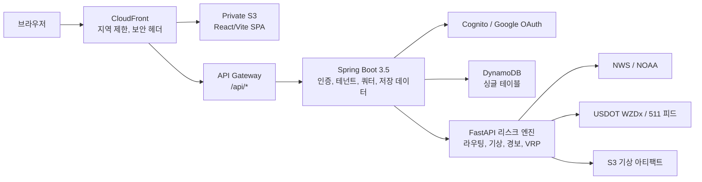

# AtmosPath

**"지금 이 구간을 지나가면, 어느 루트가 날씨·도로 위험을 가장 덜 타는가?"**

일반 내비게이션은 이 질문에 답하지 않습니다. AtmosPath는 여기서 출발했습니다. 소요시간만 비교하는 대신, 실시간 기상 데이터와 NWS 공식 경보, 도로 이벤트를 겹쳐서 경로 대안을 비교합니다. 구간마다 "여기가 왜 위험한지" 설명이 붙고, 자주 쓰는 경로는 워치리스트에 저장하여 위험도를 지속적으로 추적합니다. SaaS 형태의 플랜별 쿼터와 사용량 관리도 동작하며, 기본 지도 기능은 로그인 없이 바로 사용할 수 있습니다.

[라이브 미리보기](https://d23c97ytqgl4xu.cloudfront.net/) | [API 헬스체크](https://d23c97ytqgl4xu.cloudfront.net/api/health) | [데모 플레이북](docs/demo-playbook.md) | [변경 이력](CHANGELOG.md)

**[English](README.md)** | 한국어


---

## 이 프로젝트가 하는 일

**경로 위험 비교.** 미국 내 출발지·도착지를 입력하면 세 가지 대안이 표시됩니다. 가장 빠른 길, 기상 위험이 낮은 길, 그리고 그 둘의 균형입니다. 각 경로에 구간별 리스크 설명이 붙으므로, "왜 이 코리도어가 더 위험한지"를 화면에서 직접 확인할 수 있습니다.

**실시간 위험 정보.** 전국 기상 위험 전망, 지점별 리스크 점수, 위험 유형·도시·카운티·코리도어 기준 경보 검색을 제공합니다. 데이터 소스는 NWS와 NOAA이며, 소스가 내려가면 가짜 수치를 채워 넣지 않고 "현재 이용 불가"로 표시합니다.

**경로 워치리스트.** 로그인한 사용자는 경로를 저장하고, 위험 임계값을 설정하고, 모니터링을 활성화하고, 리스크를 직접 갱신하고, 과거 위험 이력을 조회할 수 있습니다. 저장 데이터는 전부 DynamoDB에서 소유자 범위 조건부 쓰기로 관리하므로 다른 사용자의 데이터에 접근할 수 없습니다.

**SaaS 계정 레이어.** 플랜(FREE/PRO/TEAM/INTERNAL)별로 일일 사용량, 저장 경로·장소 용량, 구조화된 쿼터 에러, 멱등성 키 기반 안전 재시도를 지원합니다. 결제 연동은 의도적으로 제외했으며, 권한 경계를 먼저 확립하여 향후 결제 통합이 깔끔하게 추가되도록 설계했습니다.

**다중 경유지 최적화.** OR-Tools 위에 리스크 가중 엣지 코스트를 올린 VRP 기반입니다. ML 섀도 워크플로우는 프로모션 게이트를 전부 통과해야만 솔버 코스트에 반영됩니다.

**운영 상태 투명 공개.** `/status` 페이지에 데이터 소스 생존 여부, 프론트엔드 재시도·폴백 횟수, 브라우저 성능 스냅샷, 세션 범위 에러 로그를 노출합니다. 서드파티 분석 도구는 사용하지 않습니다.

---

## 아키텍처



React 19 SPA를 Private S3에 올리고 CloudFront로 서빙합니다. API 호출은 API Gateway를 거쳐 백엔드 두 개로 라우팅됩니다. Spring Boot가 인증·테넌트·권한·사용자 데이터 저장을 담당하고, FastAPI가 라우팅·기상 스코어링·경보 집계·VRP 최적화를 담당합니다. 운영 스토어는 DynamoDB(유휴 비용 0)이며, 공간 조인이 필요해지면 PostGIS로 확장하는 경로를 ADR로 문서화했습니다.

---

## 엔지니어링 결정

면접에서 "이거 왜 이렇게 만들었습니까?"라는 질문이 들어왔을 때 바로 답할 수 있는 내용입니다.

### 리스크 점수: 단순 평균이 아닌 이유

카테고리 점수를 단순 평균하면 토네이도 경보가 하나 떠 있어도 "전체적으로 맑음"이면 점수가 낮게 나오는 문제가 발생합니다. 그래서 설계를 바꿨습니다.

```
score = max(
    alert_score,
    precipitation * 0.35 + wind * 0.25 + heat * 0.20 + flood * 0.20
)
```

`max`을 취하면 심각한 경보 하나가 전체 점수를 지배합니다. 반대로 경보는 없는데 비+바람+더위가 겹치는 경우는 가중 합성이 잡아줍니다. 전국 리스크는 상위 20개 경보만 평균내며, 수백 개 저심각도 자문문이 점수를 희석하는 것을 방지합니다.

전국 엔드포인트에는 60초 TTL 인메모리 캐시를 적용하여, 동시 요청 시 NWS API 반복 호출을 방지합니다.

검증: `test_api.py`, `test_hazards.py`, `test_weather_snapshot.py`

### 경로 대안 비교: 라벨이 붙는 과정

OSRM에 `alternatives=3`을 요청하면 기하학적으로 서로 다른 경로가 반환됩니다. 각 후보 경로에서 웨이포인트를 찍어 기상을 샘플링하고, NWS 경보 지오메트리와 교차하는지 확인하여 점수를 매깁니다. 그 다음 소요시간순으로 정렬합니다:

- **Fastest**: 리스크와 무관하게 가장 빠른 길
- **Lower weather risk**: 가장 빠른 길이 아닌 것 중 리스크 점수가 가장 낮은 길
- **Balanced**: 시간 + 리스크 트레이드오프가 가장 좋은 길

구간별 분해도 함께 제공합니다. 경로를 기상 샘플 간격으로 쪼개서 "이 구간에서 홍수 위험이 높다" 같은 설명을 UI에서 표시합니다.

검증: `test_directions.py`, `test_vrp_route_engine.py`

### SSRF 차단: 외부 API 호출의 안전 확보

리스크 엔진은 NWS, Open-Meteo, OSRM, WZDx 같은 외부 API를 호출합니다. 임의 URL을 허용하면 SSRF 공격면이 생기므로, `outbound_http.py`에 게이트를 두고 모든 아웃바운드 요청이 통과하도록 설계했습니다:

1. **호스트 허용 목록.** api.weather.gov, router.project-osrm.org 등 사전 승인 도메인만 통과. 환경변수로 명시적 추가 가능.
2. **HTTPS만.** 공개 호스트에 평문 HTTP 요청은 즉시 거부.
3. **리다이렉트 차단.** 커스텀 `HTTPRedirectHandler`가 리다이렉트 시 예외를 발생시킵니다. 오픈 리다이렉트를 통한 허용 목록 우회 공격을 차단합니다.
4. **DNS 해석 검증.** 연결 전에 호스트네임을 실제로 해석하여 loopback, link-local, private, reserved, multicast에 해당하면 차단합니다. DNS 리바인딩으로 `169.254.169.254`(클라우드 메타데이터)를 찌르는 공격을 막는 핵심 장치입니다.
5. **자격 증명 제거.** URL에 `user:pass@`가 포함되어 있으면 거부합니다.

로컬 개발 시 localhost 접근이 필요하면 `ATMOSPATH_ALLOW_LOCAL_OUTBOUND=true`를 명시적으로 설정해야 합니다.

검증: `test_outbound_http.py`

### 레이트 리밋: 버켓 분류와 비용 절감

Spring 쪽에 서블릿 필터(`RateLimitFilter`)를 두고, 메서드 + 경로 패턴으로 요청을 버켓에 분류합니다:

| 버켓 | 대상 | 제한 |
| --- | --- | --- |
| `public-risk-read` | GET /risk/national, weather-snapshot, weather-raster | 분당 설정값 |
| `place-search` | GET /places/search | 뮤테이션 티어 |
| `route-risk-mutation` | POST /directions, /risk/location | 뮤테이션 티어 |
| `authenticated-me` | /me/** | 인증 사용자 별도 제한 |

키는 `bucket:method:path:clientIP` 조합입니다. 기본 스토어는 인메모리 고정 윈도우이며, 멀티 인스턴스 전환 시 `RATE_LIMIT_STORE=redis`로 교체합니다. 모든 판정은 Micrometer 카운터(`atmospath.rate_limit.requests`)로 발행하고, 응답에는 `X-RateLimit-*` 헤더와 `Retry-After`가 포함된 구조화된 429 본문을 반환합니다.

검증: `RateLimitFilterTests.java`, `InMemoryRateLimitRepositoryTests.java`

### 멱등성: 네트워크 단절 시 유령 데이터 방지

경로 저장, 장소 저장 같은 뮤테이션에 `Idempotency-Key` 헤더를 받습니다. 구현 포인트:

1. 키 형식 검증 (1~128자, `[A-Za-z0-9._:-]`만 허용).
2. **저장 전에 SHA-256으로 해싱.** 원본 클라이언트 키가 DynamoDB에 그대로 들어가지 않습니다.
3. `tenantId + operation` 범위로 저장하여 테넌트 간 키 충돌을 원천 차단합니다.
4. 같은 키로 재시도하면 새로 생성하지 않고 기존 리소스 ID를 반환합니다.

프론트엔드에서 네트워크 단절 후 재시도해도 저장 경로가 중복 생성되지 않습니다. 멱등성 히트는 `atmospath.saved_route.commands` 메트릭으로 추적합니다.

검증: `IdempotencyServiceTests.java`, `DynamoDbIdempotencyRepositoryTests.java`

### 서비스 레이어: 컨트롤러는 얇게, 순서는 엄격하게

Platform API 컨트롤러는 요청 파싱 → 테넌트 컨텍스트 추출 → 서비스 위임, 이 세 가지만 수행합니다. 비즈니스 로직은 전부 `SavedRouteService`에 모여 있으며, 다음 순서로 처리합니다:

1. 멱등성 체크 (이미 처리된 키면 기존 리소스 반환)
2. **쿼터 체크** (플랜 용량 초과 시 여기서 거부)
3. 도메인 객체 생성 + DynamoDB 저장
4. 리스크 관측 기록 (향후 ML 학습 데이터로 활용)
5. 멱등성 키 저장
6. 커맨드 메트릭 발행

순서가 중요한 이유: 쿼터 체크가 저장 *앞*에 있으므로, 거부된 요청은 DynamoDB를 건드리지 않습니다. 이 서비스는 `@ConditionalOnProperty(atmospath.auth.enabled=true)`로, Cognito 없는 로컬 개발에서도 정상 동작합니다.

검증: `SavedRouteServiceTests.java`, `SavedRouteControllerTests.java`

### ML 서빙: 게이트 4개 전부 통과해야 반영

VRP 지연 모델이 솔버 코스트에 영향을 줄 수 있도록 설계했지만, 기본은 섀도 모드입니다. 룰 기반 점수가 권위이며, ML이 실제로 코스트를 바꾸려면 게이트 4개를 전부 통과해야 합니다:

1. **학습.** 모델 학습 + 평균 지연 baseline 대비 백테스트. MAE가 baseline보다 개선되어야 릴리스 게이트 통과.
2. **프로모션.** CLI로 `served_to_users=true` 아티팩트를 새로 생성. 섀도 아티팩트는 계속 `false`.
3. **런타임.** 환경변수에 `VRP_ML_WORKFLOW_MODE=SERVING_ENABLED` + `VRP_ML_ALLOW_SERVED_COST=true` 필요.
4. **요청.** 개별 요청에서 `useMlServedCost=true`를 명시적으로 전송해야 함.

하나라도 빠지면 룰 기반 코스트로 fail-closed. 반영되는 지연도 상한(`mlMaxDelaySeconds`), 가중치(0.35), 신뢰도 임계값으로 한 번 더 걸러집니다. 아티팩트는 pickle이 아닌 순수 JSON(계수, 피처명, 메트릭)이라 사람이 열어볼 수 있고, 로드 시 임의 코드가 실행되지 않습니다.

검증: `test_ml_workflow.py`

### 프론트엔드: 네트워크 불안정 시에도 화면 유지

서비스 워커나 외부 라이브러리 없이 직접 구현했습니다:

- **재시도.** 5xx나 네트워크 에러만 백오프로 재시도하고, 4xx는 재시도하지 않습니다.
- **Stale 캐시 폴백.** 공개 리스크 응답을 `sessionStorage`(512 kB 상한)에 캐시하고, 새 요청이 실패하면 캐시된 데이터 + "직전 데이터입니다" 배너 + 시각을 함께 표시합니다.
- **연결 상태 인식.** `navigator.onLine`, `NetworkInformation.effectiveType`을 확인하여 오프라인이나 저속 네트워크 시 배너를 표시합니다.
- **텔레메트리.** 재시도 횟수, 폴백 이벤트, 에러 상세를 세션 메모리에 담고 `/status`에 노출합니다. 브라우저 외부로 전송하지 않습니다.

검증: `resilience.spec.ts`, `frontend-operations.spec.ts`

### DynamoDB 싱글 테이블: Postgres가 아닌 이유

| 접근 패턴 | PK | SK |
| --- | --- | --- |
| 사용자 프로필 | `USER#{userId}` | `PROFILE` |
| 저장 장소 목록 | `USER#{userId}` | `SAVED_PLACE#{id}` (begins_with) |
| 저장 경로 목록 | `USER#{userId}` | `SAVED_ROUTE#{id}` (begins_with) |
| 일일 사용량 카운터 | `TENANT#{tenantId}` | `USAGE#{date}#{feature}` |

DynamoDB 온디맨드는 유휴 비용 0, 소유자 범위 조회 한 자릿수 ms, 조건부 쓰기로 낙관적 동시성까지 확보됩니다. 공간 쿼리는 불가하므로 PostGIS 확장 경로로 분리했습니다 (ADR-006).

검증: `DynamoDbUsageRepositoryTests.java`, `test_dynamodb_repository.py`

### VRP 코스트 행렬: 위험을 초 단위로 환산하는 공식

다중 경유지 최적화에서 각 엣지 (i, j)의 코스트를 다음과 같이 계산합니다:

```
adjusted_cost = base_duration * duration_weight
    + weather_risk * weather_weight * 6
    + traffic_risk * traffic_weight * 6
    + flood_risk * flood_weight * 8
    + alert_risk * alert_weight * 10
    + (distance_km * distance_weight)
```

승수가 6, 6, 8, 10으로 다른 이유는 명확합니다. 홍수(8)와 경보(10)는 "불쾌한 수준"이 아니라 "도로가 막히는 수준"과 상관되므로 더 무겁게 설정했습니다. 행렬에서 엣지가 빠진 경우(경로 없음)는 24시간 페널티를 부여하여 사실상 라우팅에서 제외합니다. ML 섀도 모델이 활성화되어 있으면 이 기본 코스트 위에 신뢰도 게이트 지연이 추가됩니다.

검증: `test_optimizer.py`, `test_vrp_route_engine.py`

---

## 테스트 전략 및 커버리지

### 레이어별 테스트 개요

| 레이어 | 도구 | 규모 | 라인 커버리지 |
| --- | --- | --- | --- |
| Python 리스크 엔진 | pytest + pytest-cov | 78개 테스트 | **80%** |
| Spring Platform API | JUnit 5 + Mockito | 53개 테스트 | 전체 통과 |
| Playwright E2E | Playwright | 28개 테스트 | 전체 통과 |

### 레이어별 목적

**Python 리스크 엔진 (80% 라인 커버리지).** 기상 스코어링, SSRF 차단, VRP 코스트 행렬, ML 워크플로우 등 핵심 비즈니스 로직을 검증합니다. 외부 API 호출 경로를 제외한 내부 로직을 집중적으로 다룹니다.

**Spring Platform API (53개 테스트).** 인증·인가, 레이트 리밋, 멱등성, 쿼터, DynamoDB 리포지토리 등 플랫폼 계약을 검증합니다. 컨트롤러는 얇게 유지하고 서비스 레이어 로직을 단위 테스트로 커버합니다.

**Playwright E2E (28개 테스트).** 실제 브라우저에서 지도 렌더링, 경로 비교, XSS 하드닝, 인증 불가 시 메시징, stale 데이터 폴백, 접근성(axe-core) 등 사용자 시나리오를 검증합니다.

### 주요 모듈 커버리지

| 모듈 | 커버리지 | 비고 |
| --- | --- | --- |
| `vrp/ml/shadow_cost_model.py` | 98% | ML 섀도 코스트 전체 경로 커버 |
| `vrp/cost_model.py` | 96% | 코스트 행렬 계산 로직 |
| `outbound_http.py` | 85% | SSRF 차단 게이트 |
| `main.py` | 82% | API 엔드포인트 라우팅 |
| `directions.py` | 54% | 외부 OSRM API 호출 경로 미커버 |
| `risk.py` | 28% | 외부 NWS/NOAA API 호출 경로 미커버 |

### 알려진 갭

`risk.py`(28%)와 `directions.py`(54%)의 커버리지가 낮은 이유는 외부 API(NWS, NOAA, OSRM) 호출 경로가 테스트에서 제외되어 있기 때문입니다. 이 경로들은 통합 테스트와 E2E에서 간접적으로 검증되며, 단위 테스트에서는 비즈니스 로직과 데이터 변환에 집중합니다.

### 실행 방법

```powershell
# Python 리스크 엔진 (78개 테스트, 커버리지 포함)
$env:PYTHONPATH = 'services/api'
python -m pytest services/api/tests -q --cov=services/api --cov-report=term-missing

# Spring Platform API (53개 테스트)
cd services/platform-api
../../scripts/mvn.ps1 --batch-mode test

# Playwright E2E (28개 테스트)
npm run test:e2e --prefix web
```

---

## 기술 스택

| 레이어 | 기술 |
| --- | --- |
| 프론트엔드 | React 19, TypeScript, Vite, MapLibre GL, Lucide, Playwright E2E, axe-core |
| Platform API | Java 21, Spring Boot 3.5, Spring Security (OAuth2 Resource Server), AWS SDK v2 |
| 리스크 엔진 | Python 3.12, FastAPI, Pydantic, OR-Tools, scikit-learn |
| 데이터 | DynamoDB 싱글 테이블, S3 기상 아티팩트, PostGIS (확장 경로) |
| 인프라 | CloudFront, API Gateway, Lambda, Cognito, CloudWatch, Terraform |
| CI/CD | GitHub Actions OIDC (장기 키 없음), Maven, pytest, Playwright, 번들 예산 |

---

## 스크린샷

목업이 아닌 실행 중인 앱을 Playwright로 캡처한 것입니다. 재생성: `npm run screenshots:release --prefix web`.

| 홈 | 대시보드 |
| --- | --- |
|  |  |

| 경로 비교 | 운영 상태 |
| --- | --- |
|  |  |

| 모바일 |
| --- |
|  |

---

## 로컬에서 실행하기

### 준비물

풀스택 실행에는 Docker만 있으면 됩니다.

개별 레이어만 실행할 경우 Node 20+, Python 3.12+, Java 21이 필요합니다. Windows에서는 `.tools/` 디렉터리에 Java 21과 Maven이 번들되어 있으므로 별도 설치 없이 바로 실행할 수 있습니다.

### 풀스택

```powershell
docker compose up --build
```

| 서비스 | 주소 |
| --- | --- |
| 웹 앱 | http://localhost:5173 |
| 리스크 엔진 API 문서 | http://localhost:8000/docs |
| Platform API 헬스 | http://localhost:8080/health |

### 프론트엔드만

```powershell
npm install --prefix web
npm run dev --prefix web        # 개발 서버
npm run build --prefix web      # 프로덕션 빌드
npm run test:e2e --prefix web   # Playwright E2E 28개
```

### Platform API (Spring Boot)

```powershell
cd services/platform-api
../../scripts/mvn.ps1 --batch-mode test   # 53개 테스트
```

### 리스크 엔진 (Python)

```powershell
$env:PYTHONPATH = 'services/api'
python -m pytest services/api/tests -q    # 78개 테스트
```

---

## 보안

인증은 Cognito JWT를 사용하며, Google OAuth 페더레이션 경로는 문서화했습니다. 공개 지도 API는 로그인 없이 사용하되 서버에서 레이트 리밋을 적용하고, `/me/**`는 유효 토큰이 없으면 401을 반환합니다.

핵심 하드닝:

- DynamoDB 파티션 키를 소유자 범위로 설정하고 조건부 쓰기/삭제를 적용하여, 다른 테넌트 데이터에 접근할 수 있는 경로 자체가 없습니다.
- 멱등성 키는 SHA-256 해시 후 테넌트 범위로 저장합니다. 원본 키는 어디에도 남지 않습니다.
- Spring API에 고정 윈도우 레이트 리밋 (인메모리 기본, Redis 전환 가능).
- CloudFront 오리진 검증(`X-Origin-Verify`), CSP, frame-deny, referrer policy.
- 아웃바운드 HTTP는 허용 목록 + HTTPS + 리다이렉트 차단 + 메타데이터/사설 네트워크 거부.
- 배포는 GitHub Actions OIDC. 장기 AWS 액세스 키는 이 프로젝트 어디에도 없습니다.
- 프론트엔드 E2E에 지도 마커 XSS, 인증 불가 시 메시징, stale 데이터 폴백 시나리오가 포함되어 있습니다.

---

## ML 워크플로우

기본은 섀도 모드입니다. 룰 기반 점수가 권위이며, ML이 코스트를 바꾸려면:

1. 학습 + 백테스트 (MAE, RMSE, p95 vs. baseline)
2. 릴리스 게이트 통과 후 CLI로 프로모션 (`served_to_users=true`)
3. 런타임 환경변수 활성화
4. 개별 요청에서 `useMlServedCost=true`

하나라도 충족하지 않으면 룰 기반 코스트로 fail-closed 처리됩니다. 반영되는 지연에도 상한, 가중치, 신뢰도 임계값이 적용됩니다.

아티팩트 형식은 pickle/joblib가 아닌 순수 JSON(계수, 피처명, 메트릭)입니다. 사람이 직접 열어볼 수 있고, 로드 시 임의 코드가 실행될 여지가 없습니다.

```powershell
# 학습
python services/api/scripts/train_vrp_delay_model.py --input <dataset> --output <artifact> --model-version v1

# 프로모션 (릴리스 게이트 통과 필요)
python services/api/scripts/promote_vrp_delay_model.py --input <shadow> --output <served>

# 서빙 코스트 전체 흐름 데모
python services/api/scripts/run_vrp_served_cost_demo.py --artifact-dir tmp/demo-vrp-ml --model-version demo-v1
```

---

## 테스트

마지막 전체 실행: 2026-07-07.

| 대상 | 결과 |
| --- | --- |
| Spring Platform API (53개) | 통과 |
| Python 리스크 엔진 (78개) | 통과 |
| Playwright E2E (28개) | 통과 |
| 프론트엔드 lint + 빌드 + 번들 예산 | 통과 |
| 디자인 lint | 에러 0, 경고 0 |
| 의존성 감사 | high 취약점 0 |
| ML 서빙 코스트 데모 | 통과 |

**번들 예산** (CI에서 강제): 초기 JS 98.8 / 180 kB gz, MapLibre 벤더 278 / 320 kB gz, CSS 21.8 / 90 kB gz.

**로컬 스트레스 테스트** (외부 호출 없음, 인프로세스): 180 요청 / 동시성 8 / 실패 0건. 캐시 적용 엔드포인트 p95가 500 ms 이하. 다중 경유지 계획 p95 ~3.2 s가 현재 보틀넥이며, 동기 행렬 연산이 원인입니다. 비동기 잡으로 분리하는 것이 다음 단계입니다.

```powershell
python perf/local_api_stress.py --requests 180 --concurrency 8
```

---

## 데이터 모델

DynamoDB 싱글 테이블:

| PK | SK | 용도 |
| --- | --- | --- |
| `USER#{userId}` | `PROFILE` | 프로필 |
| `USER#{userId}` | `SAVED_PLACE#{id}` | 저장 장소 |
| `USER#{userId}` | `SAVED_ROUTE#{id}` | 저장 경로 + 모니터링 설정 |
| `TENANT#{tenantId}` | `USAGE#{date}#{feature}` | 일일 사용량 |

PostGIS 확장 경로는 문서화만 되어 있으며 기본 배포에는 포함되지 않습니다. GiST 인덱스, 소유자 RLS, 경로 노출 관측, 테넌트/워크스페이스 테이블까지 설계되어 있습니다. [docs/data-model.md](docs/data-model.md), [docs/relational-data-model.md](docs/relational-data-model.md) 참고.

---

## 배포

AWS `us-east-1`, 서버리스 우선입니다. CloudFront + Private S3, API Gateway + Lambda, DynamoDB 온디맨드, Cognito로 구성됩니다. Kubernetes, Aurora, 매니지드 Redis는 사용하지 않습니다.

인프라는 전부 Terraform으로 관리하고, CI/CD는 GitHub Actions OIDC(정적 자격 증명 없음)로 운영합니다. CloudFront에 US/KR 지역 제한을 적용했고, 리소스 태그는 `Project=awsresumeproject`, `ManagedBy=IaC`, `Environment=dev`로 통일했습니다.

자세한 내용은 [배포 문서](docs/deployment.md)와 [비용 모델](docs/cost-model.md)을 참고하십시오.

---

## 현재 상태

**완료:** 기상 경로 비교, 경보 검색, 워치리스트, SaaS 쿼터, 운영 상태 페이지, 구조화된 에러 컨트랙트, 전 레이어 테스트, 번들 예산, 로컬 스트레스 하네스.

**미완료:** 배포 환경 Google OAuth 시크릿 연결, 공개 트래픽용 WAF, 다중 경유지 비동기 잡, HRRR/MRMS 래스터 프로덕션 주기, 합성 모니터링.

현재 `v0.1.0-preview` (2026-07). 로드맵은 [CHANGELOG.md](CHANGELOG.md)에 있습니다.

---

## 문서 목록

- [아키텍처 개요](docs/architecture.md)
- [데모 플레이북](docs/demo-playbook.md) (2분 면접 스크립트 포함)
- [리서치·보안 근거](docs/architecture/research-and-security-basis.md)
- [애플리케이션 리질리언스](docs/architecture/application-resilience.md)
- [백엔드 프로덕션 하드닝](docs/architecture/backend-production-hardening.md)
- [기상 리스크 파이프라인](docs/architecture/weather-risk.md)
- [VRP 경로 엔진](docs/architecture/route-engine-vrp-foundation.md)
- [ML 섀도 모델](docs/architecture/vrp-ml-shadow-model.md)
- [WZDx 도로 이벤트 피드](docs/architecture/road-events-wzdx-feeds.md)
- [SaaS 하드닝 체크리스트](docs/saas-production-hardening-checklist.md)
- [배포 가이드](docs/deployment.md)
- [Google OAuth 설정](docs/google-auth.md)
- [런북](docs/runbooks/)
- [ADR](docs/adr/)
