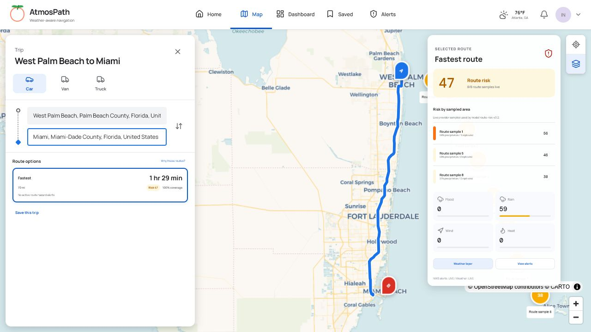
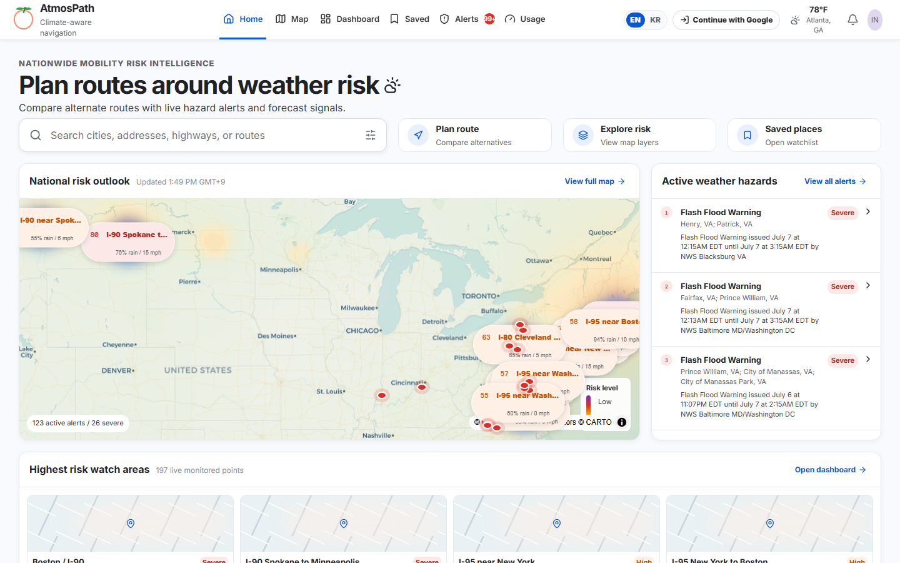
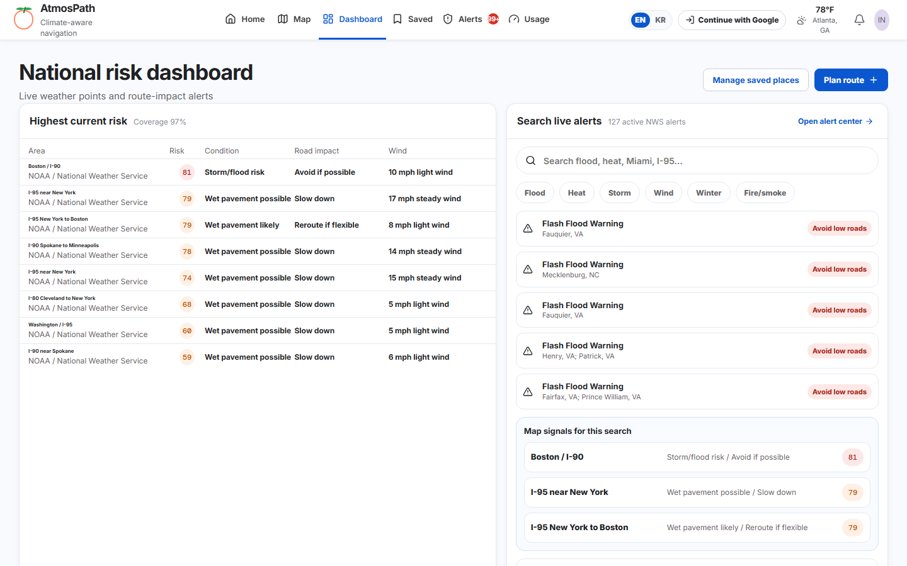
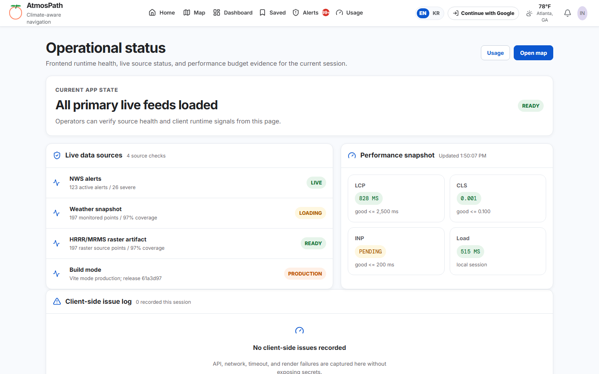
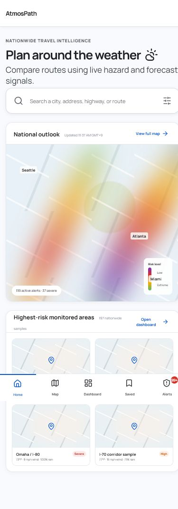
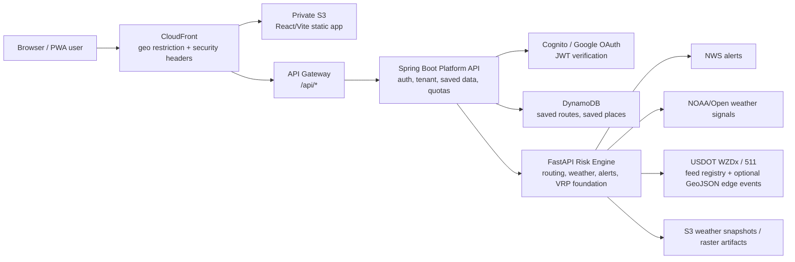
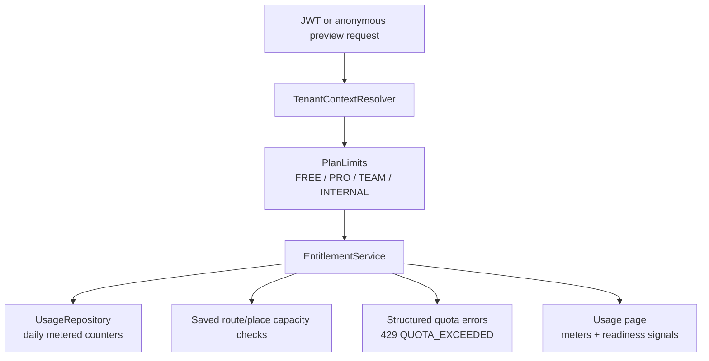

# AtmosPath

AtmosPath is a climate-aware navigation and route-risk SaaS preview. It combines route planning, official weather alerts, road-event feed discovery, saved route monitoring, and SaaS-style account entitlements so drivers can compare not only the fastest route, but the route that is safer under weather and hazard conditions.

- Live preview: https://d23c97ytqgl4xu.cloudfront.net/
- API health: https://d23c97ytqgl4xu.cloudfront.net/api/health
- Current release: `v0.1.0-preview` / Phase 2 SaaS hardening
- Release notes: [CHANGELOG.md](CHANGELOG.md)
- Architecture notes: [docs/architecture.md](docs/architecture.md)
- Demo playbook: [docs/demo-playbook.md](docs/demo-playbook.md)
- Cost model: [docs/cost-model.md](docs/cost-model.md)
- Research/security basis: [docs/architecture/research-and-security-basis.md](docs/architecture/research-and-security-basis.md)
- Application resilience: [docs/architecture/application-resilience.md](docs/architecture/application-resilience.md)
- SaaS hardening checklist: [docs/saas-production-hardening-checklist.md](docs/saas-production-hardening-checklist.md)
- ADRs: [docs/adr/](docs/adr/)
- Codebase size: about 19.6k source/test/IaC/config LOC; about 23.9k tracked text LOC including docs, excluding lockfiles and generated build output.



## 30-Second Version

| Question | Answer |
| --- | --- |
| What did I build? | A weather-aware navigation SaaS preview that compares route alternatives, surfaces official hazards, saves private route watchlists, and explains risk by route segment. |
| Why is it hard? | It combines map UX, external weather/road-event data, route optimization, saved-user state, auth boundaries, serverless deployment, observability, cost controls, and ML guardrails without pretending unavailable data is live. |
| What stack does it prove? | React 19, TypeScript, MapLibre, Spring Boot 3.5, Java 21, FastAPI, Pydantic, OR-Tools, scikit-learn workflow, DynamoDB, Cognito/Google OAuth path, Lambda, API Gateway, CloudFront, S3, Terraform, GitHub Actions. |
| How do I demo it fast? | Open the live preview, plan Seattle to Miami Beach, select the lower-weather-risk route, search `flood` in Alerts, show Saved/Usage auth boundaries, then open Status for deploy/runtime evidence. |

Two-minute interview script: [docs/demo-playbook.md](docs/demo-playbook.md#two-minute-interview-demo).

## Release Snapshot

| Field | Current value |
| --- | --- |
| Release | `v0.1.0-preview` |
| Date | July 7, 2026 |
| Status | Portfolio beta / production-shaped preview |
| Primary goal | Weather-aware route comparison with saved-route monitoring and SaaS-style operational controls |
| Deployment model | Serverless-first AWS preview: CloudFront, private S3, API Gateway, Lambda, Cognito, DynamoDB |
| Persistence | DynamoDB for low-cost saved routes, saved places, and usage counters; optional PostGIS schema documented for spatial expansion |
| ML status | Shadow workflow plus guarded served-cost mode for VRP/multi-stop routing; serving requires promoted artifact, release gate, environment guard, and request flag |
| Explicitly out of scope | Billing collection, team/workspace SaaS, public commercial launch, production ML serving, always-on Kubernetes/Aurora/Redis |

## Functional Specification

| Module | Implemented behavior | Primary surfaces |
| --- | --- | --- |
| Route planning | Search U.S. places, compare fastest/lower-weather-risk/balanced alternatives, explain segment-level risk, reopen shareable directions URLs | `/map`, `/directions`, `POST /directions` |
| Risk intelligence | Show national weather risk, location risk, weather snapshot/raster artifacts, official alert categories, and route impact context | `/dashboard`, `/alerts`, `GET /risk/national`, `POST /risk/location` |
| Saved routes | Save private routes, edit name/departure/risk threshold/monitor flag, manually refresh monitored risk, view current risk and risk history, delete owned routes | `/saved`, `/me/saved/routes`, `/me/saved/routes/{id}/current-risk`, `/me/saved/routes/{id}/risk-history`, `POST /me/saved/routes/{id}/risk-refresh` |
| Saved places | Save private places, inspect place risk, and enforce owner-scoped reads/writes/deletes | `/saved`, `/locations/{slug}`, `/me/saved/places` |
| Road events | Discover WZDx roadwork/closure feed registries by state and optionally join configured WZDx/511 GeoJSON events into VRP edge risk | `GET /road-events/feeds`, `VRP_ROAD_EVENT_FEED_URLS` |
| Account controls | Expose plan, quota, capacity, readiness signals, daily metered usage, and structured quota errors without enabling paid billing | `/usage`, `/pricing`, `GET /me/account` |
| VRP foundation | Support multi-stop route planning, route optimization contracts, OR-Tools-backed solver foundation, and risk-weighted edge costs | `POST /routes/multi-stop`, `POST /routes/multi-stop/optimize`, `POST /vrp/solve` |
| ML workflow | Convert saved-route observations into delay examples, backtest a delay model, load a safe JSON artifact, record shadow predictions, optionally apply promoted ML delay to VRP/multi-stop solver costs behind guardrails, and run a local served-cost demo | `GET /ml/vrp/workflow/status`, `POST /ml/vrp/delay-model/backtest`, `POST /ml/vrp/delay-model/predict`, `scripts/run_vrp_served_cost_demo.py` |
| Operations | Show frontend runtime health, application resilience, bundle budgets, local API stress evidence, release gates, runbooks, rollback docs, and cloud load-test strategy | `/status`, `perf/local_api_stress.py`, `docs/ops/`, `docs/runbooks/` |
| Security | Cognito JWT path, owner-scoped DynamoDB keys, idempotent mutation keys, conditional writes/deletes, request IDs, security headers, origin verification, optional PostGIS RLS migration | Spring Platform API, Terraform, `V002__tenant_rls_policies.sql` |

## Product

Most map products optimize for time first. AtmosPath is designed around a different operational question:

> If I have to drive through this region today, which route, corridor, or saved route is exposed to the least weather and infrastructure risk?

Current capabilities:

- Map-first route planning across U.S. cities and corridors.
- Route alternatives: fastest, lower weather risk, and balanced.
- Segment-level route risk explanations for rain, flood, wind, heat, winter, and official alerts.
- Live alert search by hazard type, city, county, corridor, or route impact.
- Saved routes and saved places with monitor settings, risk threshold, current risk, and risk history.
- SaaS account summary with plan, quota, saved asset capacity, and readiness signals.
- Operational status page for live source health, frontend runtime issues, and browser performance snapshots.
- Application-level resilience for unstable connections: safe API retries, short timeouts, stale public-risk fallback, and user-visible offline/slow/stale data state.
- Google OAuth/Cognito integration path for real user accounts.
- Production-shaped public preview that keeps core map flows available without login while private watchlist data requires authentication.
- Cost-aware serverless AWS deployment with CloudFront, private S3, API Gateway, Lambda, Cognito, DynamoDB, and optional PostGIS expansion.

No fake data policy: if live data is unavailable, the UI shows degraded/unavailable state instead of substituting fabricated alerts or scores.

## Screenshots

These screenshots are captured from the actual app with Playwright, not AI-generated mockups. Regenerate them with `npm run screenshots:release --prefix web` after starting a local preview, or set `SCREENSHOT_BASE_URL` to a deployed URL.

| Home | Dashboard |
| --- | --- |
|  |  |

| Route comparison | Operational status |
| --- | --- |
|  |  |

| Mobile |
| --- |
|  |

## Architecture



### Request Flow

1. React/Vite is served from private S3 through CloudFront.
2. CloudFront forwards `/api/*` to API Gateway.
3. Spring Boot Platform API enforces JWT authentication for `/me/**`, derives tenant context, applies plan/usage limits, and stores saved user data.
4. Python FastAPI Risk Engine performs place search, route planning, location risk scoring, national alert summaries, WZDx feed discovery, optional road-event edge-risk joins, and VRP foundation workflows.
5. The frontend API client retries safe transient failures, falls back to short-lived cached public risk snapshots when appropriate, and exposes evidence at `/status`.
6. Cached risk-engine reads reduce repeated provider calls and lower cloud cost.
7. DynamoDB remains the low-cost operational store; PostgreSQL/PostGIS is documented as the expansion path for spatial joins and analytics.

## SaaS Account Layer

AtmosPath now has a production-shaped SaaS control plane without billing collection.



Implemented account features:

- `GET /api/v1/me/account`
- Daily quota counters for route planning, place search, location risk, and alert search.
- Saved route and saved place capacity checks.
- `Idempotency-Key` support for saved route/place create and saved-route risk refresh retries.
- Structured API error envelope with `code`, `message`, `requestId`, and quota details.
- Request ID propagation through `X-Request-Id`.
- Usage and pricing pages in the web app.
- Saved watchlist capacity shown alongside private saved routes and places.

Billing is intentionally disabled for this portfolio release. The entitlement model is present so payment integration can be added later without redesigning the product boundary.

## Security

Implemented hardening:

- Spring Security resource server support for Cognito JWTs.
- `/api/v1/me/**` authenticated when auth is enabled.
- Public map preview endpoints remain available but are server-side quota-limited.
- CloudFront origin verification via `X-Origin-Verify`.
- Request correlation via `X-Request-Id`.
- API security headers: CSP, frame deny, referrer policy.
- DynamoDB writes use user-scoped partition keys and conditional owner checks.
- Mutation idempotency stores tenant-scoped hashed keys in DynamoDB in AWS deployments, avoiding raw retry-key persistence.
- SaaS usage counters use tenant-scoped DynamoDB atomic counters in AWS deployments.
- Optional PostGIS schema includes owner-based RLS policies and runtime `app.user_id` context execution.
- External provider calls use an outbound allowlist, HTTPS enforcement, redirect blocking, and default rejection of cloud metadata, localhost, and private-network targets.
- No long-lived AWS keys are required; deployment is designed for GitHub Actions OIDC.
- Frontend E2E covers marker text XSS hardening, unavailable-auth messaging, safe retry recovery, and stale public-risk fallback.
- Frontend error boundary prevents blank-screen failure and records render errors in session-scoped operational telemetry.

Known next security work:

- Full tenant/workspace membership tables once team accounts are enabled.
- Managed WAF rules and CSP report collection before broad public traffic.

## Data Sources

Current and planned data layers:

- National Weather Service alerts for active official hazards.
- Weather snapshot points for city/corridor monitoring.
- Weather raster artifact path for national heatmap overlays.
- USDOT WZDx feed registry discovery for roadwork/closure data.
- Configurable WZDx/511 GeoJSON road-event joins for VRP edge risk through `VRP_ROAD_EVENT_FEED_URLS`.
- Route geometry and risk-adjusted route alternatives.
- Winter road-risk/black-ice heuristic using temperature, moisture, and wind.

Deferred but tracked:

- HRRR/MRMS raster ingestion at production cadence.
- Real 511 incident/closure feeds by state.
- River gauge/flood inundation joins.
- Wildfire/smoke and power outage layers only where they materially affect driving decisions.

## Tech Stack

| Area | Technologies |
| --- | --- |
| Frontend | React 19, TypeScript, Vite, MapLibre GL, Lucide, Playwright, axe-core |
| Platform API | Java 21, Spring Boot 3.5, Spring Security, OAuth2 Resource Server, AWS SDK v2 |
| Risk Engine | Python 3.11/3.12, FastAPI, Pydantic, OSRM-style routing, risk scoring |
| Optimization | OR-Tools foundation, multi-stop route planning, VRP API contracts, ML shadow model scaffold |
| Data | DynamoDB operational store, S3 snapshots/raster artifacts, optional PostgreSQL/PostGIS expansion |
| AWS | CloudFront, private S3, API Gateway HTTP API, Lambda, Cognito, DynamoDB, CloudWatch |
| IaC/CI | Terraform, GitHub Actions, Maven, pytest, Playwright, design lint, dependency audit |

## Verification Evidence

Last local verification: July 7, 2026.

| Layer | Command | Result |
| --- | --- | --- |
| Spring Platform API | `powershell -ExecutionPolicy Bypass -File ..\..\scripts\mvn.ps1 --batch-mode test` | 45 passed |
| Python Risk Engine | `cd services/api; python -m pytest -q` | 78 passed, 4 warnings |
| ML served-cost demo | `cd services/api; python scripts/run_vrp_served_cost_demo.py --artifact-dir ..\..\tmp\demo-vrp-ml --model-version demo-served-delay-v1` | passed; feasible route, no dropped jobs, promoted ML edge delay explained |
| Frontend lint | `npm run lint --prefix web` | passed |
| Frontend build | `npm run build --prefix web` | passed |
| Frontend bundle budget | `npm run perf:budget --prefix web` | passed |
| Design rules | `npm run design:lint --prefix web` | 0 errors, 0 warnings |
| Playwright E2E | `npm run test:e2e --prefix web` | 28 passed |
| Frontend dependency audit | `npm run audit --prefix web` | 0 high vulnerabilities |

### Frontend Performance Budget

The frontend now enforces a local bundle budget after a test-mode Vite build:

```powershell
npm run perf:budget --prefix web
```

Latest result:

| Budget | Result |
| --- | --- |
| Initial JS gzip | 98.78 kB / 180.00 kB |
| MapLibre vendor chunk gzip | 278.40 kB / 320.00 kB |
| Map route chunk gzip | 9.59 kB / 45.00 kB |
| CSS gzip | 21.78 kB / 90.00 kB |

Runtime frontend observability is exposed at `/status`. It shows live source status, API retry and stale-fallback counts, the most recent browser performance snapshot from `PerformanceObserver`, and session-scoped API/network/render issues captured without sending secrets to third-party telemetry.

### Local Stress Test

The default stress harness is cost-free. It uses FastAPI `TestClient` in-process and does not hit AWS, Google, paid weather APIs, or live staging. The goal is not to prove maximum cloud throughput; it is a repeatable release gate for API latency regressions, routing hot paths, cache effectiveness, and solver bottlenecks before any paid staging test is considered.

```powershell
python perf/local_api_stress.py --requests 180 --concurrency 8 --json-output docs/ops/local-api-stress-2026-07-04.json
```

What the run exercises:

- `GET /health`
- `GET /risk/national`
- `GET /places/search`
- `POST /risk/location`
- `POST /directions`
- `POST /routes/multi-stop`

Latest result:

- 180 requests
- concurrency 8
- 0 failures
- 12.31 requests/sec
- overall p95 2988.33 ms
- cached endpoints p95: directions 403.62 ms, place search 471.54 ms, location risk 371.05 ms, national risk 422.45 ms
- remaining bottleneck: multi-stop route planning p95 3224.28 ms

The multi-stop bottleneck is expected because that path still performs route matrix and geometry work synchronously. The production path should move larger optimization jobs behind an async job API, cache key, and/or persisted result store.

### Serverless Load Testing Strategy

Serverless load tests are still meaningful, but they answer different questions than the local harness. For Lambda/API Gateway, the useful test is a controlled canary load test, not an open-ended "how many requests can it take" benchmark.

What a cloud test should validate:

- API Gateway and Lambda p95/p99 latency under expected preview traffic.
- Cold start behavior after idle periods.
- Reserved concurrency, throttling, timeout, and retry behavior.
- DynamoDB on-demand usage counter and saved-route access patterns.
- Cost envelope, CloudWatch alarms, and rollback readiness.

What it should avoid:

- Unbounded public load testing against a portfolio preview.
- Hitting paid third-party APIs or live NOAA/Google-style providers without cache controls.
- Treating Lambda burst scaling as proof that downstream data joins and solver paths are production-ready.

For this portfolio release, the safe default is local stress testing plus small authenticated smoke tests after deploy. A future staging load test should use a bounded tool such as k6 or Artillery, a fixed request budget, low reserved concurrency, and CloudWatch cost alarms. The detailed design is documented in [Cloud Load Test Strategy](docs/ops/cloud-load-test-strategy.md).

## Local Development

### Full Stack

```powershell
docker compose up --build
```

- Web: http://localhost:5173
- Risk API docs: http://localhost:8000/docs
- Platform API health: http://localhost:8080/health

### Frontend

```powershell
npm install --prefix web
npm run lint --prefix web
npm run build --prefix web
npm run perf:budget --prefix web
npm run test:e2e --prefix web
npm run audit --prefix web
```

### Spring Platform API

The repository includes Windows helpers so a system-wide Java/Maven install is not required.

```powershell
cd services/platform-api
../../scripts/mvn.ps1 --batch-mode test
```

### Python Risk Engine

```powershell
$env:PYTHONPATH='services/api'
python -m pytest services/api/tests -q
python perf/local_api_stress.py --requests 180 --concurrency 8
```

## Data Model

### DynamoDB Preview Store

Single-table operational data:

- `PK = USER#{userId}`, `SK = PROFILE`
- `PK = USER#{userId}`, `SK = SAVED_PLACE#{savedItemId}`
- `PK = USER#{userId}`, `SK = SAVED_ROUTE#{savedItemId}`
- `PK = TENANT#{tenantId}`, `SK = USAGE#{yyyy-MM-dd}#{feature}`

The deployed preview avoids idle database compute. DynamoDB is appropriate for low-cost private watchlists, saved route state, and atomic SaaS usage counters.

### PostGIS Expansion Path

Documented for advanced spatial joins:

- `saved_item.point`
- `saved_item.path`
- GiST indexes for point/path lookups
- owner-based RLS policies driven by `app.user_id`
- route exposure observations
- route risk history
- future tenant/workspace/member/subscription tables

See [docs/data-model.md](docs/data-model.md) and [docs/relational-data-model.md](docs/relational-data-model.md).

## ML and Optimization Workflow

Current status: implemented as a shadow workflow with guarded serving support
for VRP and multi-stop route optimization. The model can be trained, backtested,
loaded, promoted, evaluated against route edge features, and, when all gates are
enabled, applied to the risk-adjusted solver cost matrix. The default remains
safe: rule-based route scoring is authoritative unless the model and request are
explicitly promoted into served-cost mode.

Implemented:

- Saved-route observation payloads can be converted into delay-model training examples.
- Feature schema `edge-cost-v1` covers base duration, distance, weather risk, traffic risk, flood risk, alert risk, max risk, primary hazard, and vehicle type.
- Training uses a lightweight scikit-learn Ridge regression path with a mean-delay baseline comparison.
- Backtests record MAE, RMSE, p95 absolute error, baseline MAE, improvement over baseline, and release-gate pass/fail reasons.
- Runtime artifacts are safe JSON files containing coefficients, intercept, feature names, metrics, and release metadata instead of pickle/joblib blobs.
- `VRP_ML_MODEL_ARTIFACT` can load an artifact-backed shadow model.
- VRP and multi-stop edge costs can record `ml_delay_seconds`.
- `useMlServedCost=true` can add a confidence-gated, capped, weighted ML delay to the solver cost matrix when the artifact is promoted and runtime guards are enabled.
- Failed release gates, missing runtime allow flags, unpromoted artifacts, or low confidence fail closed to rule-based cost.
- Optional `services/api/requirements-ml.txt` includes MLflow and XGBoost for offline experiments outside the default Lambda runtime.

API and CLI:

- `GET /ml/vrp/workflow/status`
- `POST /ml/vrp/delay-model/backtest`
- `POST /ml/vrp/delay-model/predict`
- `python services/api/scripts/train_vrp_delay_model.py --input <dataset> --output <artifact> --model-version <version>`
- `python services/api/scripts/promote_vrp_delay_model.py --input <shadow-artifact> --output <served-artifact>`
- `python services/api/scripts/run_vrp_served_cost_demo.py --artifact-dir tmp/demo-vrp-ml --model-version demo-served-delay-v1`

Served-cost gate:

- Training writes `served_to_users=false` by default.
- Promotion requires a passing release gate and writes a new artifact with `served_to_users=true`.
- Runtime serving requires `VRP_ML_WORKFLOW_MODE=SERVING_ENABLED`, `VRP_ML_ALLOW_SERVED_COST=true`, and `VRP_ML_MODEL_ARTIFACT=<promoted artifact>`.
- Request serving requires `useMlServedCost=true`; otherwise the model stays in shadow/evaluation mode.
- Applied delay is capped by `mlMaxDelaySeconds`, weighted by `mlDelayWeight`, and blocked below `mlMinConfidence`.

Next ML/optimization work:

- Persist edge-level route observations from saved-route check-ins.
- Join NWS alert geometry, weather raster samples, WZDx, and 511 road events into edge features.
- Compare served ML decisions against rule-based alternatives in production telemetry before widening rollout.
- Add time windows, service duration, and vehicle shift constraints.
- Add PyVRP adapter and SVRPBench-style benchmark harness.
- Build a frontend Dispatch Optimizer only after the backend constraints and benchmark gates are real.

## Deployment and Cost Strategy

Default deployment goals:

- `us-east-1`
- serverless-first
- private S3 + CloudFront
- API Gateway + Lambda
- DynamoDB on-demand
- no Kubernetes, Aurora, or Redis in the default preview
- explicit cost review before adding recurring-cost resources
- CloudFront geo restriction for U.S. and Korea access
- GitHub Actions OIDC rather than long-lived AWS access keys

AWS resources should be tagged:

- `Project=awsresumeproject`
- `ManagedBy=IaC`
- `Environment=dev`

## Release Readiness

Ready for portfolio/beta demonstration:

- map-first weather route comparison
- alert search and route impact UX
- saved route watchlist
- SaaS account usage and quota pages
- operational status page with frontend runtime telemetry
- server-side entitlement enforcement
- DynamoDB durable usage counters and owner-conditional saved data writes/deletes
- PostGIS RLS migration path for future spatial persistence
- structured error contract
- local stress harness and published result
- frontend bundle performance budget
- backend/frontend/test coverage across critical flows

Not yet ready for open public commercial launch:

- Google OAuth secrets must be wired in the deployed environment.
- WAF/API Gateway rate limits should be enabled before broad sharing.
- Multi-stop optimization should move to async job execution for larger workloads.
- HRRR/MRMS raster cadence should be measured under budget alarms.
- Synthetic monitoring should cover home, map, health, and one route-planning flow.

## Documentation

- [Release notes](CHANGELOG.md)
- [Architecture](docs/architecture.md)
- [Demo playbook](docs/demo-playbook.md)
- [SaaS production hardening checklist](docs/saas-production-hardening-checklist.md)
- [Research and security basis](docs/architecture/research-and-security-basis.md)
- [Application resilience](docs/architecture/application-resilience.md)
- [Production risk routing](docs/architecture/production-risk-routing.md)
- [Weather risk pipeline](docs/architecture/weather-risk.md)
- [WZDx road-event feed discovery](docs/architecture/road-events-wzdx-feeds.md)
- [VRP route engine foundation](docs/architecture/route-engine-vrp-foundation.md)
- [ML shadow model](docs/architecture/vrp-ml-shadow-model.md)
- [Deployment](docs/deployment.md)
- [Google social login setup](docs/google-auth.md)
- [Runbooks](docs/runbooks/)
