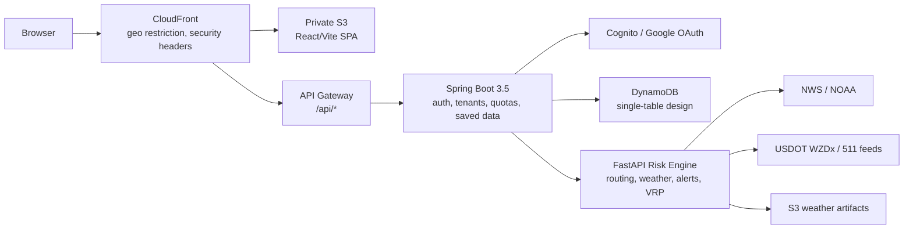

# AtmosPath

**Weather-aware route planning that answers a question most navigation tools ignore:**
*which route exposes me to the least weather and road-hazard risk right now?*

AtmosPath compares route alternatives not just by travel time, but by live weather risk, official NWS alerts, and road-event exposure. Drivers can see segment-level risk breakdowns (rain, flood, wind, heat, winter conditions), save routes to a private watchlist with monitoring thresholds, and get a SaaS-style account layer with quotas and usage tracking, all without logging in for basic map flows.

[Live preview](https://d23c97ytqgl4xu.cloudfront.net/) | [API health](https://d23c97ytqgl4xu.cloudfront.net/api/health) | [Demo playbook](docs/demo-playbook.md) | [Changelog](CHANGELOG.md)

English | **[한국어](README.ko.md)**


---

## What It Does

**Route risk comparison.** Plan a trip between any two U.S. cities and get three alternatives: fastest, lower weather risk, and balanced. Each route shows a per-segment risk explanation so you can see *why* one corridor is riskier than another.

**Live hazard intelligence.** National weather risk outlook, location-level risk scoring, and searchable official alerts by hazard type, city, county, or corridor. Data comes from NWS and NOAA; if a source is unavailable, the UI says so rather than showing fake data.

**Saved route watchlist.** Authenticated users can save routes, set risk thresholds, enable monitoring, manually refresh risk scores, and view risk history. All saved data is owner-scoped in DynamoDB with conditional writes.

**SaaS account layer.** Plan-based entitlements (FREE/PRO/TEAM/INTERNAL), daily usage meters, saved-asset capacity checks, structured quota errors, and idempotency-key support for safe retries. Billing is intentionally not wired; the entitlement boundary exists so payment can slot in later.

**Multi-stop optimization.** OR-Tools-backed VRP foundation with risk-weighted edge costs, plus an ML shadow workflow that can influence solver costs only after passing explicit promotion gates.

**Operational transparency.** A `/status` page shows live data-source health, frontend retry/fallback counts, browser performance snapshots, and session-scoped error telemetry. No third-party analytics.

---

## Architecture



The frontend is a React 19 SPA served from private S3 through CloudFront. API calls route through API Gateway to two backends: a Java Spring Boot service that owns authentication, tenant context, entitlements, and persisted user data; and a Python FastAPI service that owns routing, weather risk scoring, alert aggregation, and vehicle-routing optimization. DynamoDB is the operational store (zero idle cost); PostgreSQL/PostGIS is documented as the expansion path for spatial joins.

---

## Engineering Decisions

This section explains *how* key subsystems work and *why* they are built this way. Each entry is a conversation starter for technical review.

### Risk Scoring Pipeline

Location risk is not a simple average. The scorer computes independent category scores (precipitation, wind, heat, flood, active alerts) from live NWS/NOAA data, then takes `max(alert_score, weighted_weather_composite)`. The weighting is:

```
score = max(
    alert_score,
    precipitation * 0.35 + wind * 0.25 + heat * 0.20 + flood * 0.20
)
```

The `max` ensures a single severe alert (e.g. tornado warning) dominates even if general weather looks calm. The weighted composite handles the common case where no single alert is active but combined conditions are hazardous. National risk uses a top-20 alert average to avoid dilution from hundreds of low-severity advisories.

A 60-second in-memory TTL cache on the national endpoint prevents repeated NWS API calls under concurrent load without adding Redis infrastructure cost.

Verified by: `test_weather_snapshot.py`, `test_hazards.py`

### Route Comparison and Labeling

Route alternatives come from OSRM's `alternatives=3` parameter, which returns geometrically distinct paths. Each candidate is then scored by sampling weather at route waypoints and checking NWS alert geometry intersection along the corridor. After scoring, alternatives are sorted by duration and labeled:

- **Fastest**: shortest duration regardless of risk.
- **Lower weather risk**: best risk score among non-fastest alternatives.
- **Balanced**: best combined time + risk tradeoff.

Segment-level breakdowns divide the route into weather-sample intervals and attach per-segment hazard explanations, so the UI can show *where* on the route the risk concentrates.

Verified by: `test_directions.py`

### SSRF-Safe Outbound HTTP

The risk engine calls external providers (NWS, Open-Meteo, OSRM, WZDx). Rather than trusting arbitrary URLs, all outbound requests pass through `outbound_http.py`, which enforces:

1. **Host allowlist**: only pre-approved domains (api.weather.gov, router.project-osrm.org, etc.) plus an explicit env-var extension list.
2. **HTTPS enforcement**: no plaintext HTTP to public hosts.
3. **Redirect blocking**: a custom `HTTPRedirectHandler` raises instead of following redirects, preventing allowlist-bypass via open redirect.
4. **DNS resolution validation**: before connecting, the hostname is resolved and checked against loopback, link-local, private, reserved, and multicast ranges. This blocks DNS-rebinding attacks that resolve to `169.254.169.254` (cloud metadata) or internal IPs.
5. **Credential stripping**: URLs with embedded `user:pass@` are rejected.

Local development egress (`localhost`) is gated behind an explicit `ATMOSPATH_ALLOW_LOCAL_OUTBOUND=true` flag.

Verified by: `test_outbound_http.py`

### Rate Limiting

The Spring Platform API uses a servlet filter (`RateLimitFilter`) that classifies requests into buckets by method + path pattern:

| Bucket | Applies to | Default limit |
| --- | --- | --- |
| `public-risk-read` | GET /risk/national, weather-snapshot, weather-raster | configurable per-minute |
| `place-search` | GET /places/search | mutation-tier limit |
| `route-risk-mutation` | POST /directions, /risk/location | mutation-tier limit |
| `authenticated-me` | /me/** | separate authenticated limit |

The key is `bucket:method:path:clientIP`. The default store is in-memory fixed-window (zero infrastructure cost); setting `RATE_LIMIT_STORE=redis` switches to a Redis-backed counter for multi-instance deployments. Every decision exports Micrometer counters (`atmospath.rate_limit.requests` with `bucket` and `outcome` tags) and returns standard `X-RateLimit-*` headers plus a structured `429` body with `Retry-After`.

Verified by: `RateLimitFilterTests.java`, `InMemoryRateLimitRepositoryTests.java`

### Idempotency

Saved-route and saved-place mutations accept an `Idempotency-Key` header. The implementation:

1. Validates the key format (1-128 chars, `[A-Za-z0-9._:-]`).
2. Hashes it with SHA-256 before storage, so raw client keys never persist in DynamoDB.
3. Stores the hash scoped to `tenantId + operation`, preventing cross-tenant key collisions.
4. On retry, returns the previously created resource ID instead of creating a duplicate.

This lets the frontend safely retry network failures without creating phantom saved routes. Idempotency hits are tracked via `atmospath.saved_route.commands` metrics.

Verified by: `IdempotencyServiceTests.java`, `DynamoDbIdempotencyRepositoryTests.java`

### Service Layer Pattern

Controllers in the Platform API are thin HTTP boundaries: parse request, extract tenant context, delegate to a service. All business logic lives in `SavedRouteService`, which orchestrates:

1. Idempotency check (return existing resource if key matches).
2. Entitlement capacity check (reject if plan quota exceeded).
3. Domain object construction and persistence.
4. Risk observation recording (for future ML training data).
5. Idempotency key storage.
6. Command metric emission.

This ordering matters: quota is checked *before* persistence, so a rejected request never touches DynamoDB. The service is `@ConditionalOnProperty(atmospath.auth.enabled=true)`, so the local dev path without Cognito still works.

Verified by: `SavedRouteServiceTests.java`

### ML Serving Gates (Fail-Closed Design)

The VRP delay model can influence route optimization costs, but only after passing four independent gates:

1. **Training gate**: model is trained and backtested against a mean-delay baseline. Release gate checks MAE improvement.
2. **Promotion gate**: a CLI tool writes a new artifact with `served_to_users=true`. The shadow artifact stays at `false`.
3. **Runtime gate**: environment must set `VRP_ML_WORKFLOW_MODE=SERVING_ENABLED` and `VRP_ML_ALLOW_SERVED_COST=true`.
4. **Request gate**: individual requests must pass `useMlServedCost=true`.

Any missing condition fails closed to rule-based cost. Applied delay is additionally capped (`mlMaxDelaySeconds`), weighted (`mlDelayWeight=0.35`), and blocked below a confidence threshold. Artifacts are plain JSON (coefficients, feature names, metrics), not pickle/joblib, so they are inspectable and cannot execute arbitrary code on load.

Verified by: `test_ml_workflow.py`

### Frontend Resilience

The web app handles unstable connections without a service worker or external library:

- **Safe retries**: transient failures (5xx, network errors) retry with backoff; 4xx never retries.
- **Stale cache fallback**: public risk responses are cached in `sessionStorage` (512 kB cap). When a fresh fetch fails, the UI serves the cached version with a visible "stale data" indicator and timestamp.
- **Connection awareness**: `navigator.onLine` and `NetworkInformation.effectiveType` drive a banner for offline/slow-network states.
- **Telemetry without third parties**: retry counts, fallback events, and error details are stored in session-scoped memory and exposed at `/status`. Nothing leaves the browser.

Verified by: `resilience.spec.ts`, `security-hardening.spec.ts`

### DynamoDB Single-Table Design

The preview uses a single table with composite keys:

| Access pattern | PK | SK |
| --- | --- | --- |
| User profile | `USER#{userId}` | `PROFILE` |
| List saved places | `USER#{userId}` | `SAVED_PLACE#{id}` (begins_with) |
| List saved routes | `USER#{userId}` | `SAVED_ROUTE#{id}` (begins_with) |
| Daily usage counter | `TENANT#{tenantId}` | `USAGE#{date}#{feature}` |

Why DynamoDB over Postgres for the preview: zero idle cost (on-demand billing), single-digit-ms reads for owner-scoped queries, and conditional writes give optimistic concurrency without a transaction coordinator. The trade-off is no spatial queries, which is why PostGIS is documented as the expansion path (see ADR-006).

Verified by: `test_dynamodb_repository.py`

### VRP Cost Model

Multi-stop route optimization builds a risk-adjusted cost matrix. For each edge (i, j):

```
adjusted_cost = base_duration * duration_weight
    + weather_risk * weather_weight * 6
    + traffic_risk * traffic_weight * 6
    + flood_risk * flood_weight * 8
    + alert_risk * alert_weight * 10
    + (distance_km * distance_weight)
```

The multipliers (6, 6, 8, 10) convert 0-100 risk scores into penalty seconds. Flood and alert risk carry higher multipliers because they correlate with impassable roads, not just discomfort. Missing matrix edges get a 24-hour penalty to make them effectively unroutable. The ML shadow model, when active, adds a confidence-gated delay on top of this base cost.

Verified by: `test_vrp_route_engine.py`, `test_road_event_edge_risk.py`

---

## Tech Stack

| Layer | Technologies |
| --- | --- |
| Frontend | React 19, TypeScript, Vite, MapLibre GL, Lucide icons, Playwright E2E, axe-core a11y |
| Platform API | Java 21, Spring Boot 3.5, Spring Security (OAuth2 Resource Server), AWS SDK v2 |
| Risk Engine | Python 3.12, FastAPI, Pydantic, OR-Tools, scikit-learn (ML workflow) |
| Data | DynamoDB (single-table), S3 (weather artifacts), optional PostGIS |
| Infrastructure | CloudFront, API Gateway, Lambda, Cognito, CloudWatch, Terraform |
| CI/CD | GitHub Actions (OIDC, no long-lived keys), Maven, pytest, Playwright, bundle budget checks |

---

## Screenshots

Captured from the running app with Playwright (not mockups). Regenerate with `npm run screenshots:release --prefix web`.

| Home | Dashboard |
| --- | --- |
|  |  |

| Route comparison | Status |
| --- | --- |
|  |  |

| Mobile |
| --- |
|  |

---

## Getting Started

### Prerequisites

Docker (for full-stack), or individually: Node 20+, Python 3.12+, Java 21 (bundled in `.tools/` for Windows).

### Full stack

```powershell
docker compose up --build
```

| Service | URL |
| --- | --- |
| Web app | http://localhost:5173 |
| Risk Engine docs | http://localhost:8000/docs |
| Platform API health | http://localhost:8080/health |

### Frontend only

```powershell
npm install --prefix web
npm run dev --prefix web        # local dev server
npm run build --prefix web      # production build
npm run test:e2e --prefix web   # Playwright E2E (28 tests)
```

### Platform API (Spring Boot)

No system-wide Java/Maven install needed on Windows; the repo bundles both in `.tools/`.

```powershell
cd services/platform-api
../../scripts/mvn.ps1 --batch-mode test   # 53 tests
```

### Risk Engine (Python)

```powershell
$env:PYTHONPATH = 'services/api'
python -m pytest services/api/tests -q    # 78 tests
```

---

## Security Model

Authentication uses Cognito JWTs (Google OAuth federation path documented). Public map endpoints work without login but are server-side rate-limited; all `/me/**` endpoints require a valid token.

Key hardening decisions:

- Owner-scoped DynamoDB partition keys with conditional writes/deletes; no cross-tenant reads possible.
- Idempotency keys for mutations, stored as tenant-scoped hashes (never raw client keys).
- Fixed-window rate limiting on the Spring API (in-memory default, optional Redis via `RATE_LIMIT_STORE=redis`).
- CloudFront origin verification (`X-Origin-Verify`), CSP, frame-deny, referrer policy.
- Outbound HTTP calls restricted to an allowlist with HTTPS enforcement, redirect blocking, and metadata/localhost/private-network rejection.
- Deployment uses GitHub Actions OIDC; no long-lived AWS access keys exist anywhere.
- Frontend E2E covers XSS hardening on map markers, auth-unavailable messaging, and stale-data fallback.

---

## ML and Optimization

The VRP delay model runs as a **shadow workflow** by default. Rule-based risk scoring is authoritative unless every gate passes:

1. Model is trained and backtested (MAE, RMSE, p95 error vs. baseline).
2. Artifact passes release gate and is promoted via CLI (`served_to_users=true`).
3. Runtime env enables serving (`VRP_ML_WORKFLOW_MODE=SERVING_ENABLED`, `VRP_ML_ALLOW_SERVED_COST=true`).
4. Individual request opts in (`useMlServedCost=true`).

Any failed gate, missing flag, or low-confidence prediction fails closed to rule-based cost. Artifacts are plain JSON (coefficients, metrics, metadata), not pickle blobs.

```powershell
# Train
python services/api/scripts/train_vrp_delay_model.py --input <dataset> --output <artifact> --model-version v1

# Promote (requires passing release gate)
python services/api/scripts/promote_vrp_delay_model.py --input <shadow> --output <served>

# Demo end-to-end served-cost flow
python services/api/scripts/run_vrp_served_cost_demo.py --artifact-dir tmp/demo-vrp-ml --model-version demo-v1
```

---

## Testing Strategy and Coverage

### Coverage Summary

| Layer | Tests | Line coverage | Tool |
| --- | --- | --- | --- |
| Python Risk Engine | 78 | **80%** | pytest-cov |
| Spring Platform API | 53 (all passing) | not measured | JUnit 5 (JaCoCo not yet configured) |
| Playwright E2E | 28 | n/a | Playwright |

### Key Module Coverage (Risk Engine)

| Module | Coverage | Notes |
| --- | --- | --- |
| `vrp/ml/shadow_cost_model.py` | 98% | ML gate logic fully exercised |
| `vrp/ortools_solver.py` | 98% | Solver wrapper, constraint setup |
| `vrp/cost_model.py` | 96% | Risk-weighted edge cost formula |
| `outbound_http.py` | 85% | SSRF enforcement paths |
| `main.py` | 82% | FastAPI app wiring, middleware |
| `directions.py` | 54% | External OSRM call paths hard to unit-test |
| `risk.py` | 28% | NWS/NOAA fetch paths; scoring math covered via `test_weather_snapshot.py` |

### Per-Layer Philosophy

**Unit tests** cover the logic that must be correct regardless of infrastructure: risk scoring formulas and weighting, VRP cost model arithmetic, idempotency key hashing and format validation, rate-limit bucket classification, and ML gate fail-closed behavior. These run in milliseconds with no network or database.

**Integration tests** verify orchestration order and repository contracts: DynamoDB single-table access patterns (conditional writes, begins_with queries), service layer sequencing (quota check before persistence), and idempotency replay returning the original resource ID.

**E2E tests** (Playwright, headless Chromium) exercise the deployed-shaped experience: XSS hardening on map markers, stale-cache fallback with visible indicator, auth-unavailable UX messaging, network retry behavior, and accessibility (axe-core). These run against the Vite dev server with a mocked API layer.

**Stress tests** detect performance regressions locally without cloud cost: 180 requests at concurrency 8, asserting zero failures and p95 baselines (cached endpoints < 500 ms, multi-stop planning ~3.2 s).

### Known Gaps

- `risk.py` (28%): the low number reflects external HTTP fetch paths (NWS, NOAA) that require live APIs. The scoring math itself is covered through `test_weather_snapshot.py` and `test_hazards.py`.
- `directions.py` (54%): OSRM call paths need a running router; contract shape is tested, live routing is not.
- Spring Platform API has no JaCoCo coverage report yet. All 53 tests pass; coverage measurement is a planned CI addition.
- E2E tests mock the backend; true end-to-end against deployed Lambda is a manual step (demo playbook).

### Running the Suites

```powershell
# Risk Engine (Python) - 78 tests, ~4s
$env:PYTHONPATH = 'services/api'
python -m pytest services/api/tests -q --cov=services/api --cov-report=term-missing

# Platform API (Spring) - 53 tests, ~20s
cd services/platform-api
../../scripts/mvn.ps1 --batch-mode test

# E2E (Playwright) - 28 tests, requires dev server
npm run test:e2e --prefix web

# Stress (in-process, no cloud cost)
python perf/local_api_stress.py --requests 180 --concurrency 8
```

### Other Verification

| Check | Result |
| --- | --- |
| Frontend lint + build + bundle budget | passed |
| Design lint | 0 errors, 0 warnings |
| Dependency audit | 0 high vulnerabilities |
| ML served-cost demo | passed |

**Bundle budget** (enforced in CI): initial JS 98.8 kB gz / 180 kB limit, MapLibre vendor 278 kB gz / 320 kB limit, CSS 21.8 kB gz / 90 kB limit.

---

## Data Model

DynamoDB single-table design for the preview deployment:

| PK | SK | Purpose |
| --- | --- | --- |
| `USER#{userId}` | `PROFILE` | User profile |
| `USER#{userId}` | `SAVED_PLACE#{id}` | Saved places |
| `USER#{userId}` | `SAVED_ROUTE#{id}` | Saved routes with monitor settings |
| `TENANT#{tenantId}` | `USAGE#{date}#{feature}` | Daily usage counters |

PostGIS expansion (documented, not deployed by default): spatial columns with GiST indexes, owner-based RLS policies, route exposure observations, and future tenant/workspace tables. See [docs/data-model.md](docs/data-model.md) and [docs/relational-data-model.md](docs/relational-data-model.md).

---

## Deployment

Serverless-first on AWS `us-east-1`: CloudFront + private S3 for the SPA, API Gateway + Lambda for backends, DynamoDB on-demand for persistence, Cognito for auth. No Kubernetes, Aurora, or managed Redis in the default preview.

Infrastructure is Terraform-managed. CI/CD runs through GitHub Actions with OIDC (no static credentials). CloudFront geo-restricts to US and KR. All resources tagged `Project=awsresumeproject`, `ManagedBy=IaC`, `Environment=dev`.

Full deployment docs: [docs/deployment.md](docs/deployment.md). Cost model: [docs/cost-model.md](docs/cost-model.md).

---

## Project Status

**Ready now:** weather route comparison, alert search, saved watchlist, SaaS quotas, operational status page, structured error contract, full test coverage across all layers, bundle budgets, local stress harness.

**Not yet:** Google OAuth secrets in the deployed environment, WAF rules for broad public traffic, async multi-stop job execution, HRRR/MRMS raster ingestion at production cadence, synthetic monitoring.

Release: `v0.1.0-preview` (July 2026). Roadmap in [CHANGELOG.md](CHANGELOG.md).

---

## Documentation

- [Architecture overview](docs/architecture.md)
- [Demo playbook](docs/demo-playbook.md) (2-minute interview script included)
- [Research and security basis](docs/architecture/research-and-security-basis.md)
- [Application resilience](docs/architecture/application-resilience.md)
- [Backend production hardening](docs/architecture/backend-production-hardening.md)
- [Weather risk pipeline](docs/architecture/weather-risk.md)
- [VRP route engine foundation](docs/architecture/route-engine-vrp-foundation.md)
- [ML shadow model](docs/architecture/vrp-ml-shadow-model.md)
- [WZDx road-event feeds](docs/architecture/road-events-wzdx-feeds.md)
- [SaaS hardening checklist](docs/saas-production-hardening-checklist.md)
- [Deployment guide](docs/deployment.md)
- [Google OAuth setup](docs/google-auth.md)
- [Runbooks](docs/runbooks/)
- [ADRs](docs/adr/)
