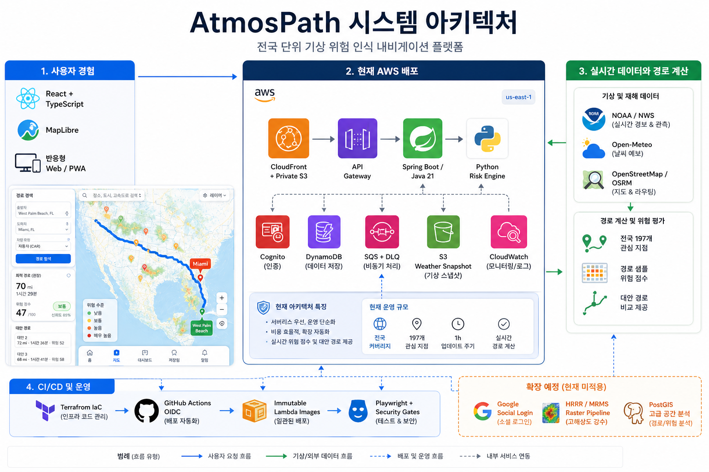

# AtmosPath

[](https://github.com/signalgap9-del/peachtree-dispatch/actions/workflows/ci.yml)
[](https://github.com/signalgap9-del/peachtree-dispatch/actions/workflows/deploy-dev.yml)

미국 전역의 기상 위험, 공식 경보, 경로 데이터를 결합해 자동차·밴·트럭 운전자가 더 안전한 경로를 비교하도록 돕는 climate-aware navigation 플랫폼입니다.

- Live demo: https://d23c97ytqgl4xu.cloudfront.net/
- API health: https://d23c97ytqgl4xu.cloudfront.net/api/health
- Architecture: [docs/architecture.md](docs/architecture.md)
- Cost model: [docs/cost-model.md](docs/cost-model.md)
- ADRs: [docs/adr/](docs/adr/)

> 현재 공개 배포는 포트폴리오/early-access 용도입니다. 링크를 가진 사용자 중심으로 테스트하며, AWS 비용을 낮게 유지하기 위해 serverless-first 구조로 운영합니다.


## 왜 만들었나

기존 지도 앱은 빠른 길을 잘 보여주지만, 장거리 운전이나 악천후 상황에서 “왜 이 경로가 위험한가”를 충분히 설명하지 않습니다. AtmosPath는 다음 질문에 답하는 서비스를 목표로 합니다.

- 같은 목적지로 가는 여러 경로 중 어떤 경로가 날씨 리스크가 낮은가?
- 현재 NWS 경보, 강수, 바람, 폭염, 홍수 위험이 경로에 얼마나 영향을 주는가?
- 주요 도시·고속도로·관심 지역의 위험도를 대시보드처럼 모니터링할 수 있는가?
- 저장한 장소와 경로를 계정 단위로 다시 볼 수 있는가?

## 현재 구현된 기능

- 미국 전역 장소 검색 및 지도 기반 route planning
- 자동차, 밴, 트럭 프로필 선택
- OSRM 기반 실제 route geometry 표시
- Fastest, Lower weather risk, Balanced 세 가지 경로 대안 비교
- 경로별 거리, 소요 시간, climate delay, risk score 계산
- 경로 checkpoint별 weather risk와 data coverage 표시
- NWS alert snapshot 기반 national outlook, alerts, dashboard 화면
- NOAA/NWS 기반 주요 도시·고속도로 관심 지점 모니터링
- MapLibre GL 기반 지도, weather/risk layer toggle
- Cognito/JWT 기반 사용자 인증 준비
- DynamoDB 기반 saved places 및 saved routes API
- Saved 화면에서 계정의 저장 장소·경로 조회 및 삭제
- 한국어/영어 언어 토글
- 모바일/데스크톱 반응형 UI
- 접근성, 보안, route contract를 검증하는 Playwright E2E 테스트

데이터 공급자가 일시적으로 실패하면 fake alert나 fake score를 보여주지 않고 `UNAVAILABLE` 또는 degraded 상태를 명시합니다.

## Screenshots

| Home | Dashboard |
| --- | --- |
|  |  |

| Route comparison | Mobile |
| --- | --- |
|  |  |

## Architecture



### Request flow

1. React/Vite app is built as static assets and served from private S3 through CloudFront.
2. CloudFront forwards `/api/*` to API Gateway.
3. Spring Boot Platform API handles account-scoped resources such as saved places and saved routes.
4. Python Risk Engine handles search, route planning, weather sampling, and risk scoring.
5. Scheduled weather collection jobs store national weather snapshots and raster artifacts in S3.
6. DynamoDB stores low-cost operational user data with pay-per-request billing.
7. Optional PostgreSQL/PostGIS schema models spatial joins, route exposure, and future advanced analytics.

## Tech Stack

| Area | Technologies |
| --- | --- |
| Frontend | React 19, TypeScript, Vite, MapLibre GL, Lucide, Playwright, axe-core |
| Platform API | Java 21, Spring Boot 3.5, Spring Security, OAuth2 Resource Server, AWS SDK v2 |
| Risk Engine | Python 3.12, FastAPI, Pydantic, OSRM integration, route risk scoring |
| Data | DynamoDB single-table operational store, S3 snapshots/raster artifacts, optional PostgreSQL/PostGIS |
| AWS | CloudFront, private S3, API Gateway HTTP API, Lambda, Cognito, DynamoDB, SQS/DLQ, CloudWatch, ECR |
| IaC | Terraform modules, environment variables, resource tagging, CloudFront response headers |
| CI/CD | GitHub Actions, web build/lint/E2E, Maven tests, Docker builds, Terraform validation, security scans |
| Security | PKCE-ready auth, JWT verification, CSP, HSTS, origin verification header, geo restriction, npm audit, Trivy |

## Data Model

### DynamoDB operational store

The deployed low-cost path uses DynamoDB for account-scoped saved data.

- `PK = USER#{userId}`, `SK = PROFILE`
- `PK = USER#{userId}`, `SK = SAVED_PLACE#{savedItemId}`
- `PK = USER#{userId}`, `SK = SAVED_ROUTE#{savedItemId}`

This keeps the preview environment cheap because there is no idle database compute.

### PostgreSQL/PostGIS expansion path

The relational schema is already modeled for advanced spatial work:

- `saved_item.point` for places
- `saved_item.path` for saved routes and corridors
- GiST indexes for point/path spatial queries
- `risk_exposure` for route-alert/hazard intersections
- `route_plan` for persisted route optimization results

More detail:

- [docs/data-model.md](docs/data-model.md)
- [docs/relational-data-model.md](docs/relational-data-model.md)

## Risk Scoring

Each route is sampled along its geometry and scored from weather and hazard signals:

- precipitation probability
- wind speed
- heat/extreme temperature
- NWS alert severity, urgency, certainty, and event category
- data coverage and provider status
- route-specific hazard exposure

The API returns multiple route alternatives. The frontend explains the trade-off between fastest travel time and lower weather risk rather than showing a single opaque score.

## Local Development

### Full stack with Docker

```powershell
docker compose up --build
```

- Web: http://localhost:5173
- Risk API docs: http://localhost:8000/docs
- Platform API health: http://localhost:8080/health

### Frontend commands

```powershell
npm install --prefix web
npm run lint --prefix web
npm run build --prefix web
npm run test:e2e --prefix web
npm run audit --prefix web
```

### Spring Boot commands

This repository includes local Windows helpers so contributors do not need a system-wide Java/Maven install.

```powershell
./scripts/bootstrap-java.ps1
cd services/platform-api
../../scripts/mvn.ps1 --batch-mode test
```

The helper downloads Temurin JDK 21 and Apache Maven into `.tools/`, which is intentionally ignored by Git.

## CI/CD

Pull requests and deployment workflows are designed to check:

- React lint, production build, and Playwright E2E
- Spring Boot Maven tests
- Python unit/API tests
- Terraform format and validation
- Docker image builds
- dependency audits and IaC/security scans
- CloudFront/S3/API smoke checks after deployment

On deploy, GitHub Actions uses AWS OIDC rather than long-lived AWS keys.

## Cost Strategy

The dev/portfolio environment is designed for a small-user, low-cost release.

- Serverless-first compute with Lambda/API Gateway
- DynamoDB on-demand for saved data
- CloudFront + private S3 for static hosting
- Scheduled weather ingestion instead of always-on workers
- No always-on Kubernetes, Aurora, or Redis in the default environment
- CloudFront geo restriction for U.S. and Korea access
- API throttling and reserved concurrency to reduce runaway spend

See [docs/cost-model.md](docs/cost-model.md).

## Release Readiness

Current status: beta/portfolio release candidate.

Already in place:

- static web deploy through CloudFront
- backend API routes behind `/api/*`
- live/degraded data states
- saved places and saved routes
- production security headers
- E2E coverage for navigation, map controls, auth prompts, saved records, accessibility, and marker XSS hardening
- rollback runbook and deployment notes
- optional HRRR/MRMS raster worker image, ECR repository, scheduled Lambda wiring, logs, and alarm

Remaining before accepting real external users:

- configure real Google OAuth client in Cognito
- verify deployed saved routes API after infrastructure rollout
- enable the HRRR/MRMS raster worker once in dev and measure duration, memory, S3 artifact size, and monthly cost
- add synthetic monitoring for `/`, `/map`, `/api/health`, and one route-planning request
- confirm CloudWatch alarms for Lambda errors, DLQ depth, API 5xx, and budget alerts
- publish polished public README screenshots from the deployed site
- add a short demo video or GIF for resume/LinkedIn

## AWS Operating Rules

- Default region: `us-east-1`
- Use Terraform/IaC for deployable resources
- Use GitHub Actions OIDC for routine deploys
- Do not create or commit long-lived AWS access keys
- Tag resources with `Project=awsresumeproject`, `ManagedBy=IaC`, and environment tags
- Require explicit confirmation before adding resources with meaningful recurring cost

## Documentation

- [Architecture](docs/architecture.md)
- [Production risk routing](docs/architecture/production-risk-routing.md)
- [Weather risk pipeline](docs/architecture/weather-risk.md)
- [Deployment](docs/deployment.md)
- [Performance/load testing](docs/architecture/performance-load-testing.md)
- [Publish readiness](docs/publish-readiness.md)
- [Roadmap](docs/roadmap.md)
- [Google social login setup](docs/google-auth.md)
- [Runbooks](docs/runbooks/)
