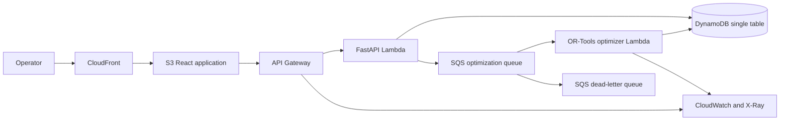

# Peachtree Dispatch Architecture

## Product

Peachtree Dispatch is a climate-aware route optimization platform for assigning deliveries, visualizing live weather risk, and producing road-aware multi-stop routes for operators.

The project is intentionally designed around Atlanta's logistics and enterprise technology market while demonstrating broadly useful cloud engineering skills.

## Technology Stack

| Area | Choice | Portfolio Signal |
| --- | --- | --- |
| Frontend | React, TypeScript, Vite, MapLibre | Map-first mobility product experience |
| Edge | CloudFront, private S3 origin | CDN, TLS, secure static hosting |
| API | API Gateway, FastAPI, Python Lambda | Serverless API and typed HTTP boundary |
| Workflows | SQS and Lambda partial batch failures | Buffered optimization, retries, and DLQ handling |
| Data | DynamoDB with point-in-time recovery | NoSQL modeling and resilience |
| Packaging | Docker and ECR | Immutable application artifacts |
| Optimization | OR-Tools capacitated VRP with climate penalties | Operations research and asynchronous compute |
| External data | Open-Meteo and OSRM adapters | Live forecast and road geometry integration |
| Observability | CloudWatch logs, metrics, alarms, dashboard, X-Ray | SRE and incident response |
| Infrastructure | Terraform | Reusable and reviewable IaC |
| CI/CD | GitHub Actions with AWS OIDC | Secretless automated delivery |
| Security | IAM least privilege, KMS, dependency and IaC scanning | DevSecOps |

## Runtime Flow



## Infrastructure Layout

```text
infra/
  bootstrap/       # Terraform state, GitHub OIDC, CI roles
  modules/         # Reusable AWS modules
  environments/
    dev/           # Low-cost deployed portfolio environment
    prod/          # Approval-gated production environment

services/
  api/             # FastAPI, DynamoDB repository, and OR-Tools worker

web/               # React operations dashboard
```

## Engineering Decisions

### Terraform instead of application-only deployment tools

Terraform is widely requested in Atlanta cloud and DevOps roles and makes infrastructure reviewable in pull requests. The repository will use an encrypted, versioned S3 backend with S3 state locking.

### Asynchronous optimization

The API persists an optimization job and sends its ID to SQS. A dedicated
Lambda worker runs OR-Tools, writes the result to DynamoDB, and reports partial
batch failures so only failed jobs are retried. Repeated failures move to a DLQ.

### Separate dev and production state

Dev is deployed and inexpensive. Production has separate Terraform state,
deletion protection, longer log retention, and an approval-gated GitHub
environment, but remains unapplied until a production release is justified.

### GitHub OIDC instead of AWS access keys

GitHub Actions will assume narrowly scoped AWS roles using OIDC. The plan role trusts pull requests, while the apply role trusts only the protected GitHub `dev` environment. No long-lived AWS credentials will be stored in GitHub secrets.

## Cost Guardrails

- Maintain a monthly AWS budget.
- Avoid NAT Gateway, always-on RDS, load balancers, and EKS in the first release.
- Configure short CloudWatch log retention.
- Tag every resource with project, environment, owner, and IaC metadata.
- Document expected monthly cost in each infrastructure pull request.

## Detailed Design Documents

- [Product requirements](requirements.md)
- [Domain model and API boundary](domain-model.md)
- [DynamoDB data model](data-model.md)
- [Cost model](cost-model.md)
- [ADR 0002: Hybrid compute](adr/0002-hybrid-compute.md)
- [ADR 0003: DynamoDB operational store](adr/0003-dynamodb-operational-store.md)
- [ADR 0004: Asynchronous OR-Tools optimization](adr/0004-async-ortools-optimization.md)
- [Deployment and promotion](deployment.md)

## Definition of Production-Style

The project is considered production-style when it includes:

- Automated tests and deployment gates
- Least-privilege IAM
- Encryption and secure defaults
- Structured logs, metrics, traces, alarms, and a dashboard
- Retries, idempotency, DLQ handling, and a replay procedure
- Backup/recovery settings and a tested runbook
- Architecture decisions and operational documentation
