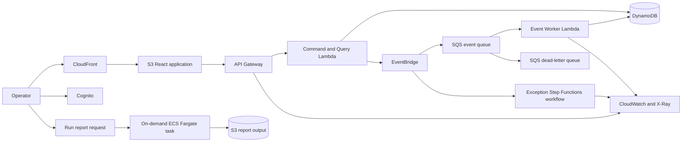

# Peachtree Dispatch Architecture

## Product

Peachtree Dispatch is a climate-aware route optimization platform for assigning deliveries, visualizing live weather risk, and producing road-aware multi-stop routes for operators.

The project is intentionally designed around Atlanta's logistics and enterprise technology market while demonstrating broadly useful cloud engineering skills.

## Technology Stack

| Area | Choice | Portfolio Signal |
| --- | --- | --- |
| Frontend | React, TypeScript, Vite, MapLibre | Map-first mobility product experience |
| Edge | CloudFront, private S3 origin | CDN, TLS, secure static hosting |
| Authentication | Amazon Cognito | Managed identity and authorization |
| API | API Gateway, Python Lambda, AWS Lambda Powertools | Serverless API and structured operations |
| Workflows | EventBridge, SQS, targeted Step Functions Express | Event routing, buffering, retries, and exception handling |
| Data | DynamoDB with point-in-time recovery | NoSQL modeling and resilience |
| Batch | Docker, ECR, on-demand ECS Fargate task | Container delivery without always-on cost |
| Optimization | Climate-risk heuristic, swappable VRP adapter | Explainable routing and future solver integration |
| External data | Open-Meteo and OSRM adapters | Live forecast and road geometry integration |
| Observability | CloudWatch logs, metrics, alarms, dashboard, X-Ray | SRE and incident response |
| Infrastructure | Terraform | Reusable and reviewable IaC |
| CI/CD | GitHub Actions with AWS OIDC | Secretless automated delivery |
| Security | IAM least privilege, KMS, dependency and IaC scanning | DevSecOps |

## Runtime Flow



## Infrastructure Layout

```text
infra/
  bootstrap/       # Terraform state, GitHub OIDC, CI roles
  modules/         # Reusable AWS modules
  environments/
    dev/           # Low-cost deployed portfolio environment

services/
  api/             # Python command/query API
  worker/          # Asynchronous event processor

web/               # React operations dashboard
tests/
  integration/     # Deployed-environment smoke and failure tests
```

## Engineering Decisions

### Terraform instead of application-only deployment tools

Terraform is widely requested in Atlanta cloud and DevOps roles and makes infrastructure reviewable in pull requests. The repository will use an encrypted, versioned S3 backend with S3 state locking.

### Hybrid compute

Lambda handles low-volume request and event workloads because it scales to zero and integrates directly with API Gateway and SQS. A later on-demand ECS Fargate task demonstrates container delivery for work that benefits from a longer-running process. No always-on container service is required.

Step Functions is not placed in the normal event path. It is reserved for a later exception workflow only when the process has multiple explicit steps, waits, or compensating actions.

### One deployed development environment

The initial portfolio uses one persistent `dev` environment. Pull requests run validation and Terraform plans without creating expensive preview environments.

### GitHub OIDC instead of AWS access keys

GitHub Actions will assume narrowly scoped AWS roles using OIDC. The plan role trusts pull requests, while the apply role trusts only the protected GitHub `dev` environment. No long-lived AWS credentials will be stored in GitHub secrets.

## Cost Guardrails

- Maintain a monthly AWS budget.
- Avoid NAT Gateway, always-on RDS, load balancers, and EKS in the first release.
- Configure short CloudWatch log retention.
- Tag every resource with project, environment, owner, and IaC metadata.
- Document expected monthly cost in each infrastructure pull request.

## Detailed Design Documents

- [Product requirements](requirements.md)
- [Domain model and API boundary](domain-model.md)
- [DynamoDB data model](data-model.md)
- [Cost model](cost-model.md)
- [ADR 0002: Hybrid compute](adr/0002-hybrid-compute.md)
- [ADR 0003: DynamoDB operational store](adr/0003-dynamodb-operational-store.md)

## Definition of Production-Style

The project is considered production-style when it includes:

- Automated tests and deployment gates
- Least-privilege IAM
- Encryption and secure defaults
- Structured logs, metrics, traces, alarms, and a dashboard
- Retries, idempotency, DLQ handling, and a replay procedure
- Backup/recovery settings and a tested runbook
- Architecture decisions and operational documentation
