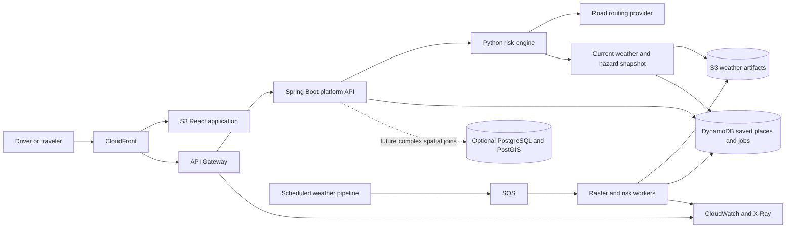

# AtmosPath Architecture

## Product

AtmosPath is a nationwide U.S. weather-risk navigation product for ordinary
drivers and travelers. It compares road-route alternatives, visualizes current
and forecast hazards, explains risk scores, and monitors saved places, routes,
and highway corridors.

AtmosPath is not a delivery-dispatch, fleet-management, or CRM product.

## Technology Stack

| Area | Choice | Portfolio signal |
| --- | --- | --- |
| Frontend | React, TypeScript, Vite, MapLibre | Map-first responsive product |
| Edge | CloudFront, private S3 origin | CDN, TLS, origin protection, geo restriction |
| Public API | Spring Boot, Java 21 | Enterprise API boundary and orchestration |
| Risk engine | FastAPI, Python | Provider adapters and explainable geospatial scoring |
| Weather pipeline | HRRR/MRMS inputs, S3 raster artifacts | National-scale data engineering |
| Workflows | SQS, Lambda, partial batch failures | Buffered jobs, retries, DLQ |
| Preview persistence | DynamoDB with TTL and PITR | Saved places, jobs, caches, idempotency |
| Future spatial scale | Optional Aurora PostgreSQL Serverless v2 + PostGIS | Complex relational and spatial SQL |
| Optimization | Ranked route alternatives; OR-Tools for bounded multi-stop planning | Operations research without fleet coupling |
| Observability | CloudWatch logs, metrics, alarms, dashboard, X-Ray | SRE and incident response |
| Infrastructure | Terraform | Reusable, reviewable IaC |
| CI/CD | GitHub Actions with AWS OIDC | Secretless automated delivery |

## Runtime Flow



## Data Ownership

- **S3:** raw/model weather data, national rasters, tiles, and historical artifacts.
- **DynamoDB:** authenticated saved places, bounded operational jobs,
  idempotency, TTL caches, notification dedupe, and current snapshot pointers.
- **PostgreSQL/PostGIS:** optional future route history and complex spatial
  relationships when the DynamoDB access pattern is no longer sufficient.

Cross-store transactions are prohibited. Events and reconciliation coordinate
work that crosses ownership boundaries.

## Repository Layout

```text
infra/                  # Terraform bootstrap, modules, dev, and prod
services/platform-api/  # Spring Boot public API and PostGIS access
services/api/           # Python risk engine and provider adapters
services/weather-raster/# Weather raster pipeline
web/                    # React map-first application
```

## Cost and Security Guardrails

- Avoid NAT Gateway, always-on databases, load balancers, and EKS.
- Keep Aurora disabled by default; when enabled, use 0-1 ACUs and auto-pause.
- Put public API traffic behind CloudFront and cap API/Lambda concurrency.
- Require Cognito JWT ownership before exposing user writes.
- Use short log retention, budgets, AWS OIDC, least privilege, and IaC tags.
- Review cost before enabling any recurring-cost resource.

## Detailed Design Documents

- [Product requirements](requirements.md)
- [Domain model and API boundary](domain-model.md)
- [DynamoDB operational data model](data-model.md)
- [PostgreSQL/PostGIS data model](relational-data-model.md)
- [Cost model](cost-model.md)
- [ADR 0006: Hybrid DynamoDB and PostGIS](adr/0006-hybrid-dynamodb-postgis.md)
- [Deployment and promotion](deployment.md)
