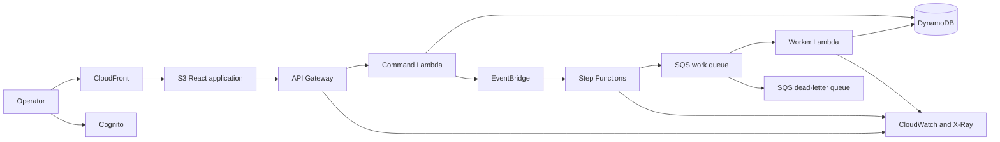

# Peachtree Dispatch Architecture

## Product

Peachtree Dispatch is a delivery operations platform for creating deliveries, ingesting status events, tracking workflow progress, and surfacing failed or delayed deliveries to operators.

The project is intentionally designed around Atlanta's logistics and enterprise technology market while demonstrating broadly useful cloud engineering skills.

## Technology Stack

| Area | Choice | Portfolio Signal |
| --- | --- | --- |
| Frontend | React, TypeScript, Vite | Modern application delivery |
| Edge | CloudFront, private S3 origin | CDN, TLS, secure static hosting |
| Authentication | Amazon Cognito | Managed identity and authorization |
| API | API Gateway, Python Lambda, AWS Lambda Powertools | Serverless API and structured operations |
| Workflows | EventBridge, SQS, Step Functions | Event-driven design, retries, failure handling |
| Data | DynamoDB with point-in-time recovery | NoSQL modeling and resilience |
| Observability | CloudWatch logs, metrics, alarms, dashboard, X-Ray | SRE and incident response |
| Infrastructure | Terraform | Reusable and reviewable IaC |
| CI/CD | GitHub Actions with AWS OIDC | Secretless automated delivery |
| Security | IAM least privilege, KMS, dependency and IaC scanning | DevSecOps |

## Runtime Flow



## Infrastructure Layout

```text
infra/
  bootstrap/       # Terraform state, GitHub OIDC, CI roles
  modules/         # Reusable AWS modules
  environments/
    dev/           # Low-cost deployed portfolio environment

services/
  api/             # Python command/query API
  worker/          # Asynchronous event processor

web/               # React operations dashboard
tests/
  integration/     # Deployed-environment smoke and failure tests
```

## Engineering Decisions

### Terraform instead of application-only deployment tools

Terraform is widely requested in Atlanta cloud and DevOps roles and makes infrastructure reviewable in pull requests. The repository will use an encrypted, versioned S3 backend with S3 state locking.

### Serverless first

Serverless services keep the public development environment inexpensive while still demonstrating distributed systems and operational practices. ECS or Kubernetes can be added later as a deliberately scoped worker migration.

### One deployed development environment

The initial portfolio uses one persistent `dev` environment. Pull requests run validation and Terraform plans without creating expensive preview environments.

### GitHub OIDC instead of AWS access keys

GitHub Actions will assume narrowly scoped AWS roles using OIDC. The plan role trusts pull requests, while the apply role trusts only the protected GitHub `dev` environment. No long-lived AWS credentials will be stored in GitHub secrets.

## Cost Guardrails

- Maintain a monthly AWS budget.
- Avoid NAT Gateway, always-on RDS, load balancers, and EKS in the first release.
- Configure short CloudWatch log retention.
- Tag every resource with project, environment, owner, and IaC metadata.
- Document expected monthly cost in each infrastructure pull request.

## Definition of Production-Style

The project is considered production-style when it includes:

- Automated tests and deployment gates
- Least-privilege IAM
- Encryption and secure defaults
- Structured logs, metrics, traces, alarms, and a dashboard
- Retries, idempotency, DLQ handling, and a replay procedure
- Backup/recovery settings and a tested runbook
- Architecture decisions and operational documentation
