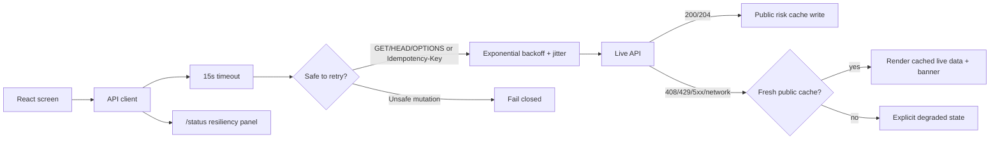

# Application Resilience

AtmosPath does not control WiFi, cellular handoff, or native OS networking.
Those decisions belong to iOS, Android, Windows, macOS, and the browser. The
product reliability layer therefore focuses on the part a web SaaS can own:
safe retries, bounded timeouts, stale public-data fallback, user-visible network
state, and operator-visible runtime evidence.

## Runtime Contract



## Implemented Behavior

- Public live-data reads retry transient network, timeout, `408`, `429`, and
  `5xx` failures with exponential backoff and jitter.
- Mutating requests are not retried unless the request carries an
  `Idempotency-Key`.
- Public risk feeds use a bounded stale cache:
  - `risk:national`
  - `risk:weather-snapshot`
  - `risk:weather-raster`
- Stale cache entries are limited to 30 minutes and 512 KB per item.
- Authenticated `/me/**` data is not cached for offline use.
- API timeouts, network failures, retry counts, stale fallback counts, and last
  successful API activity are stored in session-scoped frontend telemetry.
- A top-level connection banner explains offline, slow-network, and stale-data
  modes to users.
- `/status` exposes API resiliency evidence alongside source health,
  performance metrics, and client issue logs.

## Why This Matters

For a weather-risk navigation product, blank screens are not acceptable when a
single provider is slow. At the same time, pretending old data is live is worse.
This layer keeps the app usable while labeling stale data clearly and avoiding
unsafe replay of user mutations.

The design is intentionally conservative:

- Public, low-sensitivity risk snapshots can be cached briefly.
- Private saved routes, saved places, account data, and tokens are never stored
  in the stale cache.
- User-initiated aborts, such as changing a search query, do not retry in the
  background.
- Retry telemetry is observable without logging secrets or provider payloads.

## Verification

Playwright covers the two core contracts:

- a transient `503` on `GET /risk/national` is retried and recovers without
  degrading the app;
- a failed public risk source can render a fresh cached snapshot while showing a
  user-visible stale-data banner and `/status` evidence.

Run:

```powershell
npm run test:e2e --prefix web
```
