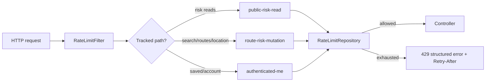

# Backend Production Hardening

This document tracks practical backend controls that make AtmosPath reviewable
as an operations-ready Spring service, not just a demo UI.

## Current Backend Controls

| Area | Implementation | Evidence |
| --- | --- | --- |
| Auth boundary | Cognito JWT resource server path for `/api/v1/me/**` | `SecurityConfig`, controller tests |
| Ownership | Saved data is keyed by authenticated user and conditionally deleted | DynamoDB repository tests |
| Service boundary | Saved-route create/update/refresh/history orchestration lives outside controllers | `SavedRouteServiceTests` |
| Idempotency | Mutation retries use tenant-scoped hashed `Idempotency-Key` records | `IdempotencyService`, DynamoDB tests |
| Quotas | Plan and usage limits enforce route/search/location/saved capacity | `EntitlementServiceTests` |
| Quota-denial metrics | Daily and capacity quota denials are counted by feature, plan, and boundary | `atmospath.quota.denials` |
| Rate limiting | Spring filter applies fixed-window limits before expensive route/risk calls | `RateLimitFilterTests` |
| Optional Redis | `RATE_LIMIT_STORE=redis` switches rate counters from in-memory to Redis | `RedisRateLimitRepository` |
| Metrics | Rate-limit allow/deny outcomes are counted by bucket | `atmospath.rate_limit.requests` |
| Saved-route metrics | Saved-route command outcomes count create/update/delete/refresh/idempotency hits | `atmospath.saved_route.commands` |
| Request tracing | `X-Request-Id` is propagated through responses and error envelopes | `RequestIdFilterTests` |
| Origin protection | CloudFront origin verification rejects direct origin traffic when configured | `OriginVerificationFilterTests` |
| Structured errors | API errors include code, message, requestId, and safe details | `GlobalApiExceptionHandler` |

## Rate Limit Design

The default preview uses an in-memory fixed-window repository so the deployed
portfolio environment does not require an always-on Redis bill. The interface is
designed so production traffic can move to Redis without changing controller
code.



Defaults:

- public risk reads: 180 requests/minute
- route/search/location calls: 30 requests/minute
- authenticated `/me/**` calls: 90 requests/minute
- window: 1 minute
- metric: `atmospath.rate_limit.requests{bucket,outcome}`

Configuration:

```text
RATE_LIMIT_ENABLED=true
RATE_LIMIT_STORE=memory
RATE_LIMIT_STORE=redis
RATE_LIMIT_PUBLIC_READ_PER_MINUTE=180
RATE_LIMIT_MUTATION_PER_MINUTE=30
RATE_LIMIT_AUTHENTICATED_MUTATION_PER_MINUTE=90
RATE_LIMIT_WINDOW=PT1M
```

## Next Backend Hardening Slices

1. Add a non-default local PostgreSQL/JPA or Testcontainers slice only when the
   team wants relational transaction exercises in CI. The deployed preview
   already has a PostGIS/RLS migration path and keeps DynamoDB as the low-cost
   operational store.
2. Add an in-flight idempotency lock state if cloud load tests show parallel
   duplicate mutation races. Sequential retry dedupe and saved-route capacity
   gates are covered today by service tests.
3. Move larger multi-stop optimization runs behind an async job API before
   raising cloud stress-test concurrency.

The roadmap intentionally avoids enabling always-on Kubernetes, Aurora, or
managed Redis in the default preview environment.
