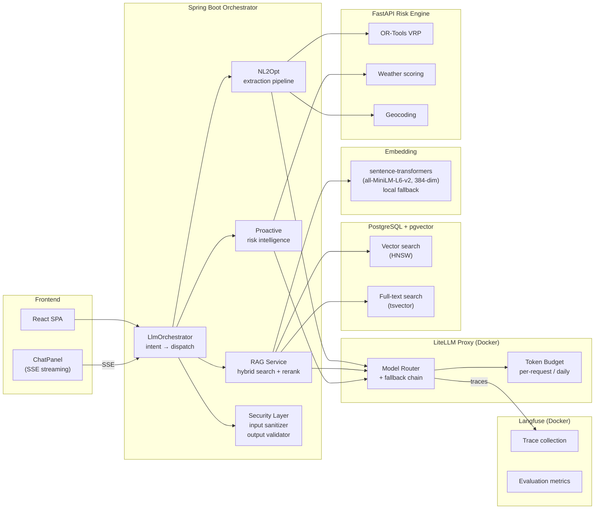
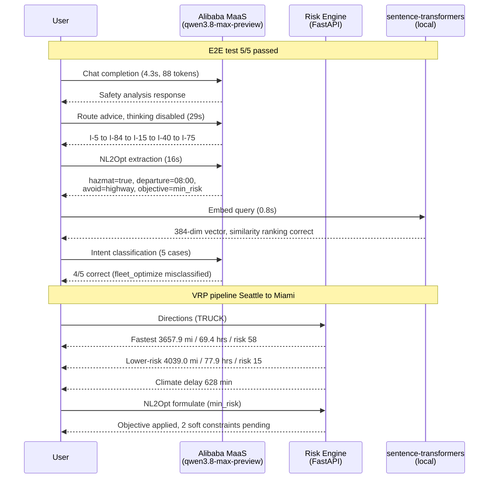
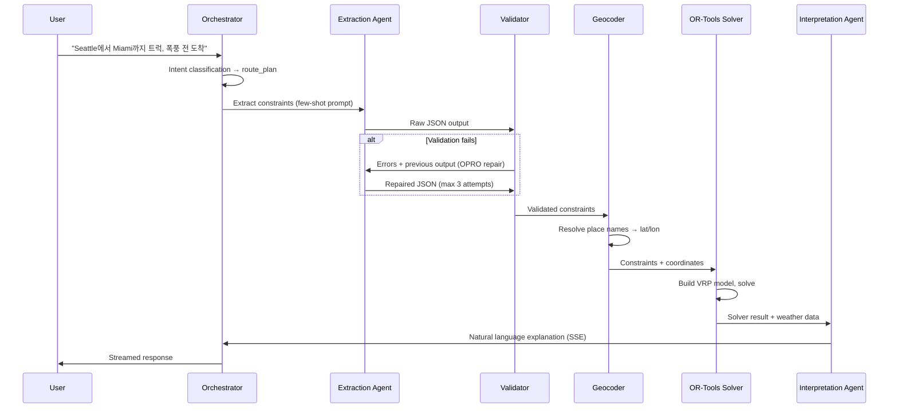
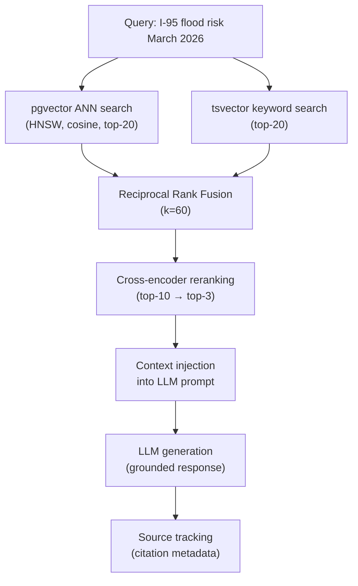
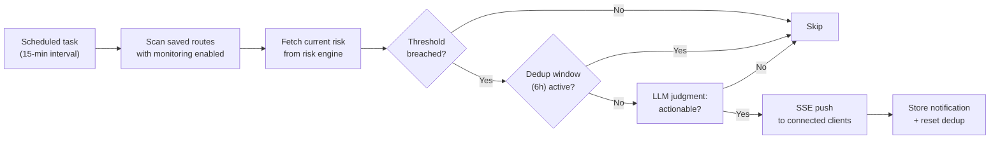
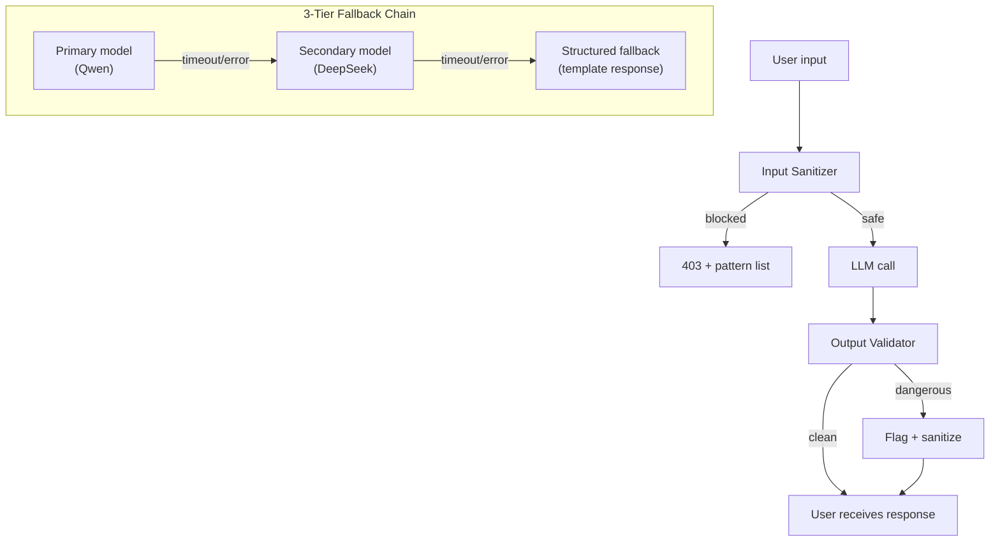

# LLM Integration Architecture

This document describes how AtmosPath integrates large language models
for natural-language route planning, retrieval-augmented explanations,
and proactive risk intelligence. The design follows the OptiMUS
multi-agent pattern (Stanford, 2024) with OPRO-style repair loops
(DeepMind, ICLR 2024).

Last verified: 2026-07-26 (E2E API test 5/5 passed, VRP pipeline demo
Seattle to Miami completed). See [TEST-RESULTS](../llm/TEST-RESULTS.md).

---

## System Overview

### Verified end-to-end flow (2026-07-26)

---

## NL2Opt Pipeline

The NL2Opt (Natural Language to Optimization) pipeline translates user
messages into structured VRP constraints, solves them, and interprets
results back into natural language.

### Extraction details

- **Prompt template**: `nl2opt_extraction.yaml` with 15 few-shot examples
  covering weather, hazmat, time windows, multi-stop, and Korean input.
- **Schema**: `VrpConstraintSchema.JSON_SCHEMA` defines 20+ constraint
  types (stops, vehicle, departure/arrival, soft/hard constraints).
- **Repair loop**: OPRO pattern. On validation failure, the error list
  and previous output are appended to the conversation. The LLM sees
  its own mistake and corrects it. Max 3 attempts.
- **Geocoding**: After extraction, place names are resolved via the
  risk engine's `/places/search` endpoint (Nominatim-backed).

### Multi-turn context

The `ConversationContextService` maintains per-session constraint state.
Modification requests ("2시간 뒤에 출발하면?") are merged with previous
constraints via `ConstraintDiff`, so the LLM only needs to extract the
delta, not the full route specification.

---

## RAG Pipeline

Retrieval-Augmented Generation grounds LLM explanations in historical
route observations, preventing hallucinated risk statistics.

### Components

| Component | Implementation | Purpose |
| --- | --- | --- |
| `EmbeddingService` | Alibaba MaaS embedding API | Query and document embedding (384-dim) |
| `VectorSearchRepository` | pgvector HNSW (m=16, ef=64) | Approximate nearest neighbor search |
| `HybridSearchService` | RRF fusion of vector + keyword | Combines semantic and exact-match signals |
| `CrossEncoderReranker` | LLM-based reranking prompt | Fine-grained relevance judgment |
| `SourceTracker` | Citation metadata attachment | Links response claims to source documents |
| `RagService` | Orchestrates the full pipeline | Query → search → rerank → generate → cite |

### Why hybrid search

Pure vector search misses exact terms ("I-95" may not embed close to
"Interstate 95"). Pure keyword search misses semantic similarity
("road was underwater" should match "flood inundation"). Hybrid search
with RRF covers both failure modes without learned weights.

---

## Proactive Intelligence

The LLM judgment layer filters noise: not every threshold breach
warrants a user notification. The LLM assesses severity, time
sensitivity, and user context before deciding to push.

---

## Security Layers

### Input sanitizer (`LlmInputSanitizer`)

- Length check (max 2000 chars)
- Known injection pattern detection (English, Korean, Chinese, JSON)
- Control character stripping (preserves Korean, punctuation, newlines)

### Output validator (`LlmOutputValidator`)

- Dangerous driving advice detection (flood, speed limit, traffic laws)
- PII masking (phone, email, SSN patterns → `[REDACTED]`)
- URL stripping (LLM should not generate links)
- Length truncation (max 5000 chars)
- Control character rejection

### Fallback chain (`LlmFallbackChain`)

1. Primary model (Qwen via LiteLLM)
2. Secondary model (DeepSeek via LiteLLM)
3. Structured fallback (template-based response, no LLM)

Each tier has independent timeout and error handling. The fallback
chain is transparent to the orchestrator.

---

## Token Budget Management

`LlmTokenBudgetService` enforces per-request and daily token limits:

| Plan | Per-request max | Daily max |
| --- | --- | --- |
| FREE | 2,000 tokens | 10,000 tokens |
| PRO | 8,000 tokens | 100,000 tokens |
| TEAM | 16,000 tokens | 500,000 tokens |

Budget tracking uses Redis counters (falls back to in-memory for
single-instance). The budget check happens before the LLM call;
exceeding the limit returns a structured quota error without
consuming tokens.

---

## Evaluation Methodology

### NL2Opt benchmark

- **50 scenarios** across 5 categories: simple_route, multi_stop,
  modification, fleet, weather_specific
- **Metrics**: constraint precision, recall, F1, geocoding accuracy,
  repair rate
- **Baselines**: (a) few-shot LLM, (b) zero-shot LLM, (c) keyword
- **Target**: F1 > 0.85

### RAG golden set

- **30 scenarios** with expected keywords and minimum relevance
- **Metrics**: recall@k, MRR, NDCG@5
- **A/B comparison**: with RAG vs. without RAG (specificity, citations)

### Conversation E2E

- **20 multi-turn scenarios** testing intent classification, constraint
  modification, and context retention across turns
- **Categories**: route planning, modification, comparison, explanation,
  fleet planning

### Safety evaluation

- Prompt injection: 6+ attack vectors (English, Korean, Chinese, JSON,
  nested, over-length)
- Output safety: PII masking, dangerous advice, URL stripping
- Pipeline: combined input→output flow verification

---

## Scaling Considerations

| Concern | Current | Scale path |
| --- | --- | --- |
| LLM throughput | Single LiteLLM proxy | Horizontal proxy replicas behind ALB |
| Token budget | Redis counters | Already distributed |
| Vector search | pgvector HNSW, single instance | Dedicated vector DB at >1M vectors |
| SSE connections | Single Spring instance | Sticky sessions or Redis pub/sub fan-out |
| Embedding generation | Synchronous per-query | Batch pre-computation for corpus updates |
| Proactive scan | Sequential route scan | Parallel scan with virtual threads |

The architecture is designed for single-instance operation at preview
scale (~100 concurrent users) with documented scale paths for each
component. No component requires a rewrite to scale; each has a
horizontal or managed-service upgrade path.

---

## Key Decisions

- [ADR-0016](../adr/0016-rag-hybrid-search.md): RAG with hybrid search
- [ADR-0017](../adr/0017-nl2opt-agent-design.md): NL2Opt agent design
- [ADR-0018](../adr/0018-proactive-risk-intelligence.md): Proactive risk intelligence

---

## Actual Test Results (2026-07-26)

Full details in [docs/llm/TEST-RESULTS.md](../llm/TEST-RESULTS.md).

### E2E API test (`scripts/test_llm_e2e.py`)

Model: `qwen3.8-max-preview` via Alibaba Cloud MaaS (OpenAI-compatible).

| Test | Result | Latency | Details |
|------|--------|---------|---------|
| Chat Completion | PASS | 4.3s | 88 tokens |
| Route Advice | PASS | 29s | I-5, I-84, I-15, I-40, I-75 |
| NL2Opt Extraction | PASS | 16s | hazmat=true, departure=08:00, avoid=highway |
| Local Embedding | PASS | 0.8s | 384-dim, similarity ranking correct |
| Intent Classification | PASS | 4/5 | fleet_optimize misclassified as route_plan |

### VRP pipeline demo (`scripts/test_vrp_pipeline.py`)

Seattle to Miami, TRUCK, objective `min_risk`:

| Route | Distance | Duration | Risk |
|-------|----------|----------|------|
| Fastest | 3,657.9 mi | 69.4 hrs | 58/100 |
| Lower weather risk | 4,039.0 mi | 77.9 hrs | 15/100 |

Climate delay: 628 min. NL2Opt formulation applied `objective=min_risk`;
2 soft constraints (`arrive_before`, `avoid`) extracted but pending
translator mapping.

---

## Known Gaps

| Gap | Impact | Mitigation |
|-----|--------|------------|
| `arrive_before` and `avoid` soft constraint types not mapped in `constraint_translators.py` | LLM extracts them correctly, but the VRP solver ignores them | Mapped types: `time_window`, `priority_stop`, `avoid_corridor`, `weather_deadline`, `hazmat`, `capacity`. Add translators for the two missing types. |
| Embedding API not available on Alibaba token plan | Cannot use `text-embedding-v3` via MaaS | Using local `sentence-transformers` (`all-MiniLM-L6-v2`, 384-dim). Works for dev/preview scale. |
| `qwen3.8-max-preview` thinking mode causes slow responses | 30-60s latency with thinking enabled | Set `enable_thinking=false` in `extra_body`, or use a faster model for latency-sensitive paths. |
| Multi-stop `RouteStop` requires `stop_id` field | Pipeline test must supply explicit stop IDs | Generate UUIDs in the NL2Opt formulation layer before calling the VRP solver. |
| Intent classification: `fleet_optimize` misclassified as `route_plan` | 4/5 accuracy on intent test | Add more fleet-specific few-shot examples to `intent_classification.yaml`. |
