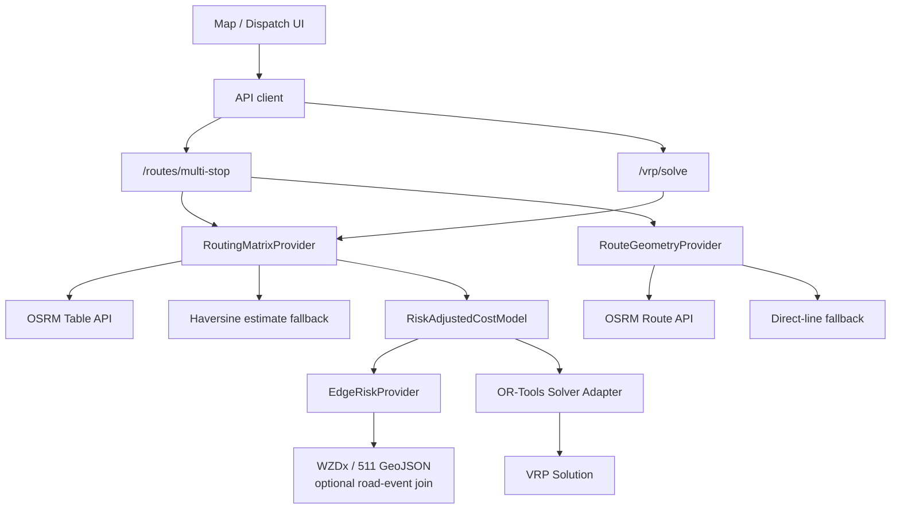

# Route Engine and VRP Foundation

Date: 2026-07-07

## Objective

AtmosPath route planning is moving from a single A-to-B weather-aware route
comparison into a risk-aware route engine:

- ordered multi-stop route evaluation
- optimized single-driver stop order
- multi-vehicle VRP dispatch solving
- risk-adjusted edge costs
- future ML shadow-cost evaluation

The route engine should not become a Google Maps clone. The product value is
risk-aware planning: road time, weather exposure, flood/alert risk, closures,
constraints, and clear explanations.

## Current Slice

This slice introduces:

- `POST /routes/multi-stop`
- `POST /routes/multi-stop/optimize`
- `POST /vrp/solve`
- `services/api/app/vrp/` as the new backend route-engine boundary
- OSRM Table-compatible matrix provider with estimated fallback
- route geometry provider with estimated fallback
- risk-adjusted cost matrix
- configurable WZDx/511 GeoJSON road-event edge-risk join
- OR-Tools solver adapter for baseline CVRP

## Architecture

## Provider Rules

- Live provider failures must not create fake-live data.
- Fallbacks are allowed for preview continuity, but must be marked
  `ESTIMATED` or `UNAVAILABLE`.
- Public OSRM is acceptable for local/demo previews only. Production should use
  self-hosted OSRM, Valhalla, GraphHopper, or a paid routing matrix provider.
- Road-event joins are disabled unless `VRP_ROAD_EVENT_FEED_URLS` is configured;
  no fake incidents are invented when feeds are absent.
- ML cannot directly choose route sequence in the first implementation. ML can
  predict edge delay/risk in shadow mode after benchmark evidence exists.

## Future Slices

1. Add frontend MultiStopPlannerPage and DispatchOptimizerPage.
2. Add state-specific WZDx/511 feed adapters and freshness weighting.
3. Add VRP persistence tables for scenario, solution, and edge observations.
4. Add service durations and time windows to OR-Tools dimensions.
5. Add Peachtree synthetic benchmark runner.
6. Add ML shadow edge cost model behind a feature flag.
