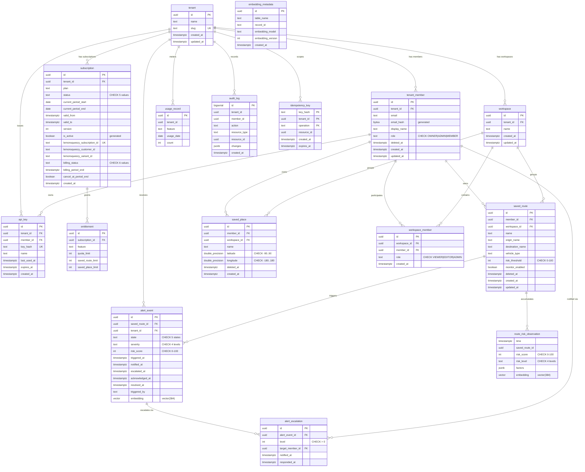

# Data Dictionary

Final schema after Flyway migrations V001-V017. Source of truth:
`services/platform-api/src/main/resources/db/migration/`.

Engine: PostgreSQL 16 + TimescaleDB + pgvector + pg_trgm + btree_gist.

---

## Entity Relationship Diagram

---

## Domain: Tenancy

### tenant

**Purpose.** Root multi-tenant identity; every row in the system hangs from a tenant.

| Column | Type | Null | Default | Constraints |
|--------|------|------|---------|-------------|
| `id` | UUID | NO | `gen_random_uuid()` | PK |
| `name` | TEXT | NO | | |
| `slug` | TEXT | NO | | UNIQUE |
| `created_at` | TIMESTAMPTZ | NO | `now()` | |
| `updated_at` | TIMESTAMPTZ | NO | `now()` | trigger-maintained |

**Indexes.**

| Name | Columns | Type | Purpose |
|------|---------|------|---------|
| `tenant_pkey` | `id` | btree | PK |
| `tenant_slug_key` | `slug` | btree UNIQUE | URL-safe lookup |

**RLS.** `tenant_isolation`: `id = current_tenant_id()`.

**Row growth.** Low (one row per organization).

---

### tenant_member

**Purpose.** A user's membership in a tenant with RBAC role and soft-delete.

| Column | Type | Null | Default | Constraints |
|--------|------|------|---------|-------------|
| `id` | UUID | NO | `gen_random_uuid()` | PK |
| `tenant_id` | UUID | NO | | FK -> tenant(id) ON DELETE CASCADE |
| `email` | TEXT | NO | | |
| `email_hash` | BYTEA | NO | | GENERATED ALWAYS AS `digest(lower(email), 'sha256')` STORED |
| `display_name` | TEXT | YES | | |
| `role` | TEXT | NO | `'MEMBER'` | CHECK IN ('OWNER','ADMIN','MEMBER') |
| `deleted_at` | TIMESTAMPTZ | YES | | soft-delete |
| `created_at` | TIMESTAMPTZ | NO | `now()` | |
| `updated_at` | TIMESTAMPTZ | NO | `now()` | trigger-maintained |

**Indexes.**

| Name | Columns | Type | Purpose |
|------|---------|------|---------|
| `tenant_member_pkey` | `id` | btree | PK |
| `uq_tenant_member_active_email` | `(tenant_id, email) WHERE deleted_at IS NULL` | btree UNIQUE partial | one active membership per email per tenant |
| `uq_tenant_member_active_email_hash` | `(tenant_id, email_hash) WHERE deleted_at IS NULL` | btree UNIQUE partial | PII-safe duplicate check (V016) |
| `idx_tenant_member_tenant_id` | `(tenant_id) WHERE deleted_at IS NULL` | btree partial | active members by tenant |
| `idx_tenant_member_tenant_fk` | `(tenant_id)` | btree | FK cascade index (covers soft-deleted rows) |
| `idx_tenant_member_tenant_role` | `(tenant_id, role) WHERE deleted_at IS NULL` | btree partial | AlertEscalationService.firstMemberInRole() |

**RLS.** `tenant_member_isolation`: `tenant_id = current_tenant_id()`.

**Row growth.** Low-medium (few members per tenant).

---

### workspace

**Purpose.** Logical grouping of saved routes/places within a tenant.

| Column | Type | Null | Default | Constraints |
|--------|------|------|---------|-------------|
| `id` | UUID | NO | `gen_random_uuid()` | PK |
| `tenant_id` | UUID | NO | | FK -> tenant(id) ON DELETE CASCADE |
| `name` | TEXT | NO | | |
| `created_at` | TIMESTAMPTZ | NO | `now()` | |
| `updated_at` | TIMESTAMPTZ | NO | `now()` | trigger-maintained |

**Indexes.**

| Name | Columns | Type | Purpose |
|------|---------|------|---------|
| `workspace_pkey` | `id` | btree | PK |
| `idx_workspace_tenant_id` | `(tenant_id)` | btree | list workspaces per tenant |

**RLS.** `workspace_isolation`: `tenant_id = current_tenant_id()`.

**Row growth.** Low.

---

### workspace_member

**Purpose.** Join table granting a tenant_member access to a workspace with a role.

| Column | Type | Null | Default | Constraints |
|--------|------|------|---------|-------------|
| `id` | UUID | NO | `gen_random_uuid()` | PK |
| `workspace_id` | UUID | NO | | FK -> workspace(id) ON DELETE CASCADE |
| `member_id` | UUID | NO | | FK -> tenant_member(id) ON DELETE CASCADE |
| `role` | TEXT | NO | `'VIEWER'` | CHECK IN ('VIEWER','EDITOR','ADMIN') |
| `created_at` | TIMESTAMPTZ | NO | `now()` | |

**Indexes.**

| Name | Columns | Type | Purpose |
|------|---------|------|---------|
| `workspace_member_pkey` | `id` | btree | PK |
| `workspace_member_workspace_id_member_id_key` | `(workspace_id, member_id)` | btree UNIQUE | one membership per member per workspace |
| `idx_workspace_member_member_id` | `(member_id)` | btree | find workspaces for a member |

**RLS.** `workspace_member_isolation`: EXISTS join through workspace.tenant_id.

**Row growth.** Low.

---

## Domain: Subscription / Billing

### subscription

**Purpose.** Temporal subscription versions; one active row per tenant (valid_to = infinity).

| Column | Type | Null | Default | Constraints |
|--------|------|------|---------|-------------|
| `id` | UUID | NO | `gen_random_uuid()` | PK |
| `tenant_id` | UUID | NO | | FK -> tenant(id) ON DELETE CASCADE |
| `plan` | TEXT | NO | `'FREE'` | |
| `status` | TEXT | NO | `'TRIAL'` | CHECK IN ('TRIAL','ACTIVE','PAST_DUE','GRACE','CANCELLED') |
| `current_period_start` | DATE | YES | | |
| `current_period_end` | DATE | YES | | CHECK >= current_period_start |
| `valid_from` | TIMESTAMPTZ | NO | `now()` | |
| `valid_to` | TIMESTAMPTZ | NO | `'infinity'` | CHECK >= valid_from |
| `version` | INT | NO | `1` | CHECK >= 1 |
| `is_active` | BOOLEAN | NO | | GENERATED ALWAYS AS `status IN ('TRIAL','ACTIVE','GRACE')` STORED |
| `lemonsqueezy_subscription_id` | TEXT | YES | | |
| `lemonsqueezy_customer_id` | TEXT | YES | | |
| `lemonsqueezy_variant_id` | TEXT | YES | | |
| `billing_status` | TEXT | YES | | CHECK IN ('active','on_trial','paused','past_due','cancelled','expired') |
| `billing_period_end` | TIMESTAMPTZ | YES | | |
| `cancel_at_period_end` | BOOLEAN | NO | `false` | |
| `created_at` | TIMESTAMPTZ | NO | `now()` | |

**Constraints (V016).**

| Name | Type | Rule |
|------|------|------|
| `chk_subscription_period_order` | CHECK | `current_period_end >= current_period_start` |
| `chk_subscription_validity_order` | CHECK | `valid_to >= valid_from` |
| `chk_subscription_version_positive` | CHECK | `version >= 1` |
| `excl_subscription_tenant_active_validity` | EXCLUSION (GiST) | No overlapping `[valid_from, valid_to)` for same tenant WHERE status <> 'CANCELLED' |

**Indexes.**

| Name | Columns | Type | Purpose |
|------|---------|------|---------|
| `subscription_pkey` | `id` | btree | PK |
| `uq_subscription_tenant_active` | `(tenant_id) WHERE valid_to = 'infinity'` | btree UNIQUE partial | one current row per tenant |
| `idx_subscription_tenant_status` | `(tenant_id, status)` | btree | status-filtered lookups |
| `idx_subscription_tenant_validity` | `(tenant_id, valid_to DESC) INCLUDE (status, valid_from, plan)` | btree covering | hot-path temporal lookups, index-only scans |
| `uq_subscription_ls_id` | `(lemonsqueezy_subscription_id) WHERE NOT NULL` | btree UNIQUE partial | Lemon Squeezy webhook dedup |
| `idx_subscription_ls_customer` | `(lemonsqueezy_customer_id) WHERE NOT NULL` | btree partial | customer lookup |
| `excl_subscription_tenant_active_validity` | GiST `(tenant_id, tstzrange(valid_from, valid_to))` | GiST partial | temporal exclusion |

**RLS.** `subscription_isolation`: `tenant_id = current_tenant_id()`.

**Row growth.** Low (one new row per plan change; old rows closed, not deleted).

---

### entitlement

**Purpose.** Feature quota limits granted by a subscription.

| Column | Type | Null | Default | Constraints |
|--------|------|------|---------|-------------|
| `id` | UUID | NO | `gen_random_uuid()` | PK |
| `subscription_id` | UUID | NO | | FK -> subscription(id) ON DELETE CASCADE |
| `feature` | TEXT | NO | | |
| `quota_limit` | INT | NO | `0` | CHECK >= 0 (0 = unlimited) |
| `saved_route_limit` | INT | NO | `5` | CHECK >= 0 |
| `saved_place_limit` | INT | NO | `5` | CHECK >= 0 |

**Indexes.**

| Name | Columns | Type | Purpose |
|------|---------|------|---------|
| `entitlement_pkey` | `id` | btree | PK |
| `idx_entitlement_subscription_id` | `(subscription_id)` | btree | FK lookups |
| `uq_entitlement_sub_feature` | `(subscription_id, feature)` | btree UNIQUE | one entitlement per feature per sub |
| `idx_entitlement_quota_cover` | `(subscription_id, feature) INCLUDE (quota_limit, saved_route_limit, saved_place_limit)` | btree covering | index-only quota checks |

**RLS.** `entitlement_isolation`: EXISTS join through subscription.tenant_id.

**Row growth.** Low.

---

### usage_record

**Purpose.** Daily per-tenant per-feature usage counters. Partitioned by RANGE(usage_date), monthly.

| Column | Type | Null | Default | Constraints |
|--------|------|------|---------|-------------|
| `id` | UUID | NO | `gen_random_uuid()` | PK (composite) |
| `tenant_id` | UUID | NO | | PK (composite) |
| `feature` | TEXT | NO | | PK (composite) |
| `usage_date` | DATE | NO | | PK (composite), partition key |
| `count` | INT | NO | `0` | CHECK >= 0 |

**Primary key.** `(tenant_id, feature, usage_date, id)`.

**Partitioning.** RANGE on `usage_date`, monthly. 12 partitions for 2026 pre-created.
Auto-partition trigger (`trg_usage_record_auto_partition`) creates future months on insert.
Proactive creation via `create_next_usage_partition()` (V017, pg_cron daily).

**Indexes.**

| Name | Columns | Type | Purpose |
|------|---------|------|---------|
| `idx_usage_record_tenant_feature_date` | `(tenant_id, feature, usage_date)` | btree | quota-check queries |
| `idx_usage_record_date_brin` | `(usage_date)` | BRIN | cross-tenant time-range reporting |

**RLS.** `usage_record_isolation`: `tenant_id = current_tenant_id()`.

**Row growth.** High (one row per tenant per feature per day; partitioned).

---

## Domain: Saved Data

### saved_route

**Purpose.** A user's named route with risk monitoring preferences. Soft-deletable.

| Column | Type | Null | Default | Constraints |
|--------|------|------|---------|-------------|
| `id` | UUID | NO | `gen_random_uuid()` | PK |
| `member_id` | UUID | NO | | FK -> tenant_member(id) ON DELETE CASCADE |
| `workspace_id` | UUID | YES | | FK -> workspace(id) ON DELETE SET NULL |
| `name` | TEXT | NO | | |
| `origin_name` | TEXT | YES | | |
| `destination_name` | TEXT | YES | | |
| `vehicle_type` | TEXT | NO | `'car'` | |
| `risk_threshold` | INT | NO | `55` | CHECK BETWEEN 0 AND 100 |
| `monitor_enabled` | BOOLEAN | NO | `true` | |
| `deleted_at` | TIMESTAMPTZ | YES | | soft-delete |
| `created_at` | TIMESTAMPTZ | NO | `now()` | |
| `updated_at` | TIMESTAMPTZ | NO | `now()` | trigger-maintained |

**Indexes.**

| Name | Columns | Type | Purpose |
|------|---------|------|---------|
| `saved_route_pkey` | `id` | btree | PK |
| `uq_saved_route_member_name_active` | `(member_id, name) WHERE deleted_at IS NULL` | btree UNIQUE partial | no duplicate active names |
| `idx_saved_route_member_active` | `(member_id, created_at DESC) WHERE deleted_at IS NULL` | btree partial | list active routes per member |
| `idx_saved_route_workspace` | `(workspace_id) WHERE deleted_at IS NULL AND workspace_id IS NOT NULL` | btree partial | routes in a workspace |
| `idx_saved_route_monitor` | `(member_id) WHERE deleted_at IS NULL AND monitor_enabled = true` | btree partial | monitored routes |
| `idx_saved_route_member_fk` | `(member_id)` | btree | FK cascade (covers soft-deleted) |
| `idx_saved_route_workspace_fk` | `(workspace_id) WHERE workspace_id IS NOT NULL` | btree partial | FK SET NULL cascade (covers soft-deleted) |
| `idx_saved_route_name_trgm` | `name` | GIN (pg_trgm) partial `WHERE deleted_at IS NULL` | fuzzy/autocomplete search |

**RLS.** `saved_route_isolation`: EXISTS join through tenant_member.tenant_id.

**Row growth.** Medium (user-created, bounded by entitlement limits).

---

### saved_place

**Purpose.** A user's named geographic point. Soft-deletable.

| Column | Type | Null | Default | Constraints |
|--------|------|------|---------|-------------|
| `id` | UUID | NO | `gen_random_uuid()` | PK |
| `member_id` | UUID | NO | | FK -> tenant_member(id) ON DELETE CASCADE |
| `workspace_id` | UUID | YES | | FK -> workspace(id) ON DELETE SET NULL |
| `name` | TEXT | NO | | |
| `latitude` | DOUBLE PRECISION | YES | | CHECK BETWEEN -90 AND 90 |
| `longitude` | DOUBLE PRECISION | YES | | CHECK BETWEEN -180 AND 180 |
| `deleted_at` | TIMESTAMPTZ | YES | | soft-delete |
| `created_at` | TIMESTAMPTZ | NO | `now()` | |

**Indexes.**

| Name | Columns | Type | Purpose |
|------|---------|------|---------|
| `saved_place_pkey` | `id` | btree | PK |
| `uq_saved_place_member_name_active` | `(member_id, name) WHERE deleted_at IS NULL` | btree UNIQUE partial | no duplicate active names |
| `idx_saved_place_member_active` | `(member_id, created_at DESC) WHERE deleted_at IS NULL` | btree partial | list active places |
| `idx_saved_place_workspace` | `(workspace_id) WHERE deleted_at IS NULL AND workspace_id IS NOT NULL` | btree partial | places in workspace |
| `idx_saved_place_coords` | `(latitude, longitude) WHERE deleted_at IS NULL` | btree partial | spatial point queries |
| `idx_saved_place_member_fk` | `(member_id)` | btree | FK cascade |
| `idx_saved_place_workspace_fk` | `(workspace_id) WHERE workspace_id IS NOT NULL` | btree partial | FK SET NULL cascade |
| `idx_saved_place_name_trgm` | `name` | GIN (pg_trgm) partial `WHERE deleted_at IS NULL` | fuzzy search |

**RLS.** `saved_place_isolation`: EXISTS join through tenant_member.tenant_id.

**Row growth.** Medium.

---

## Domain: Alerts

### alert_event

**Purpose.** State-machine alert lifecycle (TRIGGERED -> NOTIFIED -> ESCALATED -> ACKNOWLEDGED -> RESOLVED).

| Column | Type | Null | Default | Constraints |
|--------|------|------|---------|-------------|
| `id` | UUID | NO | `gen_random_uuid()` | PK |
| `saved_route_id` | UUID | YES | | FK -> saved_route(id) ON DELETE SET NULL |
| `tenant_id` | UUID | NO | | FK -> tenant(id) ON DELETE CASCADE |
| `state` | TEXT | NO | `'TRIGGERED'` | CHECK IN ('TRIGGERED','NOTIFIED','ESCALATED','ACKNOWLEDGED','RESOLVED') |
| `severity` | TEXT | NO | `'MODERATE'` | CHECK IN ('LOW','MODERATE','HIGH','SEVERE') |
| `risk_score` | INT | YES | | CHECK BETWEEN 0 AND 100 |
| `triggered_at` | TIMESTAMPTZ | NO | `now()` | |
| `notified_at` | TIMESTAMPTZ | YES | | CHECK >= triggered_at |
| `escalated_at` | TIMESTAMPTZ | YES | | CHECK >= triggered_at |
| `acknowledged_at` | TIMESTAMPTZ | YES | | CHECK >= triggered_at |
| `resolved_at` | TIMESTAMPTZ | YES | | CHECK >= triggered_at |
| `triggered_by` | TEXT | NO | `'SYSTEM'` | |
| `embedding` | vector(384) | YES | | pgvector (V013) |

**Indexes.**

| Name | Columns | Type | Purpose |
|------|---------|------|---------|
| `alert_event_pkey` | `id` | btree | PK |
| `idx_alert_event_tenant_state` | `(tenant_id, state) WHERE state NOT IN ('RESOLVED')` | btree partial | open alerts per tenant |
| `idx_alert_event_route` | `(saved_route_id, triggered_at DESC) WHERE saved_route_id IS NOT NULL` | btree partial | alerts per route |
| `idx_alert_event_severity` | `(tenant_id, severity, triggered_at DESC) WHERE state IN ('TRIGGERED','NOTIFIED','ESCALATED')` | btree partial | severity dashboard |
| `idx_alert_event_route_open` | `(saved_route_id, triggered_at DESC) WHERE saved_route_id IS NOT NULL AND state NOT IN ('ACKNOWLEDGED','RESOLVED')` | btree partial | findOpenByRouteId() hot path |
| `idx_alert_tenant_state` | `(tenant_id, state, triggered_at DESC)` | btree | countByTenantIdAndStateAndTriggeredAtAfter |
| `idx_alert_embedding` | `embedding` | HNSW (vector_cosine_ops, m=16, ef_construction=64) | ANN vector search |
| `idx_alert_unembedded` | `(triggered_at) WHERE embedding IS NULL` | btree partial | embedding backfill batches |

**RLS.** `alert_event_isolation`: `tenant_id = current_tenant_id()`.

**Row growth.** Medium-high (one per risk threshold breach per route).

---

### alert_escalation

**Purpose.** Escalation chain entries for an alert event (level 1, 2, 3...).

| Column | Type | Null | Default | Constraints |
|--------|------|------|---------|-------------|
| `id` | UUID | NO | `gen_random_uuid()` | PK |
| `alert_event_id` | UUID | NO | | FK -> alert_event(id) ON DELETE CASCADE |
| `level` | INT | NO | | CHECK > 0 |
| `target_member_id` | UUID | YES | | FK -> tenant_member(id) ON DELETE SET NULL |
| `notified_at` | TIMESTAMPTZ | YES | | |
| `responded_at` | TIMESTAMPTZ | YES | | |

**Indexes.**

| Name | Columns | Type | Purpose |
|------|---------|------|---------|
| `alert_escalation_pkey` | `id` | btree | PK |
| `idx_alert_escalation_event` | `(alert_event_id, level)` | btree | escalation chain per alert |
| `idx_alert_escalation_pending` | `(target_member_id, level) WHERE responded_at IS NULL` | btree partial | pending notifications for a member |
| `idx_alert_escalation_target_fk` | `(target_member_id) WHERE target_member_id IS NOT NULL` | btree partial | FK SET NULL cascade |
| `idx_alert_escalation_event_member_pending` | `(alert_event_id, target_member_id) WHERE responded_at IS NULL` | btree partial | acknowledgeAlert() lookup |

**RLS.** `alert_escalation_isolation`: EXISTS join through alert_event.tenant_id.

**Row growth.** Medium (1-3 per alert event).

---

## Domain: Risk / Observations

### route_risk_observation

**Purpose.** Time-series risk observations per route. TimescaleDB hypertable (7-day chunks).

| Column | Type | Null | Default | Constraints |
|--------|------|------|---------|-------------|
| `time` | TIMESTAMPTZ | NO | | hypertable partition key |
| `saved_route_id` | UUID | NO | | |
| `risk_score` | INT | YES | | CHECK BETWEEN 0 AND 100 |
| `risk_level` | TEXT | YES | | CHECK IN ('LOW','MODERATE','HIGH','SEVERE') |
| `factors` | JSONB | NO | `'{}'` | |
| `embedding` | vector(384) | YES | | pgvector (V013) |

**Hypertable.** `create_hypertable('route_risk_observation', 'time', chunk_time_interval => '7 days')`.

**Policies.**
- Compression: chunks older than 30 days compressed (segmentby `saved_route_id`, orderby `time DESC`).
- Retention: chunks older than 90 days dropped.
- Continuous aggregates: `cagg_risk_hourly`, `cagg_risk_daily` with auto-refresh.

**Indexes (per-chunk).**

| Name | Columns | Type | Purpose |
|------|---------|------|---------|
| `idx_risk_obs_route_time` | `(saved_route_id, time DESC)` | btree | per-route time-series queries |
| `idx_observation_time_route` | `(saved_route_id, time DESC)` | btree | hybrid search filters (V013) |
| `idx_observation_embedding` | `embedding` | HNSW (vector_cosine_ops, m=16, ef_construction=64) | ANN vector search |
| `idx_observation_unembedded` | `(saved_route_id, time) WHERE embedding IS NULL` | btree partial | embedding backfill |
| `idx_observation_time_brin` | `(time)` | BRIN | cross-route time-range scans |
| `idx_observation_factors_tsv` | `to_tsvector('english', factors::text)` | GIN | full-text keyword search |

**RLS.** None (accessed via saved_route join or service role).

**Row growth.** HIGH (multiple observations per route per hour; time-series).

---

### embedding_metadata

**Purpose.** Tracks which embedding model/version produced each record's vector.

| Column | Type | Null | Default | Constraints |
|--------|------|------|---------|-------------|
| `id` | UUID | NO | `gen_random_uuid()` | PK |
| `table_name` | TEXT | NO | | |
| `record_id` | TEXT | NO | | |
| `embedding_model` | TEXT | NO | | |
| `embedding_version` | INT | NO | `1` | CHECK >= 1 |
| `created_at` | TIMESTAMPTZ | NO | `now()` | |

**Indexes.**

| Name | Columns | Type | Purpose |
|------|---------|------|---------|
| `embedding_metadata_pkey` | `id` | btree | PK |
| `embedding_metadata_table_name_record_id_embedding_model_key` | `(table_name, record_id, embedding_model)` | btree UNIQUE | one version per model per record |

**RLS.** None.

**Row growth.** Medium (one per embedded record per model version).

---

## Domain: Audit

### audit_log

**Purpose.** Append-only audit trail. Trigger-based recording on saved_route, saved_place, subscription, alert_event.

| Column | Type | Null | Default | Constraints |
|--------|------|------|---------|-------------|
| `id` | BIGSERIAL | NO | auto | PK |
| `tenant_id` | UUID | YES | | |
| `member_id` | UUID | YES | | |
| `action` | TEXT | NO | | INSERT/UPDATE/DELETE |
| `resource_type` | TEXT | NO | | table name |
| `resource_id` | UUID | YES | | |
| `changes` | JSONB | YES | | old/new row snapshots |
| `created_at` | TIMESTAMPTZ | NO | `now()` | |

**Indexes.**

| Name | Columns | Type | Purpose |
|------|---------|------|---------|
| `audit_log_pkey` | `id` | btree | PK |
| `idx_audit_log_tenant_time` | `(tenant_id, created_at DESC)` | btree | tenant activity feed |
| `idx_audit_log_resource` | `(resource_type, resource_id, created_at DESC)` | btree | resource history |
| `idx_audit_log_member` | `(member_id, created_at DESC) WHERE member_id IS NOT NULL` | btree partial | member activity |
| `idx_audit_log_created_brin` | `(created_at)` | BRIN (pages_per_range=32) | ad-hoc time-range scans |

**RLS.** `audit_log_isolation`: `tenant_id = current_tenant_id()`.

**Row growth.** HIGH (one row per DML on audited tables; append-only).

---

## Domain: Idempotency / Keys

### idempotency_key

**Purpose.** Prevents duplicate mutation processing. TTL-based (24h default), swept by pg_cron.

| Column | Type | Null | Default | Constraints |
|--------|------|------|---------|-------------|
| `key_hash` | TEXT | NO | | PK (composite) |
| `tenant_id` | UUID | NO | | PK (composite) |
| `operation` | TEXT | NO | | PK (composite) |
| `resource_id` | UUID | YES | | |
| `created_at` | TIMESTAMPTZ | NO | `now()` | |
| `expires_at` | TIMESTAMPTZ | NO | `now() + '24 hours'` | CHECK > created_at |

**Primary key.** `(tenant_id, operation, key_hash)`.

**Indexes.**

| Name | Columns | Type | Purpose |
|------|---------|------|---------|
| `idempotency_key_pkey` | `(tenant_id, operation, key_hash)` | btree | PK + lookup |
| `idx_idempotency_key_expires` | `(expires_at)` | btree | TTL sweeper DELETE |
| `idx_idempotency_key_tenant_op` | `(tenant_id, operation, created_at DESC)` | btree | list keys per tenant+operation |

**RLS.** `idempotency_key_isolation`: `tenant_id = current_tenant_id()`.

**Row growth.** Medium (transient; swept every 15 min).

---

### api_key

**Purpose.** Hashed API keys for programmatic access. One key_hash is globally unique.

| Column | Type | Null | Default | Constraints |
|--------|------|------|---------|-------------|
| `id` | UUID | NO | `gen_random_uuid()` | PK |
| `tenant_id` | UUID | NO | | FK -> tenant(id) ON DELETE CASCADE |
| `member_id` | UUID | YES | | FK -> tenant_member(id) ON DELETE SET NULL |
| `key_hash` | TEXT | NO | | UNIQUE |
| `name` | TEXT | YES | | |
| `last_used_at` | TIMESTAMPTZ | YES | | |
| `expires_at` | TIMESTAMPTZ | YES | | CHECK IS NULL OR > created_at |
| `created_at` | TIMESTAMPTZ | NO | `now()` | |

**Indexes.**

| Name | Columns | Type | Purpose |
|------|---------|------|---------|
| `api_key_pkey` | `id` | btree | PK |
| `api_key_key_hash_key` | `key_hash` | btree UNIQUE | auth lookup by hash |
| `idx_api_key_tenant` | `(tenant_id)` | btree | list keys per tenant |
| `idx_api_key_member` | `(member_id) WHERE member_id IS NOT NULL` | btree partial | keys owned by member |
| `idx_api_key_expired` | `(expires_at) WHERE expires_at IS NOT NULL` | btree partial | expiry cleanup |

**RLS.** `api_key_isolation`: `tenant_id = current_tenant_id()`.

**Row growth.** Low.

---

## Materialized Views

### mv_workspace_usage_summary (V012)

Usage per workspace per feature per day. Refreshed every 5 min (pg_cron CONCURRENTLY).

**Indexes.** `uq_mv_workspace_usage (workspace_id, feature, usage_date)` UNIQUE, `idx_mv_workspace_usage_tenant (tenant_id, usage_date DESC)`.

### mv_tenant_risk_summary (V012)

Average/max/min risk per tenant per member per day from observations. Refreshed hourly.

**Indexes.** `uq_mv_tenant_risk (tenant_id, member_id, observation_date)` UNIQUE, `idx_mv_tenant_risk_date (tenant_id, observation_date DESC)`.

### cagg_risk_hourly (V007, TimescaleDB continuous aggregate)

Hourly avg/max/min risk_score per route. Auto-refreshed by TimescaleDB policy.

### cagg_risk_daily (V007, TimescaleDB continuous aggregate)

Daily avg/max/min risk_score per route. Auto-refreshed by TimescaleDB policy.

---

## Extensions

| Extension | Migration | Purpose |
|-----------|-----------|---------|
| `pgcrypto` | V001 | `gen_random_uuid()`, `digest()` for email_hash |
| `timescaledb` | V007 | Hypertables, continuous aggregates, compression, retention |
| `vector` | V013 | pgvector HNSW indexes for ANN search |
| `pg_trgm` | V015 | Trigram GIN indexes for fuzzy text search |
| `btree_gist` | V016 | GiST operator class for exclusion constraint |
| `pg_stat_statements` | V017 | Query performance monitoring |

---

## Stored Functions

| Function | Migration | Purpose |
|----------|-----------|---------|
| `set_updated_at()` | V001 | BEFORE UPDATE trigger: sets `updated_at = now()` |
| `create_usage_partition_if_missing()` | V004 | BEFORE INSERT trigger: auto-creates monthly partition |
| `current_tenant_id()` | V009 | Reads `app.tenant_id` session setting for RLS |
| `audit_trigger_fn()` | V008 | AFTER INSERT/UPDATE/DELETE: writes audit_log |
| `check_and_consume_quota(tenant_id, feature)` | V010 | Atomic quota check + usage increment |
| `transition_alert_state(event_id, new_state)` | V010 | Enforces alert state machine |
| `has_permission(member_id, resource_id, action)` | V010 | RBAC with workspace role inheritance |
| `prorate_subscription(subscription_id, new_plan)` | V010 | Date-proportional credit + version creation |
| `create_next_usage_partition()` | V017 | Proactive current+next month partition creation |
| `archive_audit_log(retain_days)` | V017 | Stub for future S3 cold-archive pipeline |

---

## Views

| View | Migration | Purpose |
|------|-----------|---------|
| `v_query_performance` | V017 | Convenience wrapper over pg_stat_statements (hottest queries) |
