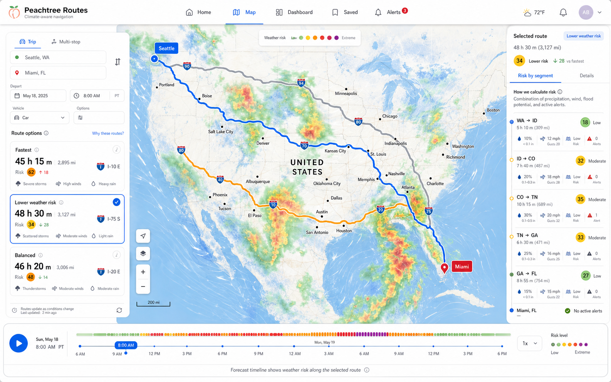
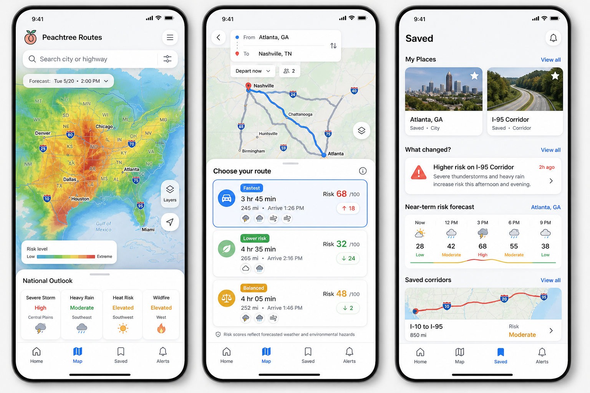
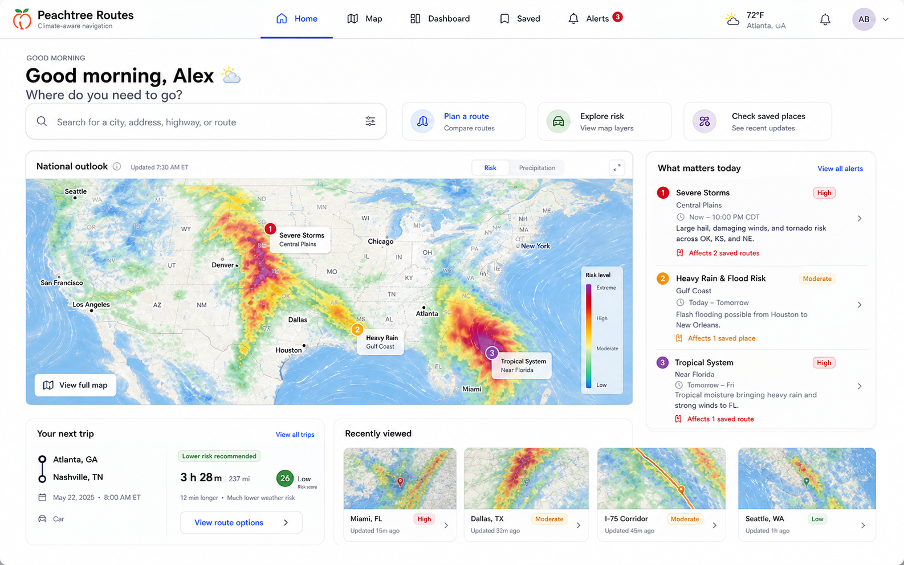
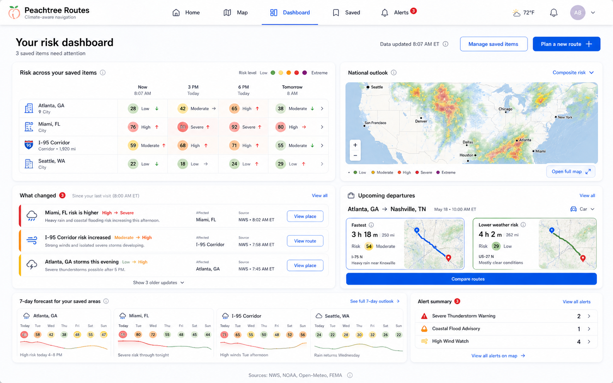
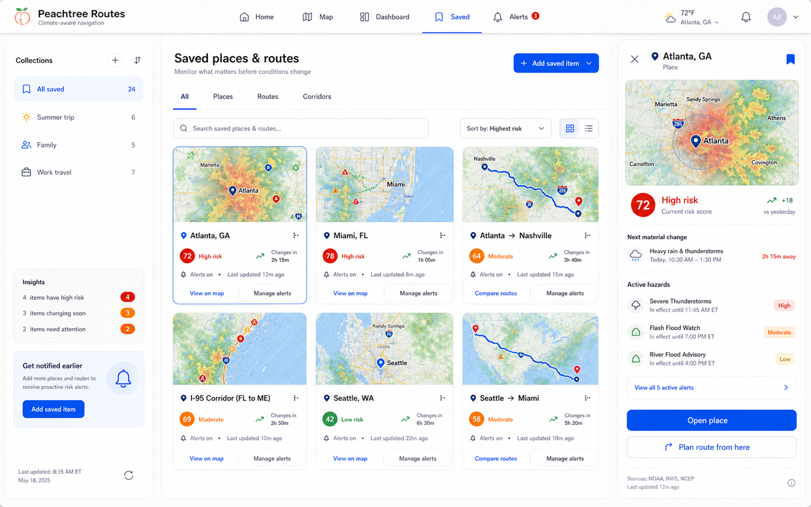
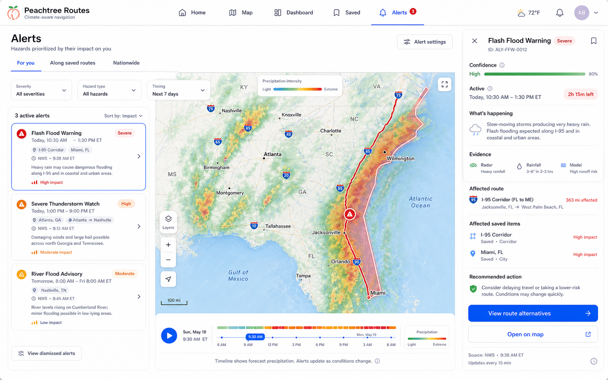
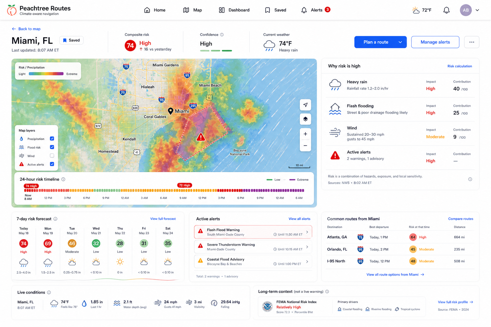

# Generated Concept Review

These generated images are original visual direction references. They are not
production UI and do not replace accessible HTML, responsive behavior, or real
data integration.

## Nationwide Route Compare: Desktop

What works:

- The map is dominant while route alternatives remain easy to compare.
- Fastest, Lower Weather Risk, and Balanced are immediately understandable.
- The selected-route inspector explains risk by segment instead of showing an
  opaque score.
- The bottom forecast timeline connects departure time to changing route risk.
- Navigation makes the product feel multi-page without disrupting the map task.

What to refine before implementation:

- Reduce weather-layer intensity when route geometry needs priority.
- Collapse the right inspector until a route is selected.
- Ensure route colors remain distinguishable from weather-risk colors.
- Define loading, unavailable-data, and no-alternative-route states.

## Cross-Platform Mobile Concepts

What works:

- Explore, route comparison, and saved monitoring are distinct product modes.
- Full-screen map plus bottom sheet is appropriate for touch interaction.
- Route cards communicate the risk/time tradeoff without requiring a dense
  dashboard.
- Saved places and corridors turn weather risk into a repeat-use product.

What to refine before implementation:

- Replace photographic saved-place thumbnails with map previews or owned assets.
- Add bottom-sheet peek, half, and full interaction specifications.
- Define offline, notification-permission, and active-navigation states.
- Keep mobile card density usable with larger accessibility text.

## Approval Recommendation

Use the desktop route-comparison concept and the mobile bottom-sheet interaction
as the primary visual direction. Preserve the Explore and Saved screen concepts
as the basis for the later `/map` and `/dashboard` pages.

## Connected Desktop Service

The following screens extend the approved route-comparison concept into one
connected desktop service. They share the same header, navigation, map
treatment, typography, risk scale, cards, and interaction language.

### Home

- Begins route planning, risk exploration, or saved-place review.
- National outlook and "What matters today" open the Map and Alerts screens.
- The next-trip card opens prefilled route alternatives.

### Dashboard

- Summarizes changes across saved places, routes, and corridors.
- Keeps comparisons and forecasts visual instead of becoming a CRM table.
- Every change and departure opens a specific place, route, or comparison.

### Saved

- Organizes Places, Routes, and Corridors with map-backed cards.
- The contextual drawer exposes the next material change and active hazards.
- Cards open the Map, place detail, route comparison, or alert settings.

### Alerts

- Prioritizes alerts by impact on the user's saved items.
- Connects evidence, affected route miles, recommended action, and alternatives.
- Avoids presenting an undifferentiated government-alert feed.

### Place Detail

- Explains the composite risk score and its contributing hazards.
- Separates live conditions from FEMA long-term context.
- Connects place monitoring to route planning, saved items, and alerts.

## Connected-Service Review

Adopt the complete desktop set as the implementation target. During
implementation:

- Replace all generated dates, locations, and values with live or fixture data.
- Use map previews instead of copyrighted or generated photography.
- Keep the header and risk scale identical across screens.
- Preserve URL-addressable detail states so cards can deep-link correctly.
- Add loading, empty, unavailable-data, and error states before calling a screen
  complete.
- Verify that every visible action has a real destination described in
  `../connected-service-flow.md`.
