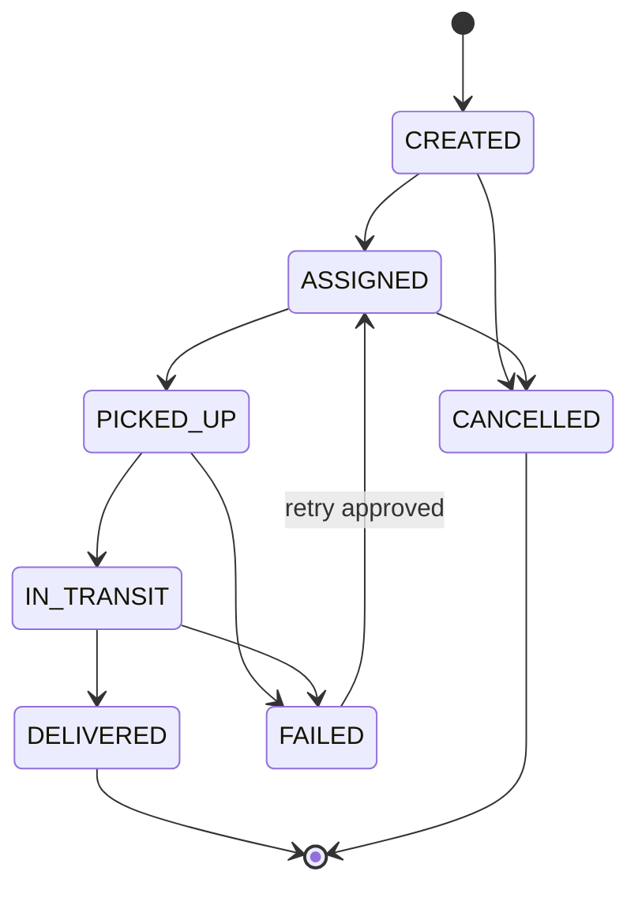

# Domain Model

## Delivery Aggregate

A delivery is the consistency boundary for current state and its event timeline.

```text
Delivery
  deliveryId
  organizationId
  status
  driverId?
  origin
  destination
  promisedAt
  createdAt
  updatedAt
  version
```

The API does not permit clients to overwrite a delivery document directly. Clients submit commands or status events, and the service validates the transition before updating the aggregate.

## Delivery Status State Machine



Invalid transitions return a conflict response and do not publish a domain event.

## Route Vehicle Profiles

The route-planning API supports three request-level vehicle profiles:

| Profile | Optimization behavior |
| --- | --- |
| `CAR` | Baseline road distance, climate penalty, and duration |
| `VAN` | Moderately higher distance, climate sensitivity, and duration factors |
| `TRUCK` | Highest distance, climate sensitivity, and duration factors |

`GET /network?vehicle_type=CAR|VAN|TRUCK` recalculates OR-Tools delivery-network
costs and duration estimates for the selected profile. Nationwide consumer-style
directions use `GET /places/search` and `POST /directions`. The current public
OSRM integration still returns general driving geometry, so truck-specific road
restrictions, vehicle dimensions, and a persistent vehicle registry remain
later-phase work.

## Commands

| Command | Result |
| --- | --- |
| `CreateDelivery` | Creates a delivery in `CREATED` |
| `AssignDriver` | Assigns a driver and transitions to `ASSIGNED` |
| `CancelDelivery` | Transitions an eligible delivery to `CANCELLED` |
| `RecordStatusEvent` | Validates and applies an external status transition |
| `ReplayFailedEvent` | Re-submits a DLQ event with the same idempotency key |
| `GenerateDailyReport` | Starts an on-demand Fargate report task in a later phase |

## Domain Events

| Event | Producer | Consumers |
| --- | --- | --- |
| `DeliveryCreated` | Command API | Audit/event archive |
| `DriverAssigned` | Command API | Notification and audit |
| `DeliveryStatusChanged` | Event worker | Dashboard projection and audit |
| `DeliveryFailed` | Event worker | Exception workflow and alarm metric |
| `DeliveryDelivered` | Event worker | Reporting and audit |

All domain events include:

- `eventId`
- `eventType`
- `eventVersion`
- `organizationId`
- `deliveryId`
- `occurredAt`
- `correlationId`
- `causationId`
- `source`

## API Boundary

| Method | Path | Purpose |
| --- | --- | --- |
| `POST` | `/deliveries` | Create delivery |
| `GET` | `/deliveries/{deliveryId}` | Get delivery and timeline |
| `GET` | `/deliveries?status=&driverId=&promisedDate=` | Query one supported list access pattern |
| `POST` | `/deliveries/{deliveryId}/assignments` | Assign driver |
| `POST` | `/deliveries/{deliveryId}/events` | Submit idempotent external status event |
| `POST` | `/operations/replays` | Replay a selected failed event |

The MVP intentionally avoids generic filtering endpoints because every DynamoDB query must map to an explicit access pattern.
