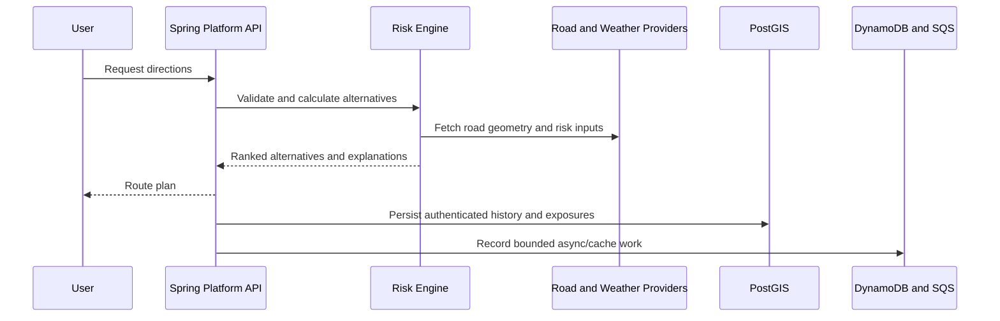

# AtmosPath Domain Model

## Core Concepts

| Concept | Responsibility |
| --- | --- |
| `RoutePlan` | One origin/destination request and its ranked route alternatives |
| `RouteAlternative` | Road geometry, time, distance, risk score, confidence, and explanations |
| `RiskExposure` | Evidence that a route or saved item overlaps a weather or hazard signal |
| `WeatherSnapshot` | Time-bounded national or regional model output with provenance |
| `SavedItem` | A user-owned place, route, or corridor |
| `AlertSubscription` | A user's threshold and hazard-category preferences for a saved item |

## Risk Contract

A risk score is never stored or returned without context:

- score from `0..100`;
- risk model version;
- source/provider status;
- data coverage and confidence;
- observed/generated/expiry timestamps; and
- contributing hazard categories.

`RiskExposure` records connect a score to evidence such as precipitation,
flood, wind, winter weather, wildfire, heat, or an official alert geometry.

## Route Planning Flow

## Public API Boundary

| Method | Path | Purpose |
| --- | --- | --- |
| `GET` | `/places/search?q=` | Search U.S. places |
| `POST` | `/directions` | Compare weather-aware route alternatives |
| `GET` | `/risk/national` | Current national hazard overview |
| `GET` | `/risk/weather-snapshot` | Current weather sample snapshot |
| `GET` | `/risk/weather-raster` | Current raster-layer manifest |
| `POST` | `/risk/location` | Explain risk at one place |

Saved-item and subscription writes remain private until Cognito JWT ownership
is enforced. Delivery, dispatch, and fleet-management endpoints are outside the
AtmosPath product boundary.
