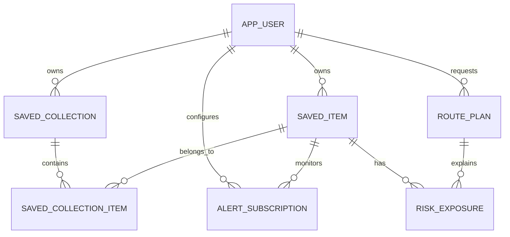

# PostgreSQL/PostGIS Data Model

## Ownership Boundary

PostgreSQL/PostGIS owns durable user-facing records and spatial relationships.
DynamoDB owns only short-lived weather/risk operational jobs, caches,
idempotency, deduplication, and current snapshot metadata.

| Entity | Purpose | Important constraints/indexes |
| --- | --- | --- |
| `app_user` | Projection of an authenticated Cognito user | Unique `auth_subject`; soft deletion |
| `saved_item` | User-owned place, route, or corridor | Owner FK; type/geometry check; GiST indexes |
| `saved_collection` | User-defined grouping | Unique name per user |
| `saved_collection_item` | Ordered many-to-many membership | Composite primary key |
| `alert_subscription` | Risk and hazard notification preferences | Owner/item FKs; enabled index |
| `route_plan` | Persisted route request/result and selected path | Owner/time and selected-path indexes |
| `risk_exposure` | Explainable hazard evidence for a route or saved item | Score checks; source/time provenance; GiST indexes |

## Relationship Diagram

## Spatial Types and Queries

- Places and route endpoints use `GEOGRAPHY(POINT, 4326)`.
- Routes, corridors, selected paths, and overlap paths use
  `GEOGRAPHY(LINESTRING, 4326)`.
- Hazard footprints use `GEOGRAPHY(MULTIPOLYGON, 4326)`.
- GiST indexes support proximity, overlap, and intersection queries in
  real-world meters across the United States.

Representative queries include nearby saved places, routes intersecting an
official alert polygon, and the distance of a selected route exposed to a
hazard footprint.

## Risk Integrity

`risk_exposure` records the hazard category, source event, geometry, overlap,
score, source, model version, timestamps, and provider-specific metadata.
This prevents a route score from becoming an unexplained number.

## Authentication Boundary

`app_user.auth_subject` stores immutable Cognito `sub`. User IDs must come from
a verified JWT claim; clients never choose an arbitrary owner ID. Public
relational writes therefore remain closed until Cognito authorization exists.

## Row Level Security

`V002__tenant_rls_policies.sql` enables and forces PostgreSQL RLS on user-owned
tables. Policies read `app.current_user_id()`, which resolves the transaction
local `app.user_id` setting. Runtime RDS Data API calls set that value before
issuing saved item queries, so both the SQL predicate and the database policy
must agree on the same owner.

Protected tables:

- `app_user`
- `saved_item`
- `saved_collection`
- `saved_collection_item`
- `alert_subscription`
- `route_plan`
- `risk_exposure`

This makes PostGIS a viable future primary store without relying only on
application-side `WHERE user_id = ...` filters.

## Migration Boundary

The current application initializer is suitable only for a disabled-by-default
portfolio foundation. Production enablement should still separate migration
credentials from runtime credentials and run versioned migrations as a
deployment step.
