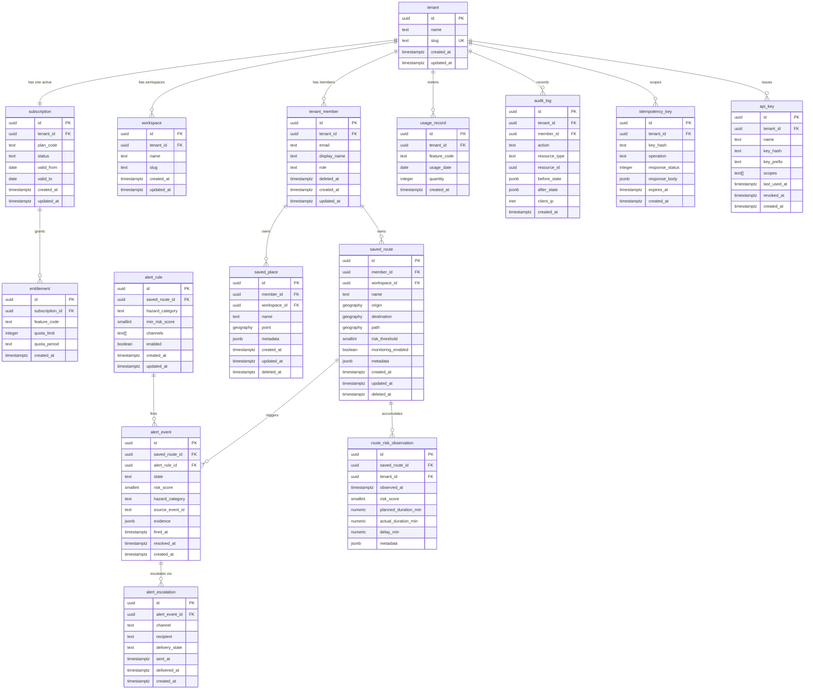

# Production SaaS Relational Data Model

PostgreSQL 16 + TimescaleDB is the system of record for all durable SaaS
entities: tenants, memberships, subscriptions, entitlements, saved assets,
alert lifecycle, usage metering, and audit trails. DynamoDB remains the
operational store for the free-tier preview deployment (zero idle cost); this
document describes the production relational schema that replaces it.

See [ADR-0010](adr/0010-production-data-stack.md) for the decision to adopt
PostgreSQL + TimescaleDB and [ADR-0011](adr/0011-dual-ledger-quota.md) for the
Redis dual-ledger quota design.

---

## Entity Relationship Diagram



---

## Table Reference

### tenant

**Purpose.** Root multi-tenant identity. Every row in the system hangs from a
tenant either directly or through `tenant_member`.

| Column | Type | Constraints |
| --- | --- | --- |
| `id` | `UUID` | PK, default `gen_random_uuid()` |
| `name` | `TEXT` | NOT NULL |
| `slug` | `TEXT` | UNIQUE NOT NULL |
| `created_at` | `TIMESTAMPTZ` | NOT NULL DEFAULT `now()` |
| `updated_at` | `TIMESTAMPTZ` | NOT NULL DEFAULT `now()`, trigger-maintained |

**Indexes.** Unique B-tree on `slug`.

**Partitioning.** None. Cardinality is low (one row per organization).

---

### tenant_member

**Purpose.** A user's membership in a tenant. Supports soft deletion and
role-based access (OWNER, ADMIN, MEMBER).

| Column | Type | Constraints |
| --- | --- | --- |
| `id` | `UUID` | PK |
| `tenant_id` | `UUID` | FK → `tenant(id)` ON DELETE CASCADE |
| `email` | `TEXT` | NOT NULL |
| `display_name` | `TEXT` | nullable |
| `role` | `TEXT` | NOT NULL DEFAULT `'MEMBER'`, CHECK IN (`OWNER`, `ADMIN`, `MEMBER`) |
| `deleted_at` | `TIMESTAMPTZ` | nullable, soft delete |
| `created_at` / `updated_at` | `TIMESTAMPTZ` | trigger-maintained |

**Indexes.**
- Partial unique on `(tenant_id, email) WHERE deleted_at IS NULL` — one active
  membership per email per tenant.
- Partial B-tree on `(tenant_id) WHERE deleted_at IS NULL`.

**Partitioning.** None.

---

### workspace

**Purpose.** Logical grouping of saved assets within a tenant. The FREE plan
gets one implicit workspace; TEAM plans can create multiple.

| Column | Type | Constraints |
| --- | --- | --- |
| `id` | `UUID` | PK |
| `tenant_id` | `UUID` | FK → `tenant(id)` ON DELETE CASCADE |
| `name` | `TEXT` | NOT NULL |
| `slug` | `TEXT` | NOT NULL |
| `created_at` / `updated_at` | `TIMESTAMPTZ` | trigger-maintained |

**Indexes.** Unique on `(tenant_id, slug)`.

**Partitioning.** None.

---

### subscription (temporal)

**Purpose.** The tenant's plan subscription with bitemporal validity. Only one
row per tenant may have `status = 'ACTIVE'` at any time; plan changes insert a
new row and close the previous one (`valid_to`).

| Column | Type | Constraints |
| --- | --- | --- |
| `id` | `UUID` | PK |
| `tenant_id` | `UUID` | FK → `tenant(id)` ON DELETE CASCADE |
| `plan_code` | `TEXT` | NOT NULL, CHECK IN (`FREE`, `PRO`, `TEAM`, `INTERNAL`) |
| `status` | `TEXT` | NOT NULL DEFAULT `'ACTIVE'`, CHECK IN (`ACTIVE`, `CANCELLED`, `EXPIRED`, `PAST_DUE`) |
| `valid_from` | `DATE` | NOT NULL |
| `valid_to` | `DATE` | nullable (NULL = open-ended) |
| `created_at` / `updated_at` | `TIMESTAMPTZ` | trigger-maintained |

**Indexes.**
- Partial unique on `(tenant_id) WHERE status = 'ACTIVE'` — at most one active
  subscription per tenant.
- B-tree on `(tenant_id, valid_from DESC)` for history queries.

**Partitioning.** None. Low cardinality.

**Temporal contract.** Application code never UPDATEs `plan_code` in place.
Plan changes call `change_subscription_plan()`, which sets `valid_to` on the
current row and inserts the successor in a single transaction.

---

### entitlement

**Purpose.** Materialized quota limits derived from the subscription's plan.
One row per (subscription, feature) pair.

| Column | Type | Constraints |
| --- | --- | --- |
| `id` | `UUID` | PK |
| `subscription_id` | `UUID` | FK → `subscription(id)` ON DELETE CASCADE |
| `feature_code` | `TEXT` | NOT NULL (e.g. `ROUTE_PLAN`, `SAVED_ROUTE`, `PLACE_SEARCH`) |
| `quota_limit` | `INTEGER` | NOT NULL CHECK `>= 0` |
| `quota_period` | `TEXT` | NOT NULL, CHECK IN (`DAILY`, `CAPACITY`, `MONTHLY`) |
| `created_at` | `TIMESTAMPTZ` | NOT NULL DEFAULT `now()` |

**Indexes.** Unique on `(subscription_id, feature_code)`.

**Partitioning.** None.

---

### saved_route

**Purpose.** A member's persisted route with monitoring configuration. Replaces
the DynamoDB `SAVED_ROUTE#{id}` access pattern.

| Column | Type | Constraints |
| --- | --- | --- |
| `id` | `UUID` | PK |
| `member_id` | `UUID` | FK → `tenant_member(id)` ON DELETE CASCADE |
| `workspace_id` | `UUID` | FK → `workspace(id)` ON DELETE SET NULL |
| `name` | `TEXT` | NOT NULL |
| `origin` | `GEOGRAPHY(POINT, 4326)` | NOT NULL |
| `destination` | `GEOGRAPHY(POINT, 4326)` | NOT NULL |
| `path` | `GEOGRAPHY(LINESTRING, 4326)` | nullable |
| `risk_threshold` | `SMALLINT` | DEFAULT 55, CHECK 0-100 |
| `monitoring_enabled` | `BOOLEAN` | NOT NULL DEFAULT `false` |
| `metadata` | `JSONB` | NOT NULL DEFAULT `'{}'` |
| `created_at` / `updated_at` / `deleted_at` | `TIMESTAMPTZ` | soft delete |

**Indexes.**
- Partial B-tree on `(member_id, updated_at DESC) WHERE deleted_at IS NULL`.
- GiST on `path` WHERE `path IS NOT NULL AND deleted_at IS NULL`.
- Partial B-tree on `(workspace_id) WHERE deleted_at IS NULL`.

**Partitioning.** None. Owner-scoped queries hit the member_id index.

---

### saved_place

**Purpose.** A member's bookmarked location. Replaces the DynamoDB
`SAVED_PLACE#{id}` access pattern.

| Column | Type | Constraints |
| --- | --- | --- |
| `id` | `UUID` | PK |
| `member_id` | `UUID` | FK → `tenant_member(id)` ON DELETE CASCADE |
| `workspace_id` | `UUID` | FK → `workspace(id)` ON DELETE SET NULL |
| `name` | `TEXT` | NOT NULL |
| `point` | `GEOGRAPHY(POINT, 4326)` | NOT NULL |
| `metadata` | `JSONB` | NOT NULL DEFAULT `'{}'` |
| `created_at` / `updated_at` / `deleted_at` | `TIMESTAMPTZ` | soft delete |

**Indexes.**
- Partial B-tree on `(member_id, updated_at DESC) WHERE deleted_at IS NULL`.
- GiST on `point` WHERE `deleted_at IS NULL`.

**Partitioning.** None.

---

### alert_rule

**Purpose.** Defines the conditions under which a saved route fires an alert.
One route can have multiple rules (e.g. flood threshold 70, wind threshold 60).

| Column | Type | Constraints |
| --- | --- | --- |
| `id` | `UUID` | PK |
| `saved_route_id` | `UUID` | FK → `saved_route(id)` ON DELETE CASCADE |
| `hazard_category` | `TEXT` | NOT NULL (e.g. `FLOOD`, `WIND`, `HEAT`, `WINTER`, `ALL`) |
| `min_risk_score` | `SMALLINT` | NOT NULL DEFAULT 55, CHECK 0-100 |
| `channels` | `TEXT[]` | NOT NULL DEFAULT `'{IN_APP}'` |
| `enabled` | `BOOLEAN` | NOT NULL DEFAULT `true` |
| `created_at` / `updated_at` | `TIMESTAMPTZ` | trigger-maintained |

**Indexes.** Partial B-tree on `(saved_route_id) WHERE enabled = true`.

**Partitioning.** None.

---

### alert_event

**Purpose.** A fired alert instance. State transitions are enforced by the
`transition_alert_state()` stored function (see ADR-0012), not application
code.

| Column | Type | Constraints |
| --- | --- | --- |
| `id` | `UUID` | PK |
| `saved_route_id` | `UUID` | FK → `saved_route(id)` ON DELETE CASCADE |
| `alert_rule_id` | `UUID` | FK → `alert_rule(id)` ON DELETE SET NULL |
| `state` | `TEXT` | NOT NULL DEFAULT `'OPEN'`, CHECK IN (`OPEN`, `ACKNOWLEDGED`, `ESCALATED`, `RESOLVED`) |
| `risk_score` | `SMALLINT` | NOT NULL, CHECK 0-100 |
| `hazard_category` | `TEXT` | NOT NULL |
| `source_event_id` | `TEXT` | nullable (NWS alert ID) |
| `evidence` | `JSONB` | NOT NULL DEFAULT `'{}'` |
| `fired_at` | `TIMESTAMPTZ` | NOT NULL DEFAULT `now()` |
| `resolved_at` | `TIMESTAMPTZ` | nullable |
| `created_at` | `TIMESTAMPTZ` | NOT NULL DEFAULT `now()` |

**State machine.** Valid transitions:

```
OPEN → ACKNOWLEDGED → RESOLVED
OPEN → ESCALATED → RESOLVED
ACKNOWLEDGED → ESCALATED
```

Any other transition raises a `check_violation` from the stored function.

**Indexes.**
- B-tree on `(saved_route_id, fired_at DESC)`.
- Partial B-tree on `(state) WHERE state IN ('OPEN', 'ACKNOWLEDGED', 'ESCALATED')`.

**Partitioning.** None at current scale. Candidate for range partitioning on
`fired_at` if alert volume exceeds 10M rows.

---

### alert_escalation

**Purpose.** Delivery record for each notification attempt on an alert event.
One alert can produce multiple escalations across channels (in-app, email,
webhook).

| Column | Type | Constraints |
| --- | --- | --- |
| `id` | `UUID` | PK |
| `alert_event_id` | `UUID` | FK → `alert_event(id)` ON DELETE CASCADE |
| `channel` | `TEXT` | NOT NULL CHECK IN (`IN_APP`, `EMAIL`, `WEBHOOK`, `SMS`) |
| `recipient` | `TEXT` | NOT NULL |
| `delivery_state` | `TEXT` | NOT NULL DEFAULT `'PENDING'`, CHECK IN (`PENDING`, `SENT`, `DELIVERED`, `FAILED`) |
| `sent_at` | `TIMESTAMPTZ` | nullable |
| `delivered_at` | `TIMESTAMPTZ` | nullable |
| `created_at` | `TIMESTAMPTZ` | NOT NULL DEFAULT `now()` |

**Indexes.** B-tree on `(alert_event_id, created_at)`.

**Partitioning.** None.

---

### route_risk_observation (TimescaleDB hypertable)

**Purpose.** Time-series risk snapshots for each saved route. Powers risk
history charts and feeds the ML delay model training pipeline.

| Column | Type | Constraints |
| --- | --- | --- |
| `id` | `UUID` | NOT NULL |
| `saved_route_id` | `UUID` | NOT NULL, FK → `saved_route(id)` ON DELETE CASCADE |
| `tenant_id` | `UUID` | NOT NULL, FK → `tenant(id)` ON DELETE CASCADE |
| `observed_at` | `TIMESTAMPTZ` | NOT NULL (hypertable time column) |
| `risk_score` | `SMALLINT` | NOT NULL, CHECK 0-100 |
| `planned_duration_min` | `NUMERIC(10,2)` | CHECK `> 0` |
| `actual_duration_min` | `NUMERIC(10,2)` | CHECK `> 0` |
| `delay_min` | `NUMERIC(10,2)` | NOT NULL |
| `metadata` | `JSONB` | NOT NULL DEFAULT `'{}'` |

**Hypertable.** Created via
`SELECT create_hypertable('route_risk_observation', 'observed_at', chunk_time_interval => INTERVAL '7 days')`.

**Indexes.**
- Composite on `(saved_route_id, observed_at DESC)` — route history queries.
- Composite on `(tenant_id, observed_at DESC)` — tenant-level aggregation.

**Compression.** Chunks older than 30 days are compressed with
`segmentby = 'saved_route_id'` and `orderby = 'observed_at DESC'`.

**Retention.** Chunks older than 365 days are dropped by a TimescaleDB
retention policy.

---

### usage_record (range-partitioned)

**Purpose.** Durable usage metering per tenant per feature per day. The Redis
dual-ledger (ADR-0011) writes hot-path counters; this table is the
reconciliation target and long-term record.

| Column | Type | Constraints |
| --- | --- | --- |
| `id` | `UUID` | NOT NULL |
| `tenant_id` | `UUID` | NOT NULL, FK → `tenant(id)` ON DELETE CASCADE |
| `feature_code` | `TEXT` | NOT NULL |
| `usage_date` | `DATE` | NOT NULL |
| `quantity` | `INTEGER` | NOT NULL DEFAULT 0, CHECK `>= 0` |
| `created_at` | `TIMESTAMPTZ` | NOT NULL DEFAULT `now()` |

**Partitioning.** Range-partitioned by `usage_date` (monthly). Partitions are
created automatically by `pg_partman` or a scheduled `CREATE TABLE ... PARTITION OF`
call. Old partitions (> 13 months) are detached and archived.

**Indexes.**
- Unique on `(tenant_id, feature_code, usage_date)` per partition.
- B-tree on `(usage_date)` for reconciliation scans.

---

### audit_log

**Purpose.** Immutable append-only record of state-changing operations. Used
for compliance, debugging, and the admin activity feed.

| Column | Type | Constraints |
| --- | --- | --- |
| `id` | `UUID` | PK |
| `tenant_id` | `UUID` | NOT NULL, FK → `tenant(id)` ON DELETE CASCADE |
| `member_id` | `UUID` | nullable, FK → `tenant_member(id)` ON DELETE SET NULL |
| `action` | `TEXT` | NOT NULL (e.g. `saved_route.create`, `subscription.change_plan`) |
| `resource_type` | `TEXT` | NOT NULL |
| `resource_id` | `UUID` | nullable |
| `before_state` | `JSONB` | nullable |
| `after_state` | `JSONB` | nullable |
| `client_ip` | `INET` | nullable |
| `created_at` | `TIMESTAMPTZ` | NOT NULL DEFAULT `now()` |

**Indexes.** B-tree on `(tenant_id, created_at DESC)`.

**Partitioning.** Range-partitioned by `created_at` (monthly), same strategy as
`usage_record`. Append-only: no UPDATE or DELETE grants.

**Immutability.** The table has no UPDATE trigger and the application role has
no UPDATE or DELETE privileges on it.

---

### idempotency_key

**Purpose.** Prevents duplicate mutations on retry. Replaces the DynamoDB
idempotency records (ADR-0009) with a relational equivalent that supports
transactional atomicity with the business write.

| Column | Type | Constraints |
| --- | --- | --- |
| `id` | `UUID` | PK |
| `tenant_id` | `UUID` | NOT NULL, FK → `tenant(id)` ON DELETE CASCADE |
| `key_hash` | `TEXT` | NOT NULL (SHA-256 hex of client key) |
| `operation` | `TEXT` | NOT NULL (e.g. `saved_route.create`) |
| `response_status` | `INTEGER` | nullable (set after first execution) |
| `response_body` | `JSONB` | nullable |
| `expires_at` | `TIMESTAMPTZ` | NOT NULL (24h TTL) |
| `created_at` | `TIMESTAMPTZ` | NOT NULL DEFAULT `now()` |

**Indexes.** Unique on `(tenant_id, key_hash, operation)`.

**Partitioning.** None. A scheduled job deletes rows where
`expires_at < now()`.

---

### api_key

**Purpose.** Hashed API keys for programmatic access. The raw key is shown once
at creation; only the SHA-256 hash is stored.

| Column | Type | Constraints |
| --- | --- | --- |
| `id` | `UUID` | PK |
| `tenant_id` | `UUID` | NOT NULL, FK → `tenant(id)` ON DELETE CASCADE |
| `name` | `TEXT` | NOT NULL |
| `key_hash` | `TEXT` | UNIQUE NOT NULL |
| `key_prefix` | `TEXT` | NOT NULL (first 8 chars, for identification) |
| `scopes` | `TEXT[]` | NOT NULL DEFAULT `'{read}'` |
| `last_used_at` | `TIMESTAMPTZ` | nullable |
| `revoked_at` | `TIMESTAMPTZ` | nullable (soft revoke) |
| `created_at` | `TIMESTAMPTZ` | NOT NULL DEFAULT `now()` |

**Indexes.** Unique B-tree on `key_hash`. Partial B-tree on `(tenant_id) WHERE revoked_at IS NULL`.

**Partitioning.** None.

---

## Row Level Security

RLS is enabled and forced on all tenant-scoped tables. Policies read the
transaction-local setting `app.tenant_id`, set by the application at connection
checkout:

```sql
CREATE OR REPLACE FUNCTION app.current_tenant_id()
RETURNS uuid
LANGUAGE sql STABLE
AS $$
  SELECT NULLIF(current_setting('app.tenant_id', true), '')::uuid
$$;
```

**Policy pattern (representative):**

```sql
ALTER TABLE saved_route ENABLE ROW LEVEL SECURITY;
ALTER TABLE saved_route FORCE ROW LEVEL SECURITY;

CREATE POLICY saved_route_tenant_isolation ON saved_route
  USING (
    member_id IN (
      SELECT id FROM tenant_member
      WHERE tenant_id = app.current_tenant_id()
    )
  )
  WITH CHECK (
    member_id IN (
      SELECT id FROM tenant_member
      WHERE tenant_id = app.current_tenant_id()
    )
  );
```

**Protected tables:** `tenant_member`, `workspace`, `subscription`,
`entitlement`, `saved_route`, `saved_place`, `alert_rule`, `alert_event`,
`alert_escalation`, `route_risk_observation`, `usage_record`, `audit_log`,
`idempotency_key`, `api_key`.

The `tenant` table itself uses a direct `id = app.current_tenant_id()` policy.

**Connection setup.** The application's `DataSourceConfig` sets the tenant
context before each unit of work:

```java
// RoutingDataSource.java (simplified)
connection.createStatement().execute(
    "SET LOCAL app.tenant_id = '" + tenantId + "'");
```

`SET LOCAL` scopes the setting to the current transaction, preventing tenant
leakage across pooled connections.

---

## Stored Functions

### transition_alert_state()

**Contract.** Atomically transitions an alert event's state, enforcing the
state machine at the database level (ADR-0012).

```sql
CREATE OR REPLACE FUNCTION transition_alert_state(
    p_alert_event_id UUID,
    p_new_state TEXT,
    p_actor_member_id UUID DEFAULT NULL
)
RETURNS alert_event
LANGUAGE plpgsql
AS $$
DECLARE
    v_event alert_event%ROWTYPE;
    v_valid BOOLEAN;
BEGIN
    SELECT * INTO v_event
    FROM alert_event
    WHERE id = p_alert_event_id
    FOR UPDATE;

    IF NOT FOUND THEN
        RAISE EXCEPTION 'alert_event % not found', p_alert_event_id;
    END IF;

    v_valid := CASE
        WHEN v_event.state = 'OPEN'
             AND p_new_state IN ('ACKNOWLEDGED', 'ESCALATED', 'RESOLVED')
            THEN TRUE
        WHEN v_event.state = 'ACKNOWLEDGED'
             AND p_new_state IN ('ESCALATED', 'RESOLVED')
            THEN TRUE
        WHEN v_event.state = 'ESCALATED'
             AND p_new_state = 'RESOLVED'
            THEN TRUE
        ELSE FALSE
    END;

    IF NOT v_valid THEN
        RAISE EXCEPTION 'invalid transition: % → %', v_event.state, p_new_state
            USING ERRCODE = 'check_violation';
    END IF;

    UPDATE alert_event
    SET state = p_new_state,
        resolved_at = CASE WHEN p_new_state = 'RESOLVED' THEN now() ELSE NULL END
    WHERE id = p_alert_event_id
    RETURNING * INTO v_event;

    INSERT INTO audit_log (tenant_id, member_id, action, resource_type, resource_id, after_state)
    SELECT sr.workspace_id, p_actor_member_id,
           'alert_event.' || lower(p_new_state),
           'alert_event', p_alert_event_id,
           jsonb_build_object('state', p_new_state)
    FROM saved_route sr
    WHERE sr.id = v_event.saved_route_id;

    RETURN v_event;
END;
$$;
```

**Guarantees.**
- `SELECT ... FOR UPDATE` prevents concurrent transition races.
- Invalid transitions raise `check_violation`, which the application maps to
  HTTP 409 Conflict.
- Every transition writes an `audit_log` entry in the same transaction.

### change_subscription_plan()

**Contract.** Closes the current subscription and opens a new one atomically.

```sql
CREATE OR REPLACE FUNCTION change_subscription_plan(
    p_tenant_id UUID,
    p_new_plan TEXT,
    p_valid_from DATE DEFAULT CURRENT_DATE
)
RETURNS subscription
LANGUAGE plpgsql
AS $$
DECLARE
    v_new subscription%ROWTYPE;
BEGIN
    UPDATE subscription
    SET valid_to = p_valid_from - 1,
        status = 'EXPIRED',
        updated_at = now()
    WHERE tenant_id = p_tenant_id
      AND status = 'ACTIVE';

    INSERT INTO subscription (tenant_id, plan_code, status, valid_from)
    VALUES (p_tenant_id, p_new_plan, 'ACTIVE', p_valid_from)
    RETURNING * INTO v_new;

    -- Materialize entitlements for the new plan
    INSERT INTO entitlement (subscription_id, feature_code, quota_limit, quota_period)
    SELECT v_new.id, feature_code, quota_limit, quota_period
    FROM plan_limits
    WHERE plan_code = p_new_plan;

    RETURN v_new;
END;
$$;
```

### set_updated_at() (trigger function)

Fires BEFORE UPDATE on all mutable tables. Sets `NEW.updated_at = now()`.

---

## Migration Strategy

Migrations run via Flyway as a deployment step, separate from application
startup. The migration role has DDL privileges; the application runtime role
has DML-only privileges (SELECT, INSERT, UPDATE, DELETE) and cannot ALTER
tables or drop indexes.

| Concern | Approach |
| --- | --- |
| Versioning | Flyway `V{NNN}__description.sql` |
| Credential separation | `FLYWAY_URL` / `FLYWAY_USER` differ from `SPRING_DATASOURCE_*` |
| Rollback | Forward-only; rollback is a new migration |
| Zero-downtime DDL | `CREATE INDEX CONCURRENTLY`, `ADD COLUMN` with DEFAULT |
| Partition maintenance | Scheduled `CREATE TABLE ... PARTITION OF` ahead of month boundary |

---

## Legacy Schema (Preview)

The original preview schema (`app_user`, `saved_item`, `saved_collection`,
`alert_subscription`, `route_plan`, `risk_exposure`) remains in the codebase
under `target/classes/db/migration/` for the DynamoDB-backed preview
deployment. The production schema in this document supersedes it. The two
schemas do not coexist in the same database.
