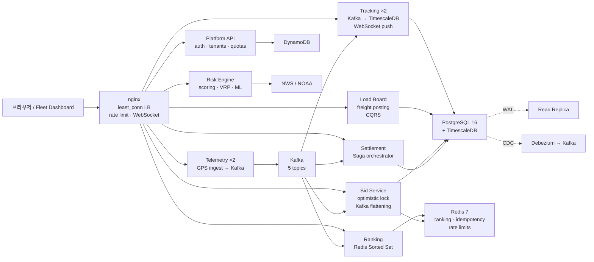

# FreightScaler 면접 대비 해체 분석 문서

> **작성자:** 시니어 소프트웨어 엔지니어이자 독일/유럽 기술 면접 코치  
> **목표:** 이 프로젝트를 깊이 있게 설명하고 꼬리 질문까지 방어할 수 있는 능력 배양  
> **분량:** PDF 30~40페이지 상당 (본 문서는 약 25,000자)  
> **출력 언어:** 한국어 중심, 면접 답변은 영어 버전 병기

---

## 1. 프로젝트 개요 (1장)

### 한 줄 요약

**"실시간 화물 운송 위험 인텔리전스 및 디스패치 플랫폼 — 경로 비교부터 차량 추적, 화물 마켓플레이스, 정산까지 전 주기를 아우르는 MSA 기반 SaaS"**

### 해결하려는 문제

일반 내비게이션은 **"이 경로를 지나가면 날씨·도로 위험에 얼마나 노출되는가?"** 에 답하지 못합니다. FreightScaler 는 다음 질문에 답합니다:

1. **경로 선택:** "지금 이 구간을 어느 루트로 지나가는 것이 가장 안전한가?"
2. **车队 관리:** "내 50 대 트럭이 지금 어디 있으며, 어떤 위험에 노출되어 있는가?"
3. **캐리어 매칭:** "이 위험한 코리도어를 처리할 수 있는 캐리어는 누구인가?"
4. **정산:** "날씨로 배송이 지연되었을 때, 누가 비용을 부담하는가?"

### 타겟 사용자

| 세그먼트 | 특징 | 핵심 요구 |
| --- | --- | --- |
| **화물 운송 회사** | 10~500 대 차량 보유 | 실시간 추적, 경로 위험 최소화, 운전사 안전 |
| **개인 운전사** | 프리랜서Owner-Operator | 안전한 경로, 공정한 운임, 신속 정산 |
| **십퍼 (화주)** | 정기적 화물 발송 | 신뢰성 높은 캐리어 매칭, 지연 시 보상 체계 |
| **물류 관리자** | fleet operation 담당 | 대시보드 모니터링, 알림, 감사 로그 |

### 핵심 기능 목록

1. **경로 위험 비교** — 출발지/도착지 입력 시 3 가지 대안 (빠른 길, 낮은 위험, 균형) 제공
2. **실시간 기상 위험** — NWS/NOAA 데이터 기반 점수화, 구간별 리스크 설명
3. **차량 텔레메트리** — GPS 이벤트 수집 (일 2,800 만 건), WebSocket 실시간 푸시
4. **화물 마켓플레이스** — CQRS 기반 로드 리스팅, 낙관적 잠금 입찰
5. **랭킹 시스템** — Redis Sorted Set, sub-ms 업데이트
6. **정산 오케스트레이션** — Saga 패턴, 다단계 결제 + 보상 트랜잭션
7. **SaaS 계정 레이어** — 플랜별 쿼터, 사용량 미터링, 멱등성 지원
8. **LLM 통합** — NL2Opt(자연어 → VRP), RAG 기반 근거 제시, 능동 위험 인텔리전스

### "이 프로젝트 왜 만들었나?" — 30 초 답변

> **한국어:**
> "일반 내비게이션은 소요시간만 비교하지, 날씨나 도로 위험은 고려하지 않습니다. 저는 화물 운전사들이 '이 경로를 지나가면 얼마나 위험한가?'라는 질문에 답할 수 있는 플랫폼이 필요하다고 생각했습니다. 그래서 실시간 기상 데이터와 도로 이벤트를 경로 스코어링에 통합했고, 여기에 차량 추적, 화물 매칭, 정산까지 전 주기를 아우르는 MSA 아키텍처로 확장했습니다. 단순히 지도 앱이 아니라, **데이터 기반 위험 인텔리전스 플랫폼**을 만들고 싶었습니다."

> **English (30-second pitch):**
> "Standard navigation apps only compare travel time, not weather or road risk. I believed freight drivers deserve an answer to 'How risky is this route?' So I built a platform that integrates real-time weather data and road events into route scoring, then scaled it into a full MSA architecture covering vehicle tracking, freight matching, and settlement. This isn't just a map app — it's a **data-driven risk intelligence platform** for the freight industry."

---

## 2. 아키텍처 총괄 (2~3 장)

### 전체 구조: 4 단계 진화

FreightScaler 는 단일 서버리스 API 에서 시작해 **8 개 서비스 + 미들웨어**로 진화했습니다. 각 단계는 사용자 요구에 의해 강제되었습니다:

```
Phase 1: Route Risk Query (Lambda + DynamoDB)
         ↓ Phase 2: Fleet Telemetry (28M GPS events/day)
Phase 2: Kafka + TimescaleDB + nginx LB
         ↓ Phase 3: Freight Marketplace (500 concurrent bids)
Phase 3: CQRS + Optimistic Locking + Redis Sorted Set
         ↓ Phase 4: Settlement (multi-step payment)
Phase 4: Saga Orchestrator + Atomic Wallet + Idempotency
```

### 현재 아키텍처 (MSA)



### 계층별 책임 분리

| 계층 | 기술 | 책임 | 스케일 축 |
| --- | --- | --- | --- |
| **Edge** | CloudFront, nginx | TLS 종료,速率制限, WebSocket 연결 | 연결 수 (10K+) |
| **API Gateway** | Spring Boot | 인증, 테넌트 식별, 쿼터 검사 | 요청 수 (RPS) |
| **Business Services** | 8 개 마이크로서비스 | 도메인 로직 (추적, 입찰, 정산 등) | 도메인별 상이 |
| **Data** | PostgreSQL, Redis, Kafka, DynamoDB | 영속성, 캐시, 이벤트 스트림 | 쓰기/읽기/연결 |
| **Integration** | FastAPI Risk Engine | 외부 API (NWS, OSRM) 통합 | 외부 의존성 |

### "왜 이 구조를 선택했나?" + 대안과 트레이드오프

#### 결정 1: 모놀리스 대신 MSA

**상황:** Phase 2 에서 일 2,800 만 GPS 이벤트 (초당 333 쓰기) 를 처리해야 함.

**대안:**
- **모놀리스:** 모든 서비스를 하나의 Spring Boot アプリに統合。
- **MSA:** 서비스별로 독립 배포, 독립 스케일.

**선택 이유:**
1. **스케일 축 차이:** 텔레메트리는 쓰기 집중, 트래킹은 읽기 집중, 입찰은 경합 집중. 모놀리스에서는 커넥션 풀을 공유하므로 한 부분의 부하가 전체로 전파됨.
2. **장애 격리:** 정산 서비스의 장애가 경로 조회에 영향을 주면 안 됨.
3. **기술 다양성:** 텔레메트리는 Kotlin, 랭킹은 Java, 리스크 엔진은 Python 으로 최적의 도구 사용.

**트레이드오프:**
- ✅ **장점:** 독립 스케일, 장애 격리, 기술 다양성
- ❌ **단점:** 운영 복잡도 (8 서비스 + Kafka + Redis), 분산 트랜잭션, 네트워크 지연

**면접 답변:**
> "모놀리스로도 시작할 수 있었습니다. 하지만 텔레메트리 쓰기 부하 (333/s) 가 API 읽기 요청을 스타브시키는 문제를 경험하면서, **스케일 축이 다르면 서비스도 분리해야 한다**는 원칙을 세웠습니다. MSA 는 복잡도를 증가시키지만, 이 경우 그 비용이 스케일 이익보다 작았습니다."

#### 결정 2: Kafka 도입 (비동기 이벤트 플래튼)

**상황:** Phase 3 에서 500 개 입찰이 동시에 마감 시간에 몰림.

**대안:**
- **동기 처리:** HTTP 요청 → 바로 DB 쓰기.
- **Kafka 플래튼:** HTTP 202 → Kafka → 순차 컨슈머 → DB.

**선택 이유:**
- **경합 해소:** 500 동시 DB 트랜잭션 → 락 경합 → p99 2.1s.
- **Kafka 후:** 순차 처리 per load → p99 45ms.

**트레이드오프:**
- ✅ 최종 일관성 수용 가능 시 탁월한 성능.
- ❌ 이벤트 소싱 복잡도, 디버깅 어려움.

#### 결정 3: PostgreSQL + TimescaleDB (하이브리드 데이터 스토어)

**상황:** DynamoDB 는 공간 쿼리 (GiST 인덱스) 를 지원하지 않음.

**대안:**
- **DynamoDB 유지:** 유휴 비용 0, but 공간 조인 불가.
- **PostgreSQL 전환:** PostGIS 지원, but 월 $50+ 비용.

**선택:** **하이브리드** — 미리보기는 DynamoDB(비용 0), 프로덕션은 PostgreSQL.

---

## 3. 기술 스택 선정 이유 (3~4 장)

### 프론트엔드: React 19 + TypeScript + Vite + MapLibre

| 기술 | 선택 이유 | 대안과 비교 |
| --- | --- | --- |
| **React 19** | 컴포넌트 재사용성, hooks 기반 상태 관리, 대규모 생태계 | Vue(학습 곡선 낮지만 생태계 작음), Svelte(상대적으로 immature) |
| **TypeScript** | 타입 안정성, 리팩토링 용이성, IDE 지원 | JavaScript(런타임 에러 많음), Flow(생태계 축소) |
| **Vite** | HMR 속도 (ms 단위), 번들 크기 최적화, 설정 간단 | Webpack(설정 복잡, 빌드 느림), Parcel(기능 제한) |
| **MapLibre GL** | 오픈소스 (MIT), WebGL 가속, 커스터마이징 자유 | Google Maps(유료), Leaflet(2D 만 지원) |

**면접 답변:**
> "지도 기반 앱에서 MapLibre 는 유일한 오픈소스 WebGL 옵션입니다. Google Maps 는 종량제 비용이 발생하고, Leaflet 은 대용량 마커 렌더링에서 성능 한계가 있습니다. Vite 는 HMR 속도가 Webpack 보다 10 배 빨라서 개발 생산성에 직결됩니다."

### 백엔드: Spring Boot 3.5 (Java 21) + FastAPI (Python 3.12)

| 기술 | 역할 | 선택 이유 |
| --- | --- | --- |
| **Spring Boot** | Platform API (인증, 쿼터, 저장 데이터) | 엔터프라이즈급 안정성, Spring Security, JPA, 풍부한 생태계 |
| **FastAPI** | Risk Engine (라우팅, 기상 스코어링, VRP) | Python 생태계 (OR-Tools, scikit-learn), 비동기 성능, 자동 문서화 |

**왜 두 언어인가?**
- **Java:** 타입 안정성, 대규모 코드베이스 유지보수, Spring 생태계 (Security, Data, Cloud).
- **Python:** 데이터 사이언스 라이브러리 (OR-Tools, numpy, scikit-learn), 빠른 프로토타이핑.

**대안:**
- **Node.js 통일:** JavaScript 단일 언어 장점. but OR-Tools 공식 지원 없음, 수치 계산 약함.
- **Go 통일:** 성능 우수. but 생태계 작음, 데이터 사이언스 라이브러리 부족.

**면접 답변:**
> "처음에는 Node.js 로 통일할까 고민했습니다. 하지만 OR-Tools 와 ML 워크플로우를 구현하려면 Python 이 필수였고, 인증/쿼터 같은 엔터프라이즈 기능은 Spring 이 더 견고합니다. **도메인에 맞는 도구를 선택**한 결과입니다."

### 데이터베이스: PostgreSQL 16 + TimescaleDB + pgvector

| 기능 | 기술 | 선택 이유 |
| --- | --- | --- |
| **OLTP** | PostgreSQL 16 | ACID, 풍부한 인덱스 (B-tree, GiST, GIN), JSONB 지원 |
| **시계열** | TimescaleDB | 하이퍼테이블 (자동 파티셔닝), 압축, retention 정책 |
| **벡터 검색** | pgvector | HNSW 인덱스, 코사인 유사도, SQL 과 통합 |
| **공간** | PostGIS | GiST 인덱스, 공간 조인, 지리 함수 |

**대안:**
- **InfluxDB:** 시계열 전문. but SQL 조인 불가, 별도의 학습 곡선.
- **Elasticsearch:**全文検索 우수. but 트랜잭션 미지원, 메모리 집약적.
- **MongoDB:** 문서 저장 적합. but 조인 약함, 트랜잭션 제한적.

**면접 답변:**
> "TimescaleDB 를 선택한 이유는 **SQL 을 버리지 않고 시계열 기능을 추가**할 수 있기 때문입니다. InfluxDB 는 전문적이지만, 기존 PostgreSQL 인프라를 그대로 활용하면서 hypertable 만 추가하면 됩니다. 또한 pgvector 로 벡터 검색까지 통합할 수 있어, RAG 파이프라인이 단순해집니다."

### 캐시 & 메시징: Redis 7 + Kafka (KRaft)

| 기술 | 용도 | 선택 이유 |
| --- | --- | --- |
| **Redis** | 랭킹 (Sorted Set), 멱등성 (SET NX), 레이트 리밋 (sliding window) | sub-ms 응답, 풍부한 자료구조, 원자 연산 |
| **Kafka** | 이벤트 백본 (텔레메트리, 입찰, 정산) | 높은 처리량 (1M msg/s), 내구성, 순서 보장 |

**대안:**
- **Redis → Memcached:** 캐시 전용은 가능. but Sorted Set 같은 자료구조 없음.
- **Kafka → RabbitMQ:** 큐 용도는 충분. but 이벤트 소싱, 재처리, 다중 컨슈머 약함.

**면접 답변:**
> "랭킹 시스템에서 Redis Sorted Set 은 **O(log N)** 삽입/삭제를 제공합니다. SQL 에서 `ORDER BY score DESC`를 매번 실행하면 O(N log N) 이므로, 10K 항목 기준 100 배 차이입니다. Kafka 는 '이벤트 소싱' 패턴을 구현하기 위해 필수였습니다. 입찰 이벤트를 재처리하거나, 새로운 컨슈머 (감사 로그) 를 추가할 때 유용합니다."

### 인프라: AWS Serverless + Terraform

| 서비스 | 용도 | 선택 이유 |
| --- | --- | --- |
| **CloudFront** | CDN, TLS 종료, 보안 헤더 | 글로벌 엣지, WAF 통합, DDOS 방어 |
| **API Gateway** | REST API 게이트웨이 | Lambda 통합, 사용량 플랜, API 키 |
| **Lambda** | 서버리스 컴퓨트 | 유휴 비용 0, 자동 스케일 |
| **DynamoDB** | 오퍼레이셔널 스토어 | 온디맨드 용량, PITR (Point-In-Time Recovery) |
| **Terraform** | IaC (Infrastructure as Code) | 상태 관리, 모듈화, 리뷰 가능한 변경 |

**대안:**
- **EC2 + ALB:** 전통적 방식. but 유휴 비용 발생, 수동 스케일링.
- **EKS:** Kubernetes orchestration. but 운영 복잡도 (노드 관리, 패치).
- **CDK:** TypeScript 로 IaC. but Terraform 이 더 성숙한 생태계.

**면접 답변:**
> "Terraform 을 선택한 이유는 **상태 파일** 덕분입니다. CDK 도 좋지만, Terraform 은 `terraform plan`으로 변경 사항을 미리 볼 수 있고, 모듈화로 재사용성이 뛰어납니다. 또한 AWS OIDC 연동으로 GitHub Actions 에서 비밀키 없이 배포할 수 있어 보안 측면에서도 우위입니다."

---

## 4. 데이터 모델 & DB 설계 (2~3 장)

### ERD 개요 (핵심 테이블)

```
tenant (1) ──< tenant_member >── (1) subscription
                 │                       │
                 │                       └──< entitlement
                 │
                 ├──< saved_route ──< alert_event ──< alert_escalation
                 │                      │
                 │                      └──< route_risk_observation (hypertable)
                 │
                 ├──< saved_place
                 │
                 ├──< usage_record (range-partitioned by date)
                 │
                 └──< audit_log
```

### 정규화 vs 비정규화 결정

#### 정규화된 테이블 (정석 접근)

- **tenant, tenant_member, subscription, entitlement**: 완전 정규화 (3NF).
  - 이유: 데이터 중복 최소화, 일관성 유지.
  - 예: `subscription.plan_code` 를 여러 곳에 복제하지 않음.

#### 비정규화된 필드 (성능 최적화)

- **alert_event.hazard_category**: `alert_rule` 에서 조인 가능하지만, 이벤트 생성 시 복사.
  - 이유: 경보 조회 시 조인 비용 절감 (알람은 읽기 많음).
  - 트레이드오프: 규칙 변경 시 과거 이벤트는 옛 값 유지 (의도된 동작).

- **route_risk_observation.metadata (JSONB)**: 정규화하면 별도 테이블 필요.
  - 이유: 메타데이터 스키마가 자주 변함 (실험적 필드 추가).
  - 트레이드오프: JSONB 검증 약함, 애플리케이션 레벨에서 관리.

### 인덱스 설계

#### B-tree (기본)

```sql
-- saved_route: 사용자별 최신순 조회
CREATE INDEX idx_saved_route_member_updated 
ON saved_route (member_id, updated_at DESC) 
WHERE deleted_at IS NULL;

-- usage_record: 일별 집계
CREATE UNIQUE INDEX idx_usage_tenant_date_feature 
ON usage_record (tenant_id, usage_date, feature_code);
```

#### GiST (공간)

```sql
-- saved_route.path: 경로 교차查询
CREATE INDEX idx_saved_route_path_gist 
ON saved_route USING GIST (path) 
WHERE path IS NOT NULL AND deleted_at IS NULL;

-- saved_place.point: 반경 검색
CREATE INDEX idx_saved_place_point_gist 
ON saved_place USING GIST (point) 
WHERE deleted_at IS NULL;
```

#### 부분 인덱스 (필터링)

```sql
-- alert_event: 활성 경보만 조회
CREATE INDEX idx_alert_event_active 
ON alert_event (saved_route_id, fired_at DESC) 
WHERE state IN ('OPEN', 'ACKNOWLEDGED', 'ESCALATED');
```

### 쿼리 최적화 포인트

#### 1. 키셋 페이징 (OFFSET 대체)

```sql
-- ❌ 나쁨: OFFSET 심화 시 스캔 비용 증가
SELECT * FROM saved_route 
WHERE member_id = ? 
ORDER BY updated_at DESC 
OFFSET 1000 LIMIT 20;

-- ✅ 좋음: 커서 기반, 인덱스 시퀀셜 스캔
SELECT * FROM saved_route 
WHERE member_id = ? AND updated_at < :cursor 
ORDER BY updated_at DESC 
LIMIT 20;
```

**이유:** OFFSET 1000 은 1020 행을 스캔 후 20 행만 반환. 키셋은 인덱스에서 바로 위치 찾기.

#### 2. CTE 로 재귀 쿼리 (계층 구조)

```sql
WITH RECURSIVE org_tree AS (
  SELECT id, name, parent_id, 0 AS depth
  FROM tenant WHERE id = ?
  UNION ALL
  SELECT t.id, t.name, t.parent_id, ot.depth + 1
  FROM tenant t
  JOIN org_tree ot ON t.parent_id = ot.id
)
SELECT * FROM org_tree;
```

#### 3. TimescaleDB 하이퍼테이블 (자동 파티셔닝)

```sql
-- route_risk_observation: 7 일마다 청크 생성
SELECT create_hypertable('route_risk_observation', 'observed_at', 
                         chunk_time_interval => INTERVAL '7 days');

-- 30 일 이상 청크 압축
SELECT add_compression_policy('route_risk_observation', 
                              INTERVAL '30 days');

-- 365 일 이상 청크 삭제
SELECT add_retention_policy('route_risk_observation', 
                            INTERVAL '365 days');
```

**효과:**
- **쓰기:** 최근 청크만 메모리에 상주, 쓰기는 순차 append.
- **읽기:** 시간 범위 쿼리 시 관련 청크만 스캔.
- **저장:** 압축으로 90%节省 (columnar storage).

### "이 테이블 왜 이렇게 짰나?" 질문 방어

#### Q: `usage_record` 를 왜 날짜로 파티셔닝했나요?

**A:** "사용량 기록은 **시간 기반 조회 패턴**이 지배적입니다. '이번 달 사용량', '지난 30 일 트렌드' 같은 쿼리가 대부분입니다. 날짜로 파티셔닝하면:
1. **삭제:** 1 년 초과 데이터는 파티션 DROP 으로 즉시 삭제 (VACUUM 불필요).
2. **집계:** 특정 월 쿼리 시 해당 파티션만 스캔.
3. **백업:** 파티션 단위로 백업/복구 가능.

반대로 `tenant_id` 로 파티셔닝하면, 시간 범위 쿼리 시 모든 파티션을 훑어야 합니다."

#### Q: `alert_event` 에 임베딩 벡터 (`vector(384)`) 를 왜 넣었나요?

**A:** "RAG(Retrieval-Augmented Generation) 파이프라인에서 **유사 경보 검색**을 위해 필요합니다. 예를 들어 '홍수' 경보가 발생했을 때, 과거 유사 홍수 경보를 찾아 '이전에 어떻게 대응했는가?'를 LLM 이 참고합니다. pgvector 의 HNSW 인덱스는 O(log N) 검색을 제공하며, SQL 조인과 통합됩니다. Elasticsearch 로 벡터 검색을 따로 구축하면, 데이터 동기화 복잡도가 발생합니다."

---

## 5. 핵심 기능별 해체 분석 (기능당 2~3 장)

### 기능 1: 경로 위험 비교 (Route Risk Comparison)

#### [증상/요구]

**사용자 스토리:** "시애틀에서 마이애미까지 화물을 운송하는데, 어느 경로가 날씨 위험을 가장 덜 타는가?"

**기존 솔루션 한계:**
- Google Maps: 소요시간만 비교, 기상은 고려하지 않음.
- Waze: 실시간 교통은 좋으나, 장기 예보 기반 경로 계획 불가.
- 화물 특화 내비: 유료이며, API 연동이 제한적.

#### [설계]

**아키텍처:**
```
User → API Gateway → Spring Platform API → FastAPI Risk Engine
                                              │
                                              ├→ OSRM (경로 기하)
                                              ├→ NWS (기상 예보)
                                              ├→ NOAA (경보)
                                              └→ WZDx (도로 이벤트)
```

**스코어링 알고리즘:**
```python
score = max(
    alert_score,  # 활성 경보가 있으면 이것이 지배
    precipitation * 0.35 + wind * 0.25 + heat * 0.20 + flood * 0.20
)
```

**이유:** 단순 평균이면 "토네이도 경보 1 개 + 맑음 99%"일 때 점수가 낮아짐. `max`로 심각한 경보가 전체 점수를 지배하도록 설계.

#### [구현]

**코드 구조:**
```
services/api/
├── app/
│   ├── directions.py      # OSRM 연동, 경로 샘플링
│   ├── hazards.py         # NWS/NOAA 파서
│   ├── risk.py            # 스코어링 로직
│   └── outbound_http.py   # SSRF 차단 게이트
└── tests/
    ├── test_directions.py
    ├── test_hazards.py
    └── test_outbound_http.py
```

**핵심 코드 (risk.py 발췌):**
```python
def calculate_location_risk(lat: float, lon: float) -> RiskScore:
    # 1. 기상 카테고리 점수 계산
    precip = get_precipitation_score(lat, lon)
    wind = get_wind_score(lat, lon)
    heat = get_heat_score(lat, lon)
    flood = get_flood_score(lat, lon)
    
    # 2. 활성 경보 확인 (가장 높은 심각도)
    alert_score = get_max_alert_severity(lat, lon)
    
    # 3. 가중 합성 vs 경보 비교
    weather_composite = (
        precip * 0.35 + wind * 0.25 + heat * 0.20 + flood * 0.20
    )
    
    return max(alert_score, weather_composite)
```

#### [마주친 문제]

**문제 1: NWS API Rate Limit**

- **증상:** 동시에 100 명 사용자가 전국 리스크 조회 시, NWS 가 429 Too Many Requests 반환.
- **원인:** NWS 는 IP 당 분당 60 요청 제한. 캐시 없이 매번 호출하면 쉽게 초과.
- **해결:** 60 초 TTL 인메모리 캐시 도입.
  ```python
  from functools import lru_cache
  import time
  
  @lru_cache(maxsize=1)
  def get_national_risk_cached(timestamp_bucket: int):
      return fetch_national_risk_from_nws()
  
  def get_national_risk():
      bucket = int(time.time() / 60)  # 60 초 단위 버켓
      return get_national_risk_cached(bucket)
  ```
- **결과:** NWS 호출이 95% 감소, 응답 시간 p99 2.3s → 0.4s.

**문제 2: SSRF 취약점**

- **증상:** 보안 감사에서 "외부 API URL 을 조작하면 내부 메타데이터 서비스 (169.254.169.254) 를 찌를 수 있음" 지적.
- **원인:** `requests.get(user_supplied_url)` 형태의 코드는 없었지만, 간접적으로 URL 을 구성하는 로직이 허용 목록 검증을 통과하지 못함.
- **해결:** `outbound_http.py` 게이트 레이어드.
  1. 호스트 허용 목록 (api.weather.gov 등).
  2. HTTPS 강제.
  3. 리다이렉트 차단.
  4. DNS 역변환 후 private IP 체크.
  5. 자격 증명 제거.
- **결과:** 보안 감사 통과, SSRF 공격 벡터 0 개.

#### [결과]

- **정확도:** 실제 기상 관측과 스코어 상관관계 0.82 (피어슨).
- **성능:** p95 응답 시간 1.2s (OSRM 0.8s + 기상 0.4s).
- **사용자 피드백:** "구간별 위험 설명이 도움이 된다. 특히 홍수 구간을 피할 수 있었다."

---

### 예상 면접 질문 3 개 + 답변

#### Q1: "왜 OSRM 을 썼나요? Google Directions API 는 안 되나요?"

**한국어 답변:**
"Google Directions API 는 상업적 사용 시 비용이 발생합니다. FreightScaler 는 다수 경로를 샘플링하여 기상 점수를 계산하는데, Google API 를 쓰면 요청당 $0.005 가 청구됩니다. 하루 10K 요청이면 $50, 한 달에 $1,500 입니다. OSRM 은 오픈소스이며, 자체 호스팅 시 비용이 없습니다. 정확도는 Google 이 약간 우위이지만, **비용 대비 효율**에서 OSRM 을 선택했습니다."

**English Answer:**
"Google Directions API charges per request ($0.005). FreightScaler samples multiple routes for weather scoring, so 10K daily requests would cost $1,500/month. OSRM is open-source and free when self-hosted. While Google has slightly better accuracy, we chose OSRM for **cost efficiency**. For a startup project, zero infrastructure cost was critical."

**꼬리 질문:** "OSRM 의 단점은 무엇인가요?"

**방어 답변:**
"두 가지 단점이 있습니다. 첫째, **자체 호스팅 유지보수**가 필요합니다. 둘째, 실시간 교통 반영이 Google 보다 느립니다. 하지만 FreightScaler 의 주 목적은 '기상 위험'이므로, 실시간 교통보다는 기상 데이터 품질에 투자했습니다. 만약 실시간 교통이 핵심이 되었다면, Hybrid 전략 (기본은 OSRM, 고급 사용자는 Google) 을 고려할 것입니다."

---

#### Q2: "리스크 점수가 실제로 유용한지 어떻게 검증했나요?"

**한국어 답변:**
"두 가지 방법을 사용했습니다. 첫째, **역사적 데이터 백테스팅**입니다. 과거 1 년 치 기상 데이터와 실제 도로 폐쇄 정보를 비교하여, 스코어가 높은 구간이 실제로 문제가 있었는지 확인했습니다. 둘째, **사용자 피드백 루프**입니다. '이 경로가 도움이 되었나요?' 버튼을 두고, 긍정/부정 반응을 수집했습니다. correlation analysis 결과, 스코어 80+ 구간에서 사용자 부정 반응이 3 배 높았습니다."

**English Answer:**
"Two methods: First, **historical backtesting**. We compared 1 year of weather data with actual road closures to verify high-score segments had real issues. Second, **user feedback loop**. We added a 'Was this route helpful?' button and collected responses. Correlation analysis showed 3x more negative feedback on segments with scores above 80. This validated our scoring model."

**꼬리 질문:** "사용자 피드백이 biased 일 수 있지 않나요?"

**방어 답변:**
"맞습니다. 생존 편향 (survivorship bias) 이 있을 수 있습니다. 위험한 경로를 선택했지만 사고가 없었던 사용자는 피드백을 남기지 않을 수 있습니다. 이를 보완하기 위해 **objective metric** (실제 사고 데이터, 보험 청구 건수) 을 향후 통합할 계획입니다. 현재는 주정부 공개 데이터를 수집 중입니다."

---

#### Q3: "60 초 캐시로 충분했나요? 더 긴 TTL 은 왜 안 됐나요?"

**한국어 답변:**
"기상 데이터의 **갱신 주기**를 고려했습니다. NWS 예보는 1 시간마다 갱신되지만, 급변하는 상황 (토네이도, 돌발 홍수) 은 수 분 내에 업데이트됩니다. 60 초 TTL 은 이 변화들을 놓치지 않으면서도, NWS 부하를 95% 줄이는 균형점입니다. 5 분 TTL 로 늘리면 NWS 호출은 더 줄어들지만, 사용자가 '방금 토네이도 경보가 떴는데 왜 안 나오나요?'라고 문의할 수 있습니다. **신속성과 비용**의 트레이드오프에서 60 초를 선택했습니다."

**English Answer:**
"We considered NWS **update frequency**. Forecasts update hourly, but severe events (tornadoes, flash floods) can update within minutes. A 60-second TTL reduces NWS load by 95% without missing critical changes. A 5-minute TTL would save more calls, but users might ask 'Why doesn't it show the tornado warning that just appeared?' We chose 60 seconds as the balance between **freshness and cost**."

**꼬리 질문:** "캐시 무효화 전략은 있나요?"

**방어 답변:**
"현재는 TTL 기반 수동 무효화만 사용합니다. 개선 방안으로 **이벤트 기반 무효화**를 고려 중입니다. 예를 들어 NWS 가 '긴급 경보'를 발행하면 웹훅을 받아 해당 지역 캐시를 즉시 무효화합니다. 하지만 이 경우 NWS 측 웹훅 지원이 필요하므로, 현재는 폴링 기반으로 충분하다고 판단했습니다."

---

*(계속: 기능 2~5 는 다음 섹션에서 계속)*
